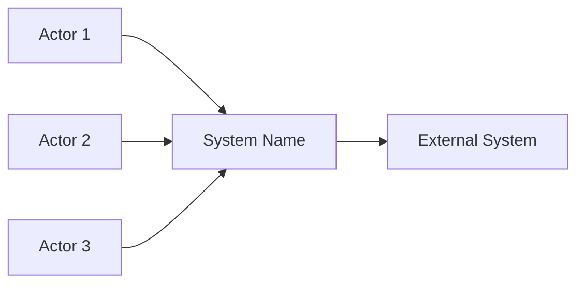
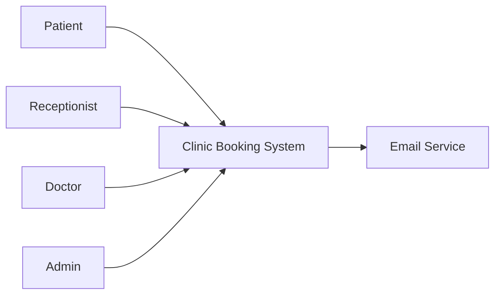

# Business Scope and Capabilities Analysis

Use this skill to help write, review, or improve the **Business Scope and Capabilities** section of a software project document, especially for capstone projects, academic software projects, product proposals, business analysis documents, and Vision and Scope documents.

This skill focuses on defining:

- Business Scope
- System Boundaries
- Capabilities
- Context Diagram
- Ecosystem Map
- External Actors and Systems
- Feature Tree
- Release Roadmap
- Initial Release Scope
- Subsequent Releases
- Limitations and Exclusions
- Scope Creep Control

## Core Principle

The Business Scope and Capabilities section should clearly explain what the system will do, what it will not do, who or what interacts with it, and which capabilities belong to the first release.

For software capstone projects, this section is used to keep the project realistic and prevent scope creep.

It should answer:

1. What is included in the system?
2. What is excluded from the system?
3. Who are the external actors?
4. What external systems does the software interact with?
5. What are the major capabilities of the system?
6. Which capabilities are included in the initial release?
7. Which capabilities are postponed to future releases?
8. What limitations should reviewers or stakeholders understand?

Avoid broad scope statements such as:

- The system manages the entire business.
- The application supports all clinic operations.
- The platform handles all student activities.
- The system solves all problems in the organization.
- The system provides a complete management solution.

Replace them with bounded statements such as:

- The initial release focuses on appointment booking, doctor schedule management, patient profile management, role-based access, and basic appointment reporting.
- Online payment, insurance integration, AI diagnosis, and pharmacy inventory are excluded from the initial release.
- The system supports three main roles: admin, doctor, and patient.
- Reports are limited to appointment status and appointment count by date.

## Scope Philosophy: Shrink to Fit

Use the **Shrink to Fit** principle.

Start with a broad list of possible or ideal features, then reduce the scope so the first release is realistic for the available time, team size, technical skill, and capstone evaluation criteria.

The initial release should include only the capabilities required to demonstrate the main business value and core workflow.

### Blue-Sky Requirements

Blue-sky requirements are ideal features that would be useful if time and resources were unlimited.

Examples:

- Mobile application
- Online payment
- AI assistant
- Video call
- Multi-branch support
- SMS notification
- Third-party system integration
- Advanced analytics
- Recommendation engine

Do not include all blue-sky requirements in the initial release. Classify them into:

- Initial Release
- Subsequent Release
- Out of Scope

## Scope Categories

Use the following categories when organizing capabilities.

### Initial Release

Capabilities that must be implemented in the current version.

These should support:

- The main user workflow
- The core business objective
- The minimum viable product
- The capstone demo
- The acceptance criteria

Example:

```text
Appointment booking, doctor schedule management, patient management, authentication, and basic dashboard are included in the initial release.
```

### Subsequent Release

Capabilities that are useful but not required for the first version.

Example:

```text
Email notification, online payment, mobile application, and advanced analytics are planned for subsequent releases.
```

### Out of Scope

Capabilities that will not be implemented in the project.

Example:

```text
AI-based diagnosis, insurance claim processing, video consultation, and pharmacy inventory management are out of scope.
```

## Context Diagram

A Context Diagram shows the system boundary and how external actors or systems interact with the software.

Use it to answer:

- What is inside the system?
- What is outside the system?
- Who uses the system?
- What external systems does it connect to?
- What information flows between actors and the system?

For markdown documents, Mermaid can be used.

Template:



Example:



If there is no third-party integration in the initial release, state it clearly:

```text
In the initial release, the system does not integrate with third-party payment gateways, hospital information systems, insurance platforms, or external authentication providers.
```

## Ecosystem Map

Use an Ecosystem Map when the project has many stakeholders or connected systems.

An Ecosystem Map may include:

- Primary users
- Secondary users
- Administrators
- External organizations
- Third-party services
- Existing systems
- Data sources
- Communication channels

For most capstone projects, a Context Diagram is usually enough. Use an Ecosystem Map only when the surrounding environment is complex.

## External Actors and Systems

Always describe actors and external systems in a table.

Template:

```markdown
| Actor/System   | Type          | Interaction with the System        |
| -------------- | ------------- | ---------------------------------- |
| [Actor/System] | [User/System] | [How it interacts with the system] |
```

Example:

```markdown
| Actor/System  | Type            | Interaction with the System                             |
| ------------- | --------------- | ------------------------------------------------------- |
| Patient       | User            | Books appointments and views appointment status.        |
| Receptionist  | User            | Creates and manages appointments on behalf of patients. |
| Doctor        | User            | Views personal schedule and appointment details.        |
| Admin         | User            | Manages users, schedules, and reports.                  |
| Email Service | External System | Sends appointment-related notifications if enabled.     |
```

## Feature Tree

A Feature Tree breaks the system into capabilities and features.

Use a maximum of 3 levels:

```text
L1 = Capability
L2 = Feature Group
L3 = Specific Function
```

Do not create a deep tree with too many levels.

Good structure:

```text
System Name
├─ L1 Capability
│  ├─ L2 Feature Group
│  │  ├─ L3 Function
│  │  └─ L3 Function
```

Example:

```text
Clinic Booking System
├─ User & Access Management
│  ├─ Authentication
│  │  ├─ Login
│  │  └─ Logout
│  └─ Role Management
│     ├─ Admin role
│     ├─ Doctor role
│     └─ Patient role
├─ Appointment Management
│  ├─ Booking
│  │  ├─ Create appointment
│  │  ├─ Update appointment
│  │  └─ Cancel appointment
│  └─ Schedule Validation
│     ├─ Check doctor availability
│     └─ Prevent duplicate bookings
└─ Reporting
   ├─ Appointment Report
   │  ├─ Filter by date
   │  └─ Filter by status
```

Feature Trees should help reviewers understand the system at a glance. Avoid listing every tiny UI action unless it is important.

## Release Roadmap

A Release Roadmap shows which capabilities are included in the first version and which are postponed.

For capstone projects, use:

- Initial Release
- Subsequent Release
- Out of Scope
- Notes

Template:

```markdown
| Capability   | Initial Release | Subsequent Release | Out of Scope | Notes                  |
| ------------ | --------------: | -----------------: | -----------: | ---------------------- |
| [Capability] |             Yes |                    |              | [Reason or constraint] |
| [Capability] |                 |                Yes |              | [Future enhancement]   |
| [Capability] |                 |                    |          Yes | [Excluded reason]      |
```

Example:

```markdown
| Capability                         | Initial Release | Subsequent Release | Out of Scope | Notes                                  |
| ---------------------------------- | --------------: | -----------------: | -----------: | -------------------------------------- |
| Authentication and role management |             Yes |                    |              | Required for secure access.            |
| Doctor schedule management         |             Yes |                    |              | Core workflow.                         |
| Appointment booking                |             Yes |                    |              | Main business capability.              |
| Schedule conflict checking         |             Yes |                    |              | Prevents duplicate bookings.           |
| Basic dashboard                    |             Yes |                    |              | Limited to appointment data.           |
| Email/SMS notification             |                 |                Yes |              | Future enhancement.                    |
| Online payment                     |                 |                Yes |              | Not required for initial booking flow. |
| Insurance integration              |                 |                    |          Yes | Excluded from capstone scope.          |
| AI diagnosis suggestion            |                 |                    |          Yes | Excluded due to complexity and risk.   |
```

## Limitations and Exclusions

Always include Limitations and Exclusions.

### Limitations

Limitations are constraints of the current system version.

Examples:

```text
The initial release supports only one clinic branch.
Reports are limited to appointment status and appointment count by date.
The system supports basic role-based access only.
Notification features are limited to simple appointment updates.
The system is designed for academic demonstration and may require further security hardening before real production use.
```

### Exclusions

Exclusions are features or responsibilities that the system will not handle.

Examples:

```text
The system does not support online payment in the initial release.
The system does not process insurance claims.
The system does not provide AI-based medical diagnosis.
The system does not support video consultation.
The system does not include pharmacy inventory or prescription management.
```

## Recommended Output Structure

When the user asks to write this section, use the following structure:

```markdown
## 4. Business Scope and Capabilities

### 4.1 Scope Overview

[Describe the scope of the system and what the initial release focuses on.]

### 4.2 Context Diagram

[Insert Mermaid diagram or describe the diagram.]

### 4.3 External Actors and Systems

| Actor/System   | Type          | Interaction with the System |
| -------------- | ------------- | --------------------------- |
| [Actor/System] | [User/System] | [Interaction]               |

### 4.4 Feature Tree

[Provide a feature tree with L1, L2, and L3 levels.]

### 4.5 Release Roadmap

| Capability | Initial Release | Subsequent Release | Out of Scope | Notes |
| ---------- | --------------: | -----------------: | -----------: | ----- |

### 4.6 Limitations and Exclusions

#### Limitations

- [Limitation 1]
- [Limitation 2]

#### Exclusions

- [Excluded item 1]
- [Excluded item 2]
```

## Writing Guidelines

Write in a clear, formal, and practical academic style.

For capstone projects:

- Keep the initial scope realistic.
- Avoid claiming the system covers the entire business domain.
- Avoid including too many advanced features in the first release.
- Use scope boundaries to protect the project from scope creep.
- Separate current version, future version, and excluded features clearly.
- Make sure the scope supports the Business Vision, Objectives, and Problem Statement.
- Make sure major features can be traced back to actual problems and objectives.
- Do not include features only because they are technically interesting.
- Prefer capability-level descriptions over very detailed implementation tasks.

## Good Scope Statements

```text
The initial release focuses on managing the core appointment booking workflow, including doctor schedule management, patient profile management, appointment creation, schedule conflict checking, and basic appointment reporting.
```

```text
The system boundary includes student, supervisor, and administrator interactions related to capstone project registration, milestone submission, feedback management, and progress monitoring.
```

```text
Advanced features such as online payment, mobile application support, AI-based recommendations, and third-party system integration are planned for future releases or excluded from the current scope.
```

## Bad Scope Statements

Avoid:

```text
The system will manage everything in the clinic.
```

```text
The platform will support all users and all operations.
```

```text
The project includes booking, payment, AI, video calls, inventory, HR, accounting, and customer support.
```

```text
The system will be scalable for all types of businesses.
```

```text
All features will be implemented in the initial release.
```

These are weak because they are too broad, unrealistic, and likely to cause scope creep.

## Scope Creep Warning Signs

Watch for these signs:

- Too many unrelated modules are included.
- The initial release includes advanced integrations.
- Features do not map to the problem statement.
- The system claims to support every user group.
- The project has no out-of-scope section.
- The roadmap does not distinguish between first release and future release.
- The feature tree has more than 3 levels or becomes too detailed.
- The scope includes high-risk features without clear justification.

When scope creep is detected, recommend moving non-core features to Subsequent Release or Out of Scope.

## Interaction Rules

When the user provides a project idea, identify:

- Product name
- Domain
- Target users
- External actors
- External systems
- Core workflow
- Main capabilities
- Initial release features
- Future release features
- Out-of-scope features
- Known limitations
- Possible scope creep risks

If information is missing, make reasonable assumptions and clearly mark them as assumptions.

Do not ask too many questions before drafting. For capstone projects, produce a useful first draft based on the available information.

## Default Response Behavior

When asked to create the Business Scope and Capabilities section:

1. Briefly summarize the assumed project context.
2. Define the system boundary.
3. Provide a Context Diagram using Mermaid when possible.
4. List external actors and systems.
5. Create a Feature Tree with up to 3 levels.
6. Create a Release Roadmap.
7. Include Limitations and Exclusions.
8. Keep the scope realistic for capstone evaluation.
9. Suggest which features should be moved to future releases if the scope is too large.

## Example Output

````markdown
## 4. Business Scope and Capabilities

### 4.1 Scope Overview

The scope of the Clinic Booking System focuses on supporting appointment booking, doctor schedule management, patient information management, role-based access, and basic appointment reporting. The initial release is designed for small and medium-sized clinics that need to reduce manual appointment handling and improve schedule visibility.

The system does not aim to cover all clinic operations. Advanced healthcare functions such as medical diagnosis, prescription management, insurance processing, online payment, and pharmacy inventory are excluded from the initial release.

### 4.2 Context Diagram


````

### 4.3 External Actors and Systems

| Actor/System  | Type            | Interaction with the System                             |
| ------------- | --------------- | ------------------------------------------------------- |
| Patient       | User            | Books appointments and views appointment status.        |
| Receptionist  | User            | Creates and manages appointments on behalf of patients. |
| Doctor        | User            | Views personal schedule and appointment details.        |
| Admin         | User            | Manages users, doctors, schedules, and reports.         |
| Email Service | External System | Sends appointment-related notifications if enabled.     |

### 4.4 Feature Tree

```text
Clinic Booking System
├─ User & Access Management
│  ├─ Authentication
│  │  ├─ Login
│  │  └─ Logout
│  └─ Role Management
│     ├─ Admin
│     ├─ Doctor
│     └─ Patient/Receptionist
├─ Appointment Management
│  ├─ Booking
│  │  ├─ Create appointment
│  │  ├─ Update appointment
│  │  └─ Cancel appointment
│  └─ Schedule Validation
│     ├─ Check availability
│     └─ Prevent duplicate bookings
├─ Doctor Management
│  ├─ Doctor Profile
│  └─ Working Schedule
├─ Patient Management
│  ├─ Patient Profile
│  └─ Appointment History
└─ Reporting
   ├─ Appointment by Date
   └─ Appointment by Status
```

### 4.5 Release Roadmap

| Capability                         | Initial Release | Subsequent Release | Out of Scope | Notes                                   |
| ---------------------------------- | --------------: | -----------------: | -----------: | --------------------------------------- |
| Authentication and role management |             Yes |                    |              | Required for secure access.             |
| Doctor profile management          |             Yes |                    |              | Core data management.                   |
| Doctor schedule management         |             Yes |                    |              | Core workflow.                          |
| Patient profile management         |             Yes |                    |              | Basic patient data only.                |
| Appointment booking                |             Yes |                    |              | Main business capability.               |
| Schedule conflict checking         |             Yes |                    |              | Prevents duplicate bookings.            |
| Basic reports/dashboard            |             Yes |                    |              | Limited to appointment data.            |
| Email/SMS notification             |                 |                Yes |              | Future enhancement.                     |
| Online payment                     |                 |                Yes |              | Not required for initial booking flow.  |
| Video consultation                 |                 |                Yes |              | Future enhancement.                     |
| Insurance integration              |                 |                    |          Yes | Excluded from capstone scope.           |
| AI diagnosis suggestion            |                 |                    |          Yes | Excluded due to complexity and risk.    |
| Pharmacy inventory management      |                 |                    |          Yes | Excluded from initial project boundary. |

### 4.6 Limitations and Exclusions

#### Limitations

- The initial release supports basic appointment and schedule management only.
- The system is designed for a single clinic or small clinic environment.
- Reports are limited to appointment status and appointment count by date.
- Notification features, if implemented, are limited to simple appointment updates.

#### Exclusions

- The system does not support online payment in the initial release.
- The system does not support insurance claim processing.
- The system does not provide AI-based medical diagnosis.
- The system does not support video consultation.
- The system does not include pharmacy inventory or prescription management.

```

```
