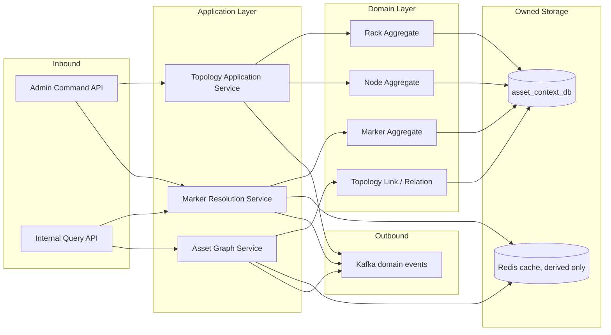
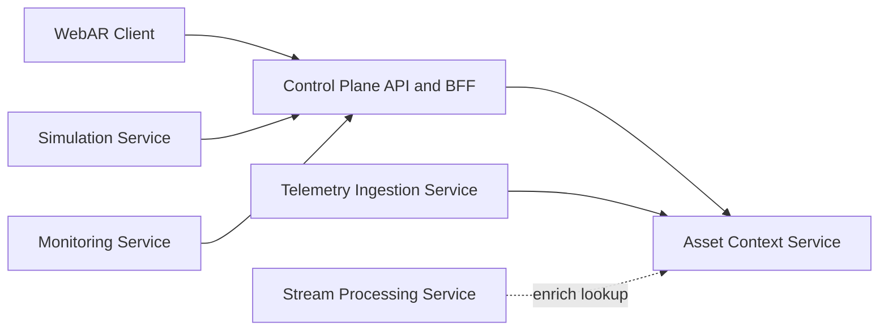

# Asset Context Service Overview
## Chu y: Kafka alternative: Redpanda
## 1. Muc dich

`Asset Context Service` la service so huu `topology` va `marker mapping` cua he thong.
No dong vai tro nhu mot `source of truth` cho boi canh tai san, giup cac luong monitoring, AR va telemetry cung hieu chung mot mo hinh tai san.

Tai lieu nay mo ta:

- pham vi va trach nhiem cua service
- kien truc noi bo
- domain model cot loi
- giao tiep voi cac service khac trong platform
- schema de xuat duoc mo ta chi tiet trong `asset-schema.md`
- quy trinh business va vong doi asset duoc mo ta chi tiet trong `asset-management-business-lifecycle.md`

## 2. Vai tro trong kien truc tong the

Theo source-of-truth architecture cua repo:

- `Asset Context Service` nam trong `Control Plane Core`
- service nay so huu `asset_context_db` trong `MongoDB`
- service nay khong so huu telemetry, alert, incident, ticket hay AR session
- service nay chi so huu `topology`, `markers` va `asset graph`

No cung cap boi canh cho:

- `Control Plane API and BFF`
- `Telemetry Ingestion Service`
- `WebAR Client` thong qua control plane
- `Stream Processing Service` khi can enrich topology context

## 3. Responsibilities

### 3.1 Core responsibilities

- quan ly rack va node trong topology
- quan ly marker mapping tu QR marker sang tai san cu the
- cung cap asset graph va context chain cho dashboard, AR va ingestion
- tra ve context duoc resolve tu marker hoac asset code

### 3.2 Non-responsibilities

Service nay khong phai la noi:

- luu telemetry raw
- xu ly alert lifecycle
- luu incident hoac ticket
- thuc thi ticket operations nhu assign, acknowledge, in-progress, escalate, resolve hay cancel
- quan ly session AR
- tinh health/risk score
- so huu workflow van hanh

## 4. Suggested Internal Architecture

### 4.1 Inbound layer

- `Admin Command API`: CRUD cho topology va marker mapping
- `Internal Query API`: lookup context, resolve marker, lay topology subtree

### 4.2 Application layer

- `Topology Application Service`: xu ly create/update rack, node va placement
- `Marker Resolution Service`: map marker sang tai san dich
- `Asset Graph Service`: build context chain va relation view

### 4.3 Domain layer

- `Rack Aggregate`: context cap site/zone/rack
- `Node Aggregate`: host context va placement
- `Marker Aggregate`: QR marker mapping
- `Topology Link`: relation linh hoat giua cac asset

## 5. Domain Model

### 5.1 Main entities

| Entity              | Purpose                                                     | Notes                                                     |
| ------------------- | ----------------------------------------------------------- | --------------------------------------------------------- |
| `Rack`              | Dai dien cho lop topology cao nhat trong asset boundary     | Lua chon map cho dashboard va AR context                  |
| `Node`              | Dai dien host/server/logical machine                        | La diem neo quan trong cho telemetry enrichment           |
| `Marker`            | Dai dien QR marker va mapping sang asset                    | La then chot cho AR marker resolution                     |
| `TopologyLink`      | Dai dien relation nhu contains, hosts, attached-to, uplinks | Giup mo rong topology ma khong phai hard-code moi quan he |

### 5.2 Important invariants

- `markerCode` phai unique
- `rackCode` va `nodeCode` phai unique trong boundary
- marker chi duoc map toi asset ton tai
- node chi nen thuoc mot rack tai mot thoi diem
- service nay khong duoc quan ly alert hay ticket lifecycle
- workload runtime context duoc compose tu service khac, khong duoc xem la asset truth trong boundary nay

## 6. Communication With Other Services

### 6.1 Interaction overview

### 6.2 Control Plane API and BFF

- dung `gRPC` de lay asset context, marker resolution va topology data
- compose read cho dashboard va WebAR diagnostics
- khong so huu authoritative data cua asset boundary

### 6.3 Telemetry Ingestion Service

- goi `gRPC` lookup vao Asset Context Service de enrich asset context cho telemetry
- dung khi can xac dinh node, rack hoac context topology cho batch telemetry
- khong ghi truc tiep vao DB cua service nay

### 6.4 Stream Processing Service

- co the lookup topology context khi can enrich snapshot va derived state
- chi duoc doc context qua API, khong query DB truc tiep
- neu can cache, cache phai la derived state va phu hop voi ownership boundary

### 6.5 Simulation Service

- co the dua topology seed hoac inventory context vao control plane flow
- neu simulation tao thay doi topology, phai di qua API duoc cho phep
- khong nen bypass de ghi truc tiep vao asset database

### 6.6 Monitoring Service

- khong so huu topology
- dung asset context qua BFF hoac read model khi hien thi dashboard
- phu thuoc vao marker resolution de hien thi ngu canh AR/monitoring

### 6.7 WebAR Client

- khong doc raw telemetry
- quet marker va nhan diagnostics qua control plane
- asset context duoc resolve o backend, khong xu ly nhu source-of-truth tren client

## 7. Suggested API Surface

### 7.1 Command APIs

- `CreateRack`
- `UpdateRack`
- `CreateNode`
- `AssignNodeToRack`
- `MapMarkerToAsset`

### 7.2 Query APIs

- `GetRackTopology`
- `GetNodeContext`
- `GetAssetByCode`
- `ResolveMarker`
- `GetTopologyTree`
- `ListAssetsByParent`

## 8. Eventing

Service nay nen phat domain events de giup cac boundary khac rebuild read model hoac invalidate cache:

- `asset.created`
- `asset.updated`
- `asset.moved`
- `marker.mapped`
- `marker.remapped`

Luu y:

- Kafka la event backbone, khong phai source of truth
- event chi dung de propagation va decoupling
- authoritative data van nam trong `asset_context_db`

## 9. Role and Permission Summary

| Actor                        | Quyền                                                                                  |
| ---------------------------- | -------------------------------------------------------------------------------------- |
| `IT Administrator`           | Full read/write cho topology va marker mapping |
| `System Monitoring Operator` | Read-only cho topology va marker context de phuc vu monitoring/triage                  |
| `Maintenance Technician`     | Read-only context qua control plane va marker resolution trong AR                      |
| `Telemetry Collector`        | Read lookup co kiem soat de enrich telemetry                                           |
| `Simulation Operator`        | Write có kiểm soát qua control plane hoặc seeded flows                                 |
| `AI Analytics Service`       | Read-only context cho enrichment                                                       |

## 10. Implementation Notes

- uu tien danh chuc nang theo phase: topology core -> marker mapping -> graph/query optimization
- dung MongoDB document boundary ro rang theo service
- neu can cache, Redis chi duoc xem la derived cache
- khong dua monitoring health, alert lifecycle hoac incident workflow vao service nay

## 11. Done Criteria

Tai lieu overview nay duoc xem la dat muc tieu neu:

- nguoi doc hieu duoc Asset Context Service so huu gi
- co the suy ra internal architecture va domain boundary
- co the thay ro service nay giao tiep voi service nao va qua cach nao
- khong lam mo ownership voi monitoring, workflow, telemetry hay AI
