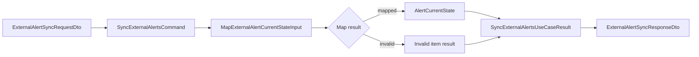

# Interface Design: Task 4 External Alert Inbound Sync

## Objective
Define the DTOs, internal commands, mapper contracts, and response shapes for the Task 4 inbound sync path that receives `Alertmanager` webhook payloads and persists normalized `AlertCurrentState` documents.

This document focuses on interface shape, not implementation details.

## Design Principles
- keep HTTP transport DTOs separate from internal application command types
- validate external payloads at the controller boundary
- normalize and map one alert item at a time
- make mapper outcomes explicit so invalid payloads can be skipped without pretending they were synced
- keep interfaces additive and narrow to avoid leaking transport quirks into the read model
- be liberal in what we accept after sanitization, but conservative in what we expose back out

## Interface Layers
Task 4 should expose four distinct layers:

1. HTTP request DTOs
2. Internal application command/result types
3. Mapper input/output contracts
4. HTTP response DTOs

## 1. HTTP Request DTOs
The external caller sends an `Alertmanager` webhook envelope.

### 1.1 Alertmanager webhook envelope DTO
```ts
export class ExternalAlertSyncRequestDto {
  receiver!: string;
  status!: 'firing' | 'resolved';
  alerts!: ExternalAlertSyncAlertItemDto[];
  groupLabels?: Record<string, unknown>;
  commonLabels?: Record<string, unknown>;
  commonAnnotations?: Record<string, unknown>;
  externalURL?: string;
  version?: string;
  groupKey?: string;
  truncatedAlerts?: number;
}
```

Notes:
- `alerts` is the only required collection for processing
- `groupLabels`, `commonLabels`, and `commonAnnotations` are accepted as data, not trusted commands
- `status` at envelope level is informative only; alert item status wins

### 1.2 Alert item DTO
```ts
export class ExternalAlertSyncAlertItemDto {
  status!: 'firing' | 'resolved';
  labels!: Record<string, unknown>;
  annotations!: Record<string, unknown>;
  startsAt!: string;
  endsAt!: string | null;
  generatorURL?: string;
  fingerprint!: string;
}
```

Notes:
- `labels` and `annotations` stay open as `Record<string, string>` at the transport edge because upstream may add extra fields
- transport-facing DTOs should not assume upstream has already stringified every value
- we intentionally do not type every upstream key in the request DTO layer
- DTO validation should still require object-ish shape for `labels` and `annotations`

### 1.3 Boundary validation expectations
At the HTTP boundary we should validate:
- request body is an object
- `alerts` is an array
- each alert has:
  - `status`
  - `labels`
  - `annotations`
  - `startsAt`
  - `fingerprint`

We should not do full business validation in the DTO layer. Scope identity validation belongs in the mapper/application boundary after normalization.

### 1.4 Internal route auth DTO/contract direction
The route should bypass global dashboard guards but require an internal shared-secret check.

Recommended request header:
```ts
type ExternalAlertSyncSecretHeader = {
  'x-monitoring-sync-secret': string;
};
```

Recommended internal decorator/guard split:
- custom decorator to mark the route as bypassing normal JWT/permission guards
- lightweight guard/interceptor/service that validates the shared secret

## 2. Internal Application Command Types
The use case should not depend on raw HTTP DTOs. It should receive a transport-neutral command.

### 2.1 Batch command
```ts
export interface SyncExternalAlertsCommand {
  receivedAt: string;
  alerts: SyncExternalAlertInput[];
  commonLabels: Record<string, string>;
  commonAnnotations: Record<string, string>;
}
```

Purpose:
- preserves batch envelope context
- removes HTTP-only naming from the use-case boundary
- allows a future Kafka or queue adapter to reuse the same use case

### 2.2 Alert input
```ts
export interface SyncExternalAlertInput {
  fingerprint: string;
  status: 'firing' | 'resolved';
  startsAt: string;
  endsAt: string | null;
  generatorUrl: string | null;
  labels: Record<string, string>;
  annotations: Record<string, string>;
  rawLabels: Record<string, string>;
  rawAnnotations: Record<string, string>;
}
```

Purpose:
- represents a single external alert item ready for normalization/mapping
- keeps external alert semantics explicit

## 3. Mapper Contracts
The mapper boundary is the most important part of Task 4 because this is where external data becomes internal monitoring state.

### 3.1 Mapper input
```ts
export interface MapExternalAlertCurrentStateInput {
  receivedAt: string;
  alert: SyncExternalAlertInput;
  commonLabels: Record<string, string>;
  commonAnnotations: Record<string, string>;
}
```

### 3.2 Mapper output
Use an explicit result union instead of returning `null`.

```ts
export type MapExternalAlertCurrentStateResult =
  | {
      kind: 'mapped';
      state: AlertCurrentState;
      metadata: ExternalAlertSyncMetadata;
    }
  | {
      kind: 'invalid';
      reason:
        | 'missing_fingerprint'
        | 'missing_scope_type'
        | 'unsupported_scope_type'
        | 'missing_required_identity'
        | 'invalid_payload_shape'
        | 'invalid_status'
        | 'invalid_severity'
        | 'invalid_category';
      metadata: ExternalAlertSyncMetadata;
    };
```

Why a union:
- avoids ambiguous `null` or thrown validation errors for per-alert failures
- makes partial success in a batch natural
- gives the controller/use case enough data to count `synced`, `skipped`, and `invalid`

### 3.3 Mapper metadata
```ts
export interface ExternalAlertSyncMetadata {
  fingerprint: string | null;
  alertName: string | null;
  scopeType: string | null;
  nodeId: string | null;
  rackId: string | null;
  workloadId: string | null;
  serviceId: string | null;
}
```

Purpose:
- logging
- response summaries if needed
- debugging invalid payloads without persisting raw garbage

## 4. Normalization Contract
Normalization should be implemented as a small helper layer used by the mapper.

### 4.1 Null-like normalization
```ts
export function normalizeExternalAlertString(
  input: string | null | undefined,
): string | null;
```

Rules:
- trim whitespace
- convert `undefined`, `null`, `''`, `'null'` to `null`
- preserve meaningful strings exactly after trim

### 4.1b Object-map sanitization
```ts
export function sanitizeExternalAlertMap(
  input: Record<string, unknown> | null | undefined,
): Record<string, string>;
```

Rules:
- accept only object-ish maps
- coerce scalar values into strings where safe
- drop nested objects/arrays in the first slice unless explicitly serialized by policy
- run string normalization on produced values

### 4.2 Fallback merge helpers
```ts
export function mergeExternalAlertLabels(
  alertLabels: Record<string, string>,
  commonLabels: Record<string, string>,
): Record<string, string>;

export function mergeExternalAlertAnnotations(
  alertAnnotations: Record<string, string>,
  commonAnnotations: Record<string, string>,
): Record<string, string>;
```

Rules:
- alert-level values win
- common values fill only missing keys
- transport-only fields are not filtered here; filtering belongs in the domain mapping step

## 5. AlertCurrentState Mapping Shape
The mapper should produce a first-class `AlertCurrentState`, not an intermediate pseudo-domain object.

### 5.1 Field mapping
```ts
type AlertCurrentState = {
  fingerprint: string;
  alertName: string;
  scopeType: 'node' | 'rack' | 'workload' | 'service';
  nodeId?: string;
  rackId?: string;
  workloadId?: string;
  serviceId?: string;
  rawLabels: Record<string, string>;
  rawAnnotations: Record<string, string>;
  severity: 'warning' | 'critical';
  category:
    | 'availability'
    | 'resource'
    | 'thermal'
    | 'runtime'
    | 'network'
    | 'connectivity';
  status: 'firing' | 'resolved';
  environment: string;
  team: string;
  source: 'grafana';
  summary: string;
  description: string;
  metricKey: string | null;
  observedWindow: string | null;
  currentValue: string | null;
  threshold: string | null;
  dashboardUrl: string | null;
  runbookUrl: string | null;
  startsAt: string;
  endsAt: string | null;
  lastReceivedAt: string;
  firstSyncedAt: string;
  lastSyncedAt: string;
  lastStatusChangedAt: string;
};
```

### 5.2 Required field rules by scope
Mapper validation should enforce:
- `node`
  - requires `node_id`
- `rack`
  - requires `rack_id`
- `workload`
  - requires `workload_id`
- `service`
  - first slice may accept upstream `workload_id` and normalize it into `serviceId`

Important:
- do not persist literal `'null'` as `rackId`
- do not synthesize `scopeId`
- preserve both the mapped identity and the original normalized raw label/annotation maps

## 6. Use Case Contract
The application layer should expose one batch-oriented use case.

### 6.1 Execute input
```ts
export interface SyncExternalAlertsUseCaseInput {
  receivedAt: string;
  alerts: SyncExternalAlertInput[];
  commonLabels: Record<string, string>;
  commonAnnotations: Record<string, string>;
}
```

### 6.2 Execute output
```ts
export interface SyncExternalAlertsUseCaseResult {
  totalReceived: number;
  synced: number;
  invalid: number;
  skipped: number;
  results: SyncExternalAlertItemResult[];
}
```

### 6.3 Per-item result
```ts
export type SyncExternalAlertItemResult =
  | {
      kind: 'synced';
      fingerprint: string;
      action: 'created' | 'updated' | 'resolved' | 'noop';
    }
  | {
      kind: 'invalid';
      fingerprint: string | null;
      reason: string;
    }
  | {
      kind: 'skipped';
      fingerprint: string | null;
      reason: string;
    };
```

Notes:
- `noop` covers idempotent duplicate replay where payload is valid and processed but produces no meaningful state change
- `skipped` covers intentionally non-persisted items without treating them as malformed
- no exception should be thrown for a single invalid alert item
- batch-fatal failures remain exceptional

## 7. HTTP Response DTOs
The endpoint should return a stable summary response for lab verification and observability.

### 7.1 Success response DTO
```ts
export class ExternalAlertSyncResponseDto {
  totalReceived!: number;
  synced!: number;
  invalid!: number;
  skipped!: number;
}
```

Optional later extension:
- `results?: ExternalAlertSyncItemResponseDto[]`

We should keep the first response small unless the user explicitly needs per-item detail over HTTP.

### 7.2 Error response shape
Follow existing Nest/global error handling, but the contract expectation should be:

```ts
interface ApiErrorResponse {
  error: {
    code: string;
    message: string;
    details?: unknown;
  };
}
```

Expected status semantics:
- `400` for malformed envelope
- `200` for partial batch success with some invalid items
- `500` for unexpected processing failure

I recommend `200` plus summary counts over custom partial-success status codes. It is simpler for upstream webhook senders and easier to observe in lab.

## 8. Controller Contract
Recommended endpoint:

```ts
POST /internal/alerts/external/sync
```

Controller responsibilities:
- validate request DTO shape
- enforce shared-secret auth after bypassing global dashboard guards
- construct `SyncExternalAlertsUseCaseInput`
- delegate batch processing to the use case
- return `ExternalAlertSyncResponseDto`

Controller should not:
- contain scope validation logic
- map directly into Mongo persistence objects
- perform per-alert business decisions inline

## 9. Mapper Placement
Recommended file placement:
- `src/application/mappers/external-alert-sync.mapper.ts`

Recommended exported functions:
```ts
export function mapExternalAlertSyncRequestToCommand(
  dto: ExternalAlertSyncRequestDto,
  receivedAt: string,
): SyncExternalAlertsCommand;

export function mapExternalAlertToCurrentState(
  input: MapExternalAlertCurrentStateInput,
): MapExternalAlertCurrentStateResult;
```

This gives us:
- one mapper for HTTP DTO -> application command
- one mapper for external alert item -> normalized domain state
- one sanitization boundary before any business mapping occurs

## 10. DTO File Direction
Recommended HTTP DTO files:
- `src/presentation/http/dto/external-alert-sync-request.dto.ts`
- `src/presentation/http/dto/external-alert-sync-response.dto.ts`

Recommended application files:
- `src/application/use-cases/sync-external-alerts.use-case.ts`
- `src/application/mappers/external-alert-sync.mapper.ts`

## 11. Mermaid


## 12. Recommended Decisions
- Use `Record<string, unknown>` at the HTTP transport edge, then sanitize into `Record<string, string>` before application mapping
- Use discriminated unions for mapper and use-case item results
- Return `200` with counts for partial success
- Keep per-item invalid reasons in the application result, but not necessarily in the public response yet
- Normalize `workload_id -> serviceId` inside the mapper for `scope_type = service` in the first slice
- Preserve `rawLabels` and `rawAnnotations` in the mapped state for future migration safety

## 13. Open Design Questions
- Do we want to expose per-item invalid reasons in the HTTP response, or keep them in logs only for now?
- Should `metricKey`, `observedWindow`, `dashboardUrl`, and `runbookUrl` be nullable in the domain model if upstream omits them, or should the mapper force empty strings?
- Should raw upstream maps live as top-level fields on `AlertCurrentState`, or inside an embedded `externalSnapshot` object?

