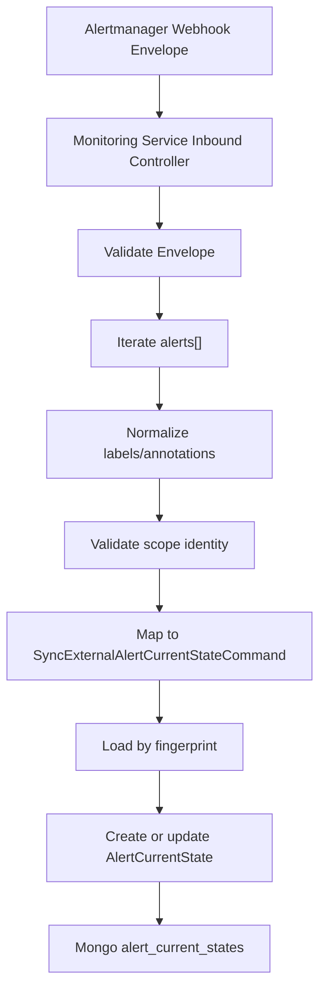
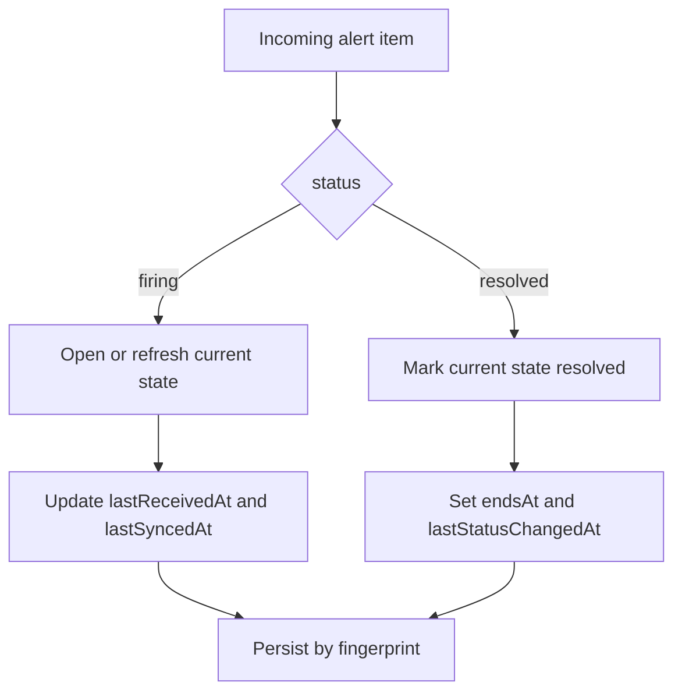

# Spec: Task 4 External Alert Inbound Sync Flow

## Assumptions I'm Making
1. This spec is only for `Task 4` in the delegated alerting plan: ingesting external alert state into `Monitoring Service`.
2. The first implementation target is a lab-friendly HTTP webhook inbound path because we already have a real `Alertmanager` payload sample.
3. `Monitoring Service` continues to own only the current alert read model and dashboard-facing composition, not alert evaluation or notification routing.
4. `AlertCurrentState` from Task 3 is the persistence target for this sync flow.
5. The inbound payload shape is the `Alertmanager` webhook envelope, not a raw Grafana rule-evaluation payload.
6. We should support imperfect upstream payloads such as `"rack_id": "null"` by validating and normalizing them at the mapper boundary instead of persisting garbage as first-class identity.

## Objective
Define the inbound sync path that lets `Monitoring Service` receive externally-evaluated alerts from the `Grafana -> Alertmanager` stack and upsert them into the `AlertCurrentState` read model.

Success for Task 4 means:
- `Monitoring Service` can accept an external webhook payload and map it into the Task 3 read model
- the sync path handles `firing`, `resolved`, and repeated updates idempotently
- invalid or low-quality payload identity is rejected or normalized consistently
- the sync path remains read-side only and does not absorb incident or notification ownership

## Tech Stack
- `NestJS 11`
- `TypeScript 5`
- `MongoDB` via `@nestjs/mongoose`
- Existing `AlertCurrentStateRepository`
- Existing external contract under `src/application/ports/external-alerting-v1.contract.ts`

Relevant files:
- `backend/apps/control-plane/monitoring-service/src/domain/alert-current-state.ts`
- `backend/apps/control-plane/monitoring-service/src/application/ports/alert-current-state.repository.ts`
- `backend/apps/control-plane/monitoring-service/src/application/ports/external-alerting-v1.contract.ts`
- `backend/apps/control-plane/monitoring-service/src/presentation/http/controllers`

## Commands
- Build: `pnpm --dir backend/apps/control-plane/monitoring-service build`
- Lint: `pnpm --dir backend/apps/control-plane/monitoring-service lint`
- Test: `pnpm --dir backend/apps/control-plane/monitoring-service test`
- Coverage: `pnpm --dir backend/apps/control-plane/monitoring-service test:cov`
- E2E: `pnpm --dir backend/apps/control-plane/monitoring-service test:e2e`
- Dev: `pnpm --dir backend/apps/control-plane/monitoring-service start:dev`

## Project Structure
- `backend/apps/control-plane/monitoring-service/docs`
  Task-level specs for alerting read-side work
- `backend/apps/control-plane/monitoring-service/src/application/use-cases`
  Sync orchestration for open, update, resolve semantics
- `backend/apps/control-plane/monitoring-service/src/application/ports`
  External alert contract and repository boundaries
- `backend/apps/control-plane/monitoring-service/src/presentation/http/controllers`
  Inbound webhook controller for lab-first integration
- `backend/apps/control-plane/monitoring-service/src/presentation/http/dto`
  Request DTOs or validation shapes for the webhook envelope
- `backend/apps/control-plane/monitoring-service/src/infrastructure/database/mongodb`
  Persistence target already introduced in Task 3

## Code Style
Prefer an explicit mapper from external webhook payload to internal command shape, with normalization isolated in one place.

```ts
export interface SyncExternalAlertCommand {
  fingerprint: string;
  status: 'firing' | 'resolved';
  receivedAt: string;
  labels: Record<string, string>;
  annotations: Record<string, string>;
  startsAt: string;
  endsAt: string | null;
  generatorUrl: string | null;
}
```

Conventions for this task:
- keep webhook transport DTOs separate from internal domain/read-model types
- normalize suspect string values such as `'null'`, `''`, and whitespace-only IDs before persistence
- prefer one alert-at-a-time mapping inside a batch envelope, even when the HTTP payload contains multiple alerts
- use explicit status semantics instead of overloading generic lifecycle flags

## Testing Strategy
- Unit tests for payload normalization and validation
- Unit tests for mapper behavior from `Alertmanager` alert item to internal sync command
- Use-case tests for:
  - first-time `firing`
  - repeated `firing` update on same `fingerprint`
  - `resolved` transition
  - duplicate `resolved` replay
  - invalid identity payload such as `rack_id = "null"`
- Controller-level tests for accepting a batch webhook envelope and iterating each alert

Priority concerns:
- idempotency by `fingerprint`
- correct status transition semantics
- preservation of human-useful annotations like `summary`, `description`, `current_value`
- no accidental persistence of transport-only fields such as `receiver`, `groupKey`, or raw `commonLabels`

## Boundaries
- Always:
  - treat the webhook as an external integration boundary, not as a trusted domain object
  - persist only normalized `AlertCurrentState` data
  - keep Task 4 read-side only
  - support envelope batches with one or more alerts
- Ask first:
  - introducing message queue ingestion instead of HTTP for the first slice
  - storing full raw payloads long-term in Mongo
  - adding triage or incident linkage in the same task
  - changing upstream Grafana/Alertmanager payload contracts from inside this task
- Never:
  - make `Monitoring Service` responsible for rule evaluation, dedup routing, or notifications
  - persist invalid identifiers like literal `"null"` as if they were real `rackId` or `nodeId`
  - use `scopeId` as a fallback identity field
  - create incident workflow side effects from this inbound sync path

## External Payload Understanding
Task 4 is based on the `Alertmanager` webhook envelope. The sample payload shows:
- envelope fields such as `receiver`, `status`, `groupLabels`, `commonLabels`, `commonAnnotations`
- a list of `alerts[]`, each carrying:
  - `status`
  - `labels`
  - `annotations`
  - `startsAt`
  - `endsAt`
  - `generatorURL`
  - `fingerprint`

Important interpretation rules:
- the authoritative unit for persistence is each item in `alerts[]`, not the envelope as a whole
- envelope-level `status` is useful for debugging but alert-level `status` should win for state transitions
- `commonLabels` and `commonAnnotations` are fallback context only; they must not overwrite alert-specific values when the alert item already provides them

## Current Problem
After Task 3, `Monitoring Service` has a place to store current external alert state, but it still has no ingestion path.

Without Task 4:
- dashboard-serving APIs cannot consume real external alert state yet
- external alert lifecycle remains stranded in Grafana/Alertmanager/webhook sink
- there is no backend-owned projection for open/update/resolve semantics

The sample payload also reveals a data-quality risk:
- `rack_id` may arrive as the literal string `"null"`
- some fields are transport/debug-oriented such as `__values__`, `groupKey`, `receiver`
- not every upstream label should become a first-class domain field

## Proposed Flow
### Step 1: Receive webhook envelope
- expose a lab-first inbound endpoint in `Monitoring Service`
- accept a batch payload from `Alertmanager`
- validate that `alerts` is an array

### Step 2: Iterate each alert item
- for each item in `alerts[]`, build a sync command
- merge per-alert values with envelope fallback only when per-alert values are absent

### Step 3: Normalize and validate
- normalize strings:
  - trim whitespace
  - convert `''` and `'null'` to missing values
- validate required identity keys by `scope_type`
- reject or skip alerts that do not satisfy minimum identity requirements after normalization

### Step 4: Map to `AlertCurrentState`
- map stable labels:
  - `alertname`
  - `severity`
  - `scope_type`
  - `node_id`
  - `rack_id`
  - `workload_id`
  - `environment`
  - `team`
  - `category`
  - `source`
- map useful annotations:
  - `summary`
  - `description`
  - `metric_key`
  - `current_value`
  - `threshold`
  - `observed_window`
  - `dashboard_url`
  - `runbook_url`

### Step 5: Apply idempotent sync semantics
- lookup by `fingerprint`
- if no record exists:
  - create a new current-state document
- if record exists and incoming status is `firing`:
  - update last-seen fields and context fields
  - preserve `firstSyncedAt`
- if record exists and incoming status is `resolved`:
  - mark `status = resolved`
  - set `endsAt`
  - update `lastStatusChangedAt` only if status truly changed
- if a duplicate replay arrives with no meaningful state change:
  - update `lastReceivedAt` and `lastSyncedAt` conservatively if desired
  - do not create a second record

## Identity And Normalization Rules
### Scope requirements
- `scope_type = node`
  - requires `node_id`
  - accepts `rack_id` when present
- `scope_type = rack`
  - requires `rack_id`
- `scope_type = workload`
  - requires `workload_id`
  - accepts `node_id` and `rack_id` when present
- `scope_type = service`
  - first slice may normalize upstream `workload_id` into internal `serviceId` if the service-scope contract still comes that way

### Null-like value handling
- treat the following as missing:
  - `null`
  - `'null'`
  - `''`
  - whitespace-only strings
- if a required identity field becomes missing after normalization, the alert should not be persisted as valid current state

### Unknown extra labels
- keep them out of the main read model unless they are explicitly promoted
- transport/debug labels like `__alert_rule_uid__`, `grafana_folder`, or `silent_dead_nodes_label` should not become primary domain fields in the first slice

## Inbound Command Shape
Task 4 should introduce an internal application command, for example:
- `SyncExternalAlertCurrentStateCommand`

Suggested fields:
- `fingerprint`
- `status`
- `receivedAt`
- `startsAt`
- `endsAt`
- `generatorUrl`
- `labels`
- `annotations`

This command is transport-neutral and gives us room to later ingest from other adapters besides HTTP.

## Persistence Semantics
- persistence target remains `alert_current_states`
- `fingerprint` is the primary upsert key
- records represent current state, not full history
- resolved records remain queryable for later dashboard/API use
- no deletion on resolve in the first slice

## HTTP Endpoint Direction
Lab-first proposal:
- `POST /internal/alerts/external/sync`

Expected behavior:
- accepts an `Alertmanager` webhook envelope
- processes each alert item independently
- returns a summary response such as:
  - total received
  - synced
  - skipped
  - invalid

This response is mainly for observability and lab verification, not for upstream business workflow.

## Error Handling Direction
- malformed envelope:
  - return `400`
- structurally valid envelope with some invalid alerts:
  - process valid alerts
  - report invalid/skipped counts in the response
- unexpected repository or mapper failure:
  - return `500`
  - log the failure with `fingerprint` if available

## Observability Direction
Task 4 should add structured logs around:
- envelope received
- alert item accepted
- alert item skipped due to invalid identity
- alert item synced as `firing`
- alert item synced as `resolved`
- repository update failure

Recommended log keys:
- `fingerprint`
- `alertName`
- `scopeType`
- `status`
- `nodeId`
- `rackId`
- `workloadId`
- `serviceId`

## Mermaid




## Success Criteria
- A task-level spec exists for the external alert inbound sync flow
- The spec clearly defines the inbound adapter as an `Alertmanager` webhook envelope
- The spec defines normalization and validation rules for bad identity values such as `'null'`
- The spec defines idempotent open/update/resolve behavior keyed by `fingerprint`
- The spec preserves `Monitoring Service` as read-side only
- The spec is concrete enough to implement controller, mapper, and use-case slices next

## Open Questions
- When an alert is invalid after normalization, should the endpoint return `200` with a skipped count or `207`-like partial semantics through a normal JSON body?
- Do we want to store a short-lived raw payload excerpt for debugging, or keep logs only in the first slice?
- For `scope_type = service`, should Task 4 normalize `workload_id -> serviceId` immediately, or should infra emit `service_id` before we implement the mapper?
- Should `commonLabels/commonAnnotations` be used as fallback in code from day one, or should the first slice trust only per-alert values to reduce ambiguity?
