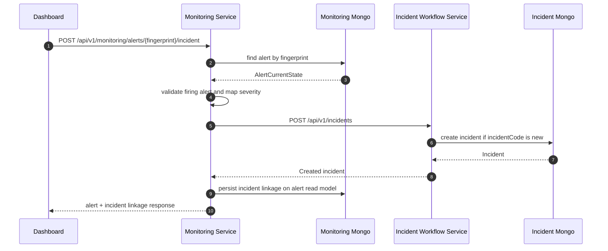

# Task 9 Manual Alert to Incident Interface Design

## Goal

Design the first manual alert-to-incident handoff flow between Monitoring Service and Incident Workflow Service.

The flow is intentionally manual-first:

- Monitoring Service owns alert read/composition state.
- Incident Workflow Service owns incident workflow truth.
- Dashboard operators decide when an active alert should become an incident.
- Monitoring stores only read-side linkage back to the created incident.

This design keeps the path ready for future hybrid automation without making the first implementation auto-create incidents.

## Boundary



## Public Monitoring API

### Endpoint

```http
POST /api/v1/monitoring/alerts/:fingerprint/incident
Authorization: Bearer <operator-jwt>
Content-Type: application/json
```

The endpoint is a command facade owned by Monitoring Service because the dashboard starts from an alert detail/card. It should forward the operator authorization context to Incident Workflow Service rather than creating incidents with an anonymous service identity.

### Permission

Require the existing `INCIDENTS_CREATE` permission on the Monitoring endpoint.

The Incident Workflow Service should still enforce its own `INCIDENTS_CREATE` permission when receiving `POST /incidents`.

### Request

```ts
export interface CreateIncidentFromAlertRequest {
  title?: string;
  description?: string;
  operatorNote?: string;
  severityOverride?: 'HIGH' | 'CRITICAL';
}
```

Request fields are optional so the dashboard can use the safe default mapping first. Overrides are additive and can be omitted by early consumers.

Validation rules:

- `title` is optional and must be a non-empty string when present.
- `description` is optional and must be a string when present.
- `operatorNote` is optional and must be a string when present.
- `severityOverride` is optional and limited to `HIGH` or `CRITICAL`.
- `severityOverride` must not downgrade a critical alert below `CRITICAL`.

### Response

```ts
export interface CreateIncidentFromAlertResponse {
  fingerprint: string;
  action: 'created' | 'already_linked' | 'linked_existing';
  triageStatus: 'incident_created';
  alert: AlertIncidentSourceSummary;
  incident: IncidentLinkageSummary;
}

export interface AlertIncidentSourceSummary {
  alertName: string;
  scopeType: 'node' | 'rack' | 'workload' | 'service';
  nodeId?: string;
  rackId?: string;
  workloadId?: string;
  serviceId?: string;
  severity: 'warning' | 'critical';
  status: 'firing' | 'resolved';
  category: string;
  summary: string;
  startsAt: string;
  lastReceivedAt: string;
}

export interface IncidentLinkageSummary {
  incidentId: string;
  incidentCode: string;
  status: string;
  severity: 'HIGH' | 'CRITICAL';
  title: string;
  createdAt: string;
  linkedAt: string;
}
```

The `action` field makes idempotency explicit:

- `created`: Monitoring created a new incident.
- `already_linked`: Monitoring already had incident linkage for this alert.
- `linked_existing`: Incident Service already had an incident with the deterministic code, and Monitoring repaired/stored the missing linkage.

## Incident Service Outbound Contract

Monitoring calls the existing Incident Workflow Service endpoint:

```http
POST /api/v1/incidents
Authorization: Bearer <operator-jwt>
Content-Type: application/json
```

Payload:

```ts
export interface CreateIncidentRequestDto {
  incidentCode: string;
  title: string;
  description?: string;
  severity: 'LOW' | 'MEDIUM' | 'HIGH' | 'CRITICAL';
  ticketIds?: string[];
  metadata?: Record<string, unknown>;
}
```

Monitoring should not write directly to Incident MongoDB.

## Severity Mapping

Monitoring alert severity maps to Incident severity as follows:

| Monitoring severity | Incident severity |
| --- | --- |
| `critical` | `CRITICAL` |
| `warning` | `HIGH` |

Rationale: in this alerting pipeline, `warning` is already operator-actionable. Mapping it to `MEDIUM` would make warning alerts too easy to ignore in the incident workflow.

## Incident Code

Monitoring generates a deterministic incident code from the alert fingerprint:

```ts
incidentCode = `MON-ALERT-${fingerprint.slice(0, 12).toUpperCase()}`
```

This gives the flow natural idempotency:

- same alert fingerprint should map to the same incident code;
- retried dashboard commands should not create duplicate incidents;
- if Monitoring linkage is missing but Incident already exists, the link can be repaired.

## Default Incident Payload

Default title:

```text
[<scopeType>] <alertName>: <summary>
```

Default description:

```text
<description>

Alert fingerprint: <fingerprint>
Scope: <scopeType> <scope identity>
Started at: <startsAt>
Last received at: <lastReceivedAt>
Dashboard: <dashboardUrl>
Runbook: <runbookUrl>
```

Metadata:

```json
{
  "source": "monitoring_alert",
  "fingerprint": "5f6f7f15437de8fe",
  "alertName": "NodeCpuTempCritical",
  "scopeType": "node",
  "nodeId": "node-msi-743e182b",
  "rackId": "6a5771e5931033f3bd53fb87",
  "monitoringSeverity": "critical",
  "incidentSeverity": "CRITICAL",
  "category": "thermal",
  "environment": "lab",
  "team": "platform",
  "metricKey": "cpu_temp_celsius",
  "currentValue": "91.5",
  "threshold": "90",
  "observedWindow": "5m",
  "dashboardUrl": "/d/monitoring-overview",
  "runbookUrl": "/docs/runbooks/alerting/node-cpu-temp-critical",
  "startsAt": "2026-07-15T20:01:30Z",
  "lastReceivedAt": "2026-07-15T20:01:45.000Z",
  "rawLabels": {},
  "rawAnnotations": {},
  "operatorNote": "Optional note from the dashboard command"
}
```

The metadata preserves raw labels and annotations so future mapper changes or migrations do not lose external alert context.

## Monitoring Linkage Fields

Add read-side linkage to `AlertCurrentState`.

```ts
export type AlertTriageStatus =
  | 'new'
  | 'acknowledged'
  | 'incident_created'
  | 'suppressed';

export interface AlertIncidentLinkage {
  triageStatus: AlertTriageStatus;
  incidentId: string | null;
  incidentCode: string | null;
  incidentStatus: string | null;
  incidentSeverity: 'HIGH' | 'CRITICAL' | null;
  incidentTitle: string | null;
  incidentCreatedAt: string | null;
  incidentLinkedAt: string | null;
  lastEscalatedAt: string | null;
}
```

Initial default for synced alerts:

```json
{
  "triageStatus": "new",
  "incidentId": null,
  "incidentCode": null,
  "incidentStatus": null,
  "incidentSeverity": null,
  "incidentTitle": null,
  "incidentCreatedAt": null,
  "incidentLinkedAt": null,
  "lastEscalatedAt": null
}
```

Monitoring should not store incident comments, ticket workflow, assignees, or resolution truth. Those remain owned by Incident Workflow Service.

## State API Enrichment

Existing state APIs should expose linkage additively:

```ts
export interface AlertStateListItem {
  fingerprint: string;
  alertName: string;
  severity: 'warning' | 'critical';
  status: 'firing' | 'resolved';
  summary: string;
  startsAt: string;
  triageStatus?: AlertTriageStatus;
  incident?: IncidentLinkageSummary | null;
}
```

This keeps backward compatibility because existing fields stay unchanged and new fields are optional/additive.

## Error Semantics

Use the service's existing response envelope and structured error strategy.

| Case | HTTP status | Error code |
| --- | --- | --- |
| Alert fingerprint does not exist | `404` | `ALERT_NOT_FOUND` |
| Alert is resolved and policy requires active alert | `409` | `ALERT_NOT_ACTIVE` |
| Operator lacks permission | `403` | `FORBIDDEN` |
| Request body is invalid | `400` or `422` | `VALIDATION_ERROR` |
| Incident Service is unavailable | `502` | `INCIDENT_SERVICE_UNAVAILABLE` |
| Incident create conflict but existing incident cannot be recovered | `409` | `INCIDENT_ALREADY_EXISTS` |

Phase 1 policy: only active `firing` alerts can be escalated manually. Resolved alert escalation can be added later as a separate use case if the dashboard needs historical incident creation.

## Robustness Rules

- Be conservative when sending to Incident Service: only send normalized DTO fields.
- Be liberal when reading alert state: preserve raw labels and raw annotations in metadata.
- Treat Incident Service responses as untrusted external data at the Monitoring boundary.
- Do not expose raw Incident Service error bodies directly to dashboard consumers.
- Keep endpoint idempotent by deterministic `incidentCode` and read-side linkage checks.
- Avoid changing existing `/monitoring/racks/state` and `/monitoring/nodes/state` fields; add linkage fields only.

## Implementation Units

Suggested implementation order:

1. Add Monitoring domain linkage fields and Mongo schema fields with safe defaults.
2. Add `IncidentWorkflowClientPort` and HTTP adapter in Monitoring Service.
3. Add `CreateIncidentFromAlertUseCase`.
4. Add `POST /monitoring/alerts/:fingerprint/incident` controller and DTOs.
5. Add repository method for updating linkage by fingerprint.
6. Enrich node/rack state alert DTOs with optional `triageStatus` and `incident`.
7. Add tests for severity mapping, idempotency, conflict repair, and permission boundary.

## Acceptance Criteria

- Dashboard can create an incident from an active alert through Monitoring Service.
- `warning` alerts create `HIGH` incidents.
- `critical` alerts create `CRITICAL` incidents.
- Repeating the same command does not create duplicate incidents.
- Monitoring stores only incident linkage, not workflow truth.
- Existing node/rack state response fields remain backward compatible.
