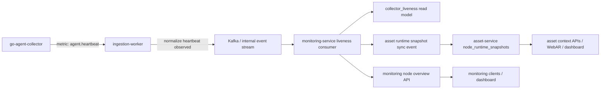

# Spec: Collector Heartbeat Online/Offline

## Assumptions I'm Making

1. `Task 1` chi giai quyet `collector liveness`, khong gop `network reachability`.
2. `go-agent-collector` da co thay doi de gui heartbeat nhe qua metric `agent.heartbeat`.
3. `ingestion-worker` da co ingest contract metric generic, nen co the nhan heartbeat ma khong can doi protobuf field moi.
4. `monitoring-service` la owner cua monitoring read model va la noi suy ra `collectorStatus`.
5. `asset-service` khong tu suy ra liveness; no chi luu/expose derived runtime snapshot cho asset context query.
6. API `GET /api/v1/monitoring/nodes/:nodeId/overview` dang co `node.status = healthy | alerting | unknown` theo nghia monitoring snapshot, nen khong duoc overload field nay thanh collector online/offline.

## Objective

Bo sung co che heartbeat cho Agent Collector de he thong phan biet ro:

- collector dang song va gui telemetry (`collectorStatus = ONLINE`)
- collector da mat heartbeat qua timeout (`collectorStatus = OFFLINE`)
- chua du thong tin ket luan (`collectorStatus = UNKNOWN`)

Muc tieu nghiep vu:

- UI va service downstream khong nham `node health snapshot` voi `collector liveness`
- `monitoring-service` co read model query nhanh cho collector status
- `asset-service` co the biet node co dang duoc collector quan sat hay khong thong qua derived runtime snapshot

## Tech Stack

- Collector: Go `1.25.x`
- Ingestion worker: Go `1.25.x`, gRPC ingest contract, Kafka-ready pipeline
- Monitoring service: NestJS `11`, TypeScript `5.9`, MongoDB read models, ClickHouse doc co san nhung khong phai source of truth cho collector liveness
- Asset service: NestJS `11`, TypeScript `5.9`, MongoDB derived runtime snapshot

## Commands

Collector:

```bash
cd playground/go-agent-collector
go test ./internal/app/...
```

Ingestion worker:

```bash
cd backend/apps/ingestion-worker
go test ./...
```

Monitoring service:

```bash
cd backend/apps/control-plane/monitoring-service
npm test -- --runInBand
npm run build
```

Asset service:

```bash
cd backend/apps/control-plane/asset-service
npm test -- --runInBand
npm run build
```

## Project Structure

```text
playground/go-agent-collector/
  internal/app/                                  -> heartbeat metric da duoc inject vao payload

backend/apps/ingestion-worker/
  internal/domain/telemetry.go                   -> ingest metric model generic
  internal/delivery/telemetry_handler.go         -> map gRPC request vao domain request

backend/apps/control-plane/monitoring-service/
  src/application/services/                      -> compose node overview va runtime state
  src/presentation/http/dto/                     -> schema response REST
  docs/                                          -> spec, interface design, flow

backend/apps/control-plane/asset-service/
  src/domain/entities/asset-context.entities.ts  -> NodeRuntimeSnapshotEntity
  src/use-cases/services/                        -> query asset context co runtimeSnapshot
  docs/asset-schema.md                           -> boundary va read model direction

docs/api-contracts/control-plane/
  monitoring-node-overview.md                    -> hop dong API hien tai can bo sung field
```

## Code Style

Y nghia chinh: giu `monitoring health` va `collector liveness` thanh 2 field rieng, schema ro enum, timestamp ro ten.

```ts
export type CollectorStatus = 'ONLINE' | 'OFFLINE' | 'UNKNOWN';

export interface CollectorLivenessView {
  collectorStatus: CollectorStatus;
  lastHeartbeatAt: string | null;
  collectorFreshnessSec: number | null;
  heartbeatTimeoutSec: number;
}
```

Go ingest side tiep tuc xu ly heartbeat nhu metric thong thuong, khong branch dac biet ngay tai boundary:

```go
const AgentHeartbeatMetricKey = "agent.heartbeat"

func isHeartbeatMetric(metric MetricRecord) bool {
	return metric.MetricKey == AgentHeartbeatMetricKey
}
```

Quy uoc dat ten:

- `collectorStatus` cho liveness cua agent process
- `status` giu nghia monitoring snapshot hien tai
- `lastHeartbeatAt` la source timestamp cuoi cung cua heartbeat
- `heartbeatTimeoutSec` la rule config, expose ra de UI giai thich duoc

## Testing Strategy

- Collector unit tests:
  - co metric `agent.heartbeat` trong payload
  - queue rong van gui heartbeat-only payload
- Ingestion worker unit tests:
  - ingest thanh cong batch chua `agent.heartbeat`
  - heartbeat khong lam vo mapping cua metric thong thuong
- Monitoring service unit/integration tests:
  - tinh `ONLINE` khi `now - lastHeartbeatAt <= heartbeatTimeoutSec`
  - tinh `OFFLINE` khi vuot timeout
  - tinh `UNKNOWN` khi chua co heartbeat nao
  - `node.status` hien tai khong bi doi nghia
  - `GET /monitoring/nodes/:nodeId/overview` tra them field liveness moi
- Asset service unit/integration tests:
  - runtime snapshot map duoc `collectorStatus`
  - query node context/marker resolution expose duoc liveness field moi

## Boundaries

- Always:
  - giu `collectorStatus` tach biet voi monitoring `status/severity`
  - luu timestamp heartbeat cuoi cung trong read model
  - expose schema ro rang qua API thay vi infer ngam o client
  - giu `monitoring-service` la owner suy luan liveness
- Ask first:
  - them topic Kafka moi hay tai su dung topic telemetry event hien co
  - doi enum `NodeHealthState` trong `asset-service`
  - them background scheduler moi neu trong `monitoring-service` chua co co che recalculation
- Never:
  - overload `data.node.status` thanh `ONLINE/OFFLINE`
  - de `asset-service` tro thanh noi tu suy ra heartbeat timeout truth
  - dung ClickHouse lam source of truth duy nhat cho collector online/offline

## Proposed Schema

### 1. Collector payload metric

Heartbeat duoc gui nhu mot metric nhe trong payload hien co:

```json
{
  "metricKey": "agent.heartbeat",
  "scopeType": "node",
  "scopeId": "<nodeId>",
  "value": 1,
  "unit": "state",
  "source": "go-agent-collector",
  "sourceMetric": "collector.runtime.heartbeat",
  "timestamp": "<rfc3339>"
}
```

### 2. Ingestion normalized liveness signal

`ingestion-worker` khong can doi external ingest contract, nhung nen normalize heartbeat thanh mot internal signal/event de `monitoring-service` consume on dinh:

```json
{
  "eventType": "collector.heartbeat.observed",
  "nodeId": "<nodeId>",
  "agentId": "<agentId>",
  "observedAt": "<rfc3339>",
  "source": "go-agent-collector",
  "metricKey": "agent.heartbeat"
}
```

Ghi chu:

- co the publish vao Kafka topic telemetry event hien co neu da co envelope phu hop
- neu chua co infrastructure nay, phase 1 co the upsert read model truc tiep trong `monitoring-service` qua sync API/consumer adapter, nhung target cuoi van nen la event-driven

### 3. Monitoring read model

De xuat them read model rieng cho collector liveness, hoac mo rong read model runtime neu da co:

```ts
interface CollectorLivenessSnapshot {
  nodeId: string;
  agentId: string | null;
  collectorStatus: 'ONLINE' | 'OFFLINE' | 'UNKNOWN';
  lastHeartbeatAt: string | null;
  collectorFreshnessSec: number | null;
  heartbeatTimeoutSec: number;
  updatedAt: string;
  source: string;
  metadata: Record<string, unknown>;
}
```

Rule suy luan:

- `ONLINE`: `lastHeartbeatAt` ton tai va `now - lastHeartbeatAt <= heartbeatTimeoutSec`
- `OFFLINE`: `lastHeartbeatAt` ton tai va `now - lastHeartbeatAt > heartbeatTimeoutSec`
- `UNKNOWN`: chua tung nhan heartbeat, hoac node moi duoc register nhung chua co data

Gia tri timeout de xuat:

- collector gui heartbeat moi `15s` den `30s`
- backend danh `OFFLINE` khi qua `90s`

### 4. Monitoring API impact

API hien tai:

- `GET /api/v1/monitoring/nodes/:nodeId/overview`

De xuat bo sung vao `data.node`:

```json
{
  "nodeId": "node-msi-5e8ff2c0",
  "status": "alerting",
  "severity": "high",
  "lastSeenAt": "2026-07-10T19:00:18.000Z",
  "freshnessSec": 3,
  "collectorStatus": "ONLINE",
  "lastHeartbeatAt": "2026-07-21T08:15:30.000Z",
  "collectorFreshnessSec": 12,
  "heartbeatTimeoutSec": 90
}
```

Ghi chu:

- `status` va `severity` giu nghia monitoring snapshot
- `collectorStatus` bo sung goc nhin liveness cua agent

### 5. Asset service impact

`asset-service` da co `NodeRuntimeSnapshotEntity`, de xuat mo rong:

```ts
export interface NodeRuntimeSnapshotEntity {
  id: string;
  nodeId: string;
  healthState: NodeHealthState;
  heartbeatAt?: string;
  collectorStatus?: 'ONLINE' | 'OFFLINE' | 'UNKNOWN';
  heartbeatTimeoutSec?: number;
  metricsAt?: string;
  source: string;
  metadata: Record<string, unknown>;
}
```

Nguyen tac:

- `asset-service` luu derived field de tra loi nhanh cau hoi "co song khong?"
- source truth cua timeout rule va recalculation van o `monitoring-service`
- dong bo sang asset qua event/read-model replication, khong phai cross-DB query

## Flow



## Implementation Plan

### Phase 1: Ingestion acceptance

- chap nhan heartbeat metric qua ingest path hien co
- identify heartbeat metric trong pipeline
- phat ra normalized liveness signal phia trong he thong

### Phase 2: Monitoring liveness read model

- tao read model luu `lastHeartbeatAt`
- them rule suy ra `collectorStatus`
- bo sung scheduler/recompute hook neu can de node chuyen tu `ONLINE` sang `OFFLINE` du khong co event moi

### Phase 3: API exposure

- mo rong DTO va composer cua `node overview`
- cap nhat API contract doc

### Phase 4: Asset replication

- mo rong `NodeRuntimeSnapshotEntity`
- dong bo `collectorStatus` va `heartbeatAt` vao asset runtime snapshot
- expose field moi trong asset context queries

## Task Breakdown

- [ ] Task: Chap nhan va normalize heartbeat trong `ingestion-worker`
  - Acceptance: ingest batch co `agent.heartbeat` duoc xu ly thanh cong va co internal liveness signal
  - Verify: `cd backend/apps/ingestion-worker && go test ./...`
  - Files: `internal/domain/telemetry.go`, `internal/delivery/telemetry_handler.go`, pipeline/event publisher lien quan

- [ ] Task: Tao collector liveness read model trong `monitoring-service`
  - Acceptance: co the lookup `nodeId` va nhan `collectorStatus`, `lastHeartbeatAt`, `heartbeatTimeoutSec`
  - Verify: `cd backend/apps/control-plane/monitoring-service && npm test -- --runInBand`
  - Files: read model schema/repository, application service, consumer/scheduler

- [ ] Task: Mo rong monitoring node overview API
  - Acceptance: API tra them `collectorStatus`, `lastHeartbeatAt`, `collectorFreshnessSec`, `heartbeatTimeoutSec`
  - Verify: unit test composer + HTTP response test
  - Files: `src/application/services/node-overview-composer.service.ts`, `src/presentation/http/dto/node-overview-response.dto.ts`, `docs/api-contracts/control-plane/monitoring-node-overview.md`

- [ ] Task: Replicate liveness sang `asset-service`
  - Acceptance: `runtimeSnapshot` cua asset context co heartbeat field moi va khong doi owner boundary
  - Verify: `cd backend/apps/control-plane/asset-service && npm test -- --runInBand`
  - Files: `src/domain/entities/asset-context.entities.ts`, persistence/read service lien quan, `docs/asset-schema.md` neu can chot lai wording

## Success Criteria

1. Collector gui heartbeat ma khong can them API ingest moi.
2. Ingestion worker khong lam vo ingest metric hien co khi nhan `agent.heartbeat`.
3. Monitoring service suy ra duoc `ONLINE | OFFLINE | UNKNOWN` tu heartbeat timestamp.
4. `GET /api/v1/monitoring/nodes/:nodeId/overview` tra duoc collector liveness ma khong doi nghia `status`.
5. Asset context query co the biet collector dang online/offline thong qua derived runtime snapshot.
6. ClickHouse co the van nhan raw metric, nhung collector liveness khong phu thuoc vao query ad-hoc tu ClickHouse de xac dinh real-time status.

## Open Questions

1. `monitoring-service` hien da co consumer/event bus nao san de nhan heartbeat, hay can them moi?
2. Phase 1 co chap nhan sync update tu ingestion sang monitoring de di nhanh, hay bat buoc Kafka/event-driven ngay?
3. `asset-service` co can field `collectorStatus` rieng, hay map tam vao `healthState = ONLINE/OFFLINE/UNKNOWN` cho MVP?
4. Co can them endpoint read rieng cho collector liveness, hay mo rong `node overview` la du cho phase nay?
