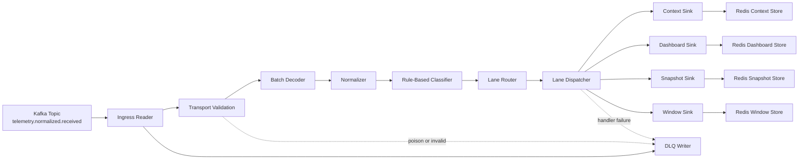

# Telemetry Shaping Service Architecture

## 1. Purpose

`telemetry-shaping-service` is a data-plane stream processor that consumes normalized telemetry batches from Kafka, reshapes them into smaller serving-oriented projections, and persists derived state for downstream consumers.

In the current implementation, the service is written in Go and sits in the `Stream Processing Service` boundary described by the repository architecture. It does not own business workflow state and it is not the source of truth for raw telemetry history. Its job is to transform a high-cardinality telemetry stream into deterministic lane-specific outputs that are easier to serve, monitor, and evolve.

The service currently consumes:

- Kafka topic: `telemetry.normalized.received`
- Message key: `agent_id`

The service currently produces derived serving state in Redis for:

- `context`
- `dashboard`
- `snapshot`
- `window`

## 2. Architectural Role

This service belongs to the data plane and should be understood as a specialized shaping and materialization worker.

Its responsibilities are:

- validate and decode inbound Kafka messages
- normalize batch and metric structure into canonical internal models
- classify metrics into semantic categories and lane masks
- route classified metrics into serving lanes
- materialize lane-specific read models in Redis
- isolate downstream consumers from raw collector payload complexity

It should not:

- own raw telemetry history
- evaluate alert lifecycle state
- own incidents, tickets, or operator workflows
- expose public APIs directly
- perform heavy ML inference inside the hot path

## 3. High-Level Flow



## 4. Processing Pipeline

### 4.1 Ingress Reader

The ingress reader is the bridge between the Kafka consumer adapter and the shaping pipeline.

It is responsible for:

- receiving Kafka records
- running transport-level validation
- invoking the shaping sink
- deciding whether a record can be committed, retried, or sent to DLQ

Observed operational outcomes:

- successful record processing leads to commit
- poison messages are redirected to DLQ
- transient sink failures trigger retry behavior

### 4.2 Decoder

The decoder converts the inbound message payload into a `DecodedBatch`.

At this stage the service extracts:

- `agent_id`
- `batch_sequence`
- batch metadata
- decoded metric records
- hardware fingerprint and headers when present

This step is intentionally close to the wire format and should avoid serving-oriented assumptions.

### 4.3 Normalizer

The normalizer converts decoded records into canonical `NormalizedMetric` values.

Normalization responsibilities include:

- canonical metric key assignment
- stable scope normalization
- timestamp normalization
- unit normalization
- value typing
- tag stringification
- `SeriesKey` generation

The normalizer does not decide where a metric should go. It only produces a canonical metric representation plus a normalization report.

### 4.4 Classifier

The classifier is rule-based in the current version.

Its responsibilities are:

- assign `MetricCategory`
- assign `LaneMask`
- mark `FeatureEligible`
- assign optional `AggregationHint`

The current rules are source-aware and key-aware for:

- Windows Exporter
- Docker
- LibreHardwareMonitor

The classifier is intentionally deterministic. It does not perform feature engineering or statistical inference.

### 4.5 Lane Router

The lane router splits a classified batch into lane-specific batches:

- `context`
- `dashboard`
- `snapshot`
- `window`

Each metric may appear in more than one lane depending on its lane mask.

### 4.6 Lane Dispatcher

The dispatcher invokes one sink per lane.

The current dispatch model is lane-oriented rather than message-oriented. This is important because each lane has a different persistence shape and different downstream read pattern.

## 5. Lane Responsibilities

### 5.1 Context Lane

The context lane materializes relatively stable descriptive state for an asset or scope.

Typical content:

- identity
- relations
- capacity
- inventory
- long-lived attributes

This lane is intended for:

- topology-aware consumers
- context enrichment
- dashboard side panels
- future monitoring and asset lookup services

### 5.2 Dashboard Lane

The dashboard lane materializes a compact dashboard-oriented view.

The current document sections are:

- `Status`
- `Resources`
- `Storage`
- `Network`
- `Health`
- `Counts`

This lane exists to give downstream dashboard readers a smaller and more curated projection than full snapshots.

### 5.3 Snapshot Lane

The snapshot lane stores the latest known metric state per scope.

This lane is the broadest serving projection and is useful when a consumer needs:

- latest metric values
- original normalized metric fields
- classification hints together with the current value

Snapshot is a current-state document, not a rolling history window.

### 5.4 Window Lane

The window lane stores short recent histories for feature-eligible series.

Important characteristics:

- one Redis document per series
- bounded point count per series
- Redis key uses a hashed storage suffix
- the full `SeriesKey` remains inside the document value
- Redis indexes are maintained for lookup by agent and by scope

This lane is intended for:

- trend visualization
- lightweight feature building
- future anomaly and forecasting workers

## 6. Redis Materialization Model

### 6.1 Context Keys

Pattern:

```text
context:<scopeType>:<agentID>:<scopeID>
```

Behavior:

- one document per scope
- batch-sequence guard prevents older batches from overwriting newer state

### 6.2 Dashboard Keys

Pattern:

```text
dashboard:<scopeType>:<agentID>:<scopeID>
```

Behavior:

- one compact dashboard projection per scope
- designed for quick dashboard reads

### 6.3 Snapshot Keys

Pattern:

```text
snapshot:<scopeType>:<agentID>:<scopeID>
```

Behavior:

- one latest-state document per scope
- stores a metric map with normalized metric payload and classification hint

### 6.4 Window Keys

Pattern:

```text
window:<scopeType>:<agentID>:<seriesHash>
```

Behavior:

- one document per time series
- Redis key uses a hash derived from full series identity
- document value still contains the original `SeriesKey`
- point trimming happens during upsert
- older batches are ignored by batch-sequence guard

### 6.5 Window Index Keys

Current indexes:

```text
window:index:agent:<agentID>
window:index:scope:<scopeType>:<scopeID>
```

These indexes are lookup aids, not sources of truth.

Recommended downstream read pattern:

1. resolve candidate document keys from an index
2. fetch the window documents by key
3. interpret the full series identity from the document value

Downstream services should not scan all Redis keys to discover telemetry.

## 7. Series Identity and Storage Keying

`SeriesKey` is built from a full logical identity, not from a short storage label.

The current normalized `SeriesKey` includes:

- `agent_id`
- canonical `metric_key`
- `scope_type`
- `scope_id`
- `source`
- `source_metric`
- sorted dimension tags

This makes `SeriesKey` stable and descriptive, but too large to embed directly in Redis keys at scale.

For that reason, the window lane now uses:

- full logical identity in the document value
- short hashed suffix in the Redis key

This separation is intentional:

- Redis key is an address
- series identity is business metadata

## 8. Failure Model

The service operates with at-least-once delivery semantics from Kafka.

Important behaviors:

- poison messages are redirected to DLQ
- downstream persistence failures trigger retry instead of silent loss
- batch sequence guards reduce stale overwrite risk
- Redis script-backed upserts preserve ordering semantics at the document level

Known failure classes:

- transport validation failure
- decode or normalization failure
- classification fallback to `unknown`
- lane dispatch failure
- Redis execution failure
- consumer poll timeout or poll error

## 9. Operational Observability

The current implementation already emits structured log lines that are useful as primary runtime signals.

### 9.1 Consumer-Level Signals

The consumer metrics log includes counters such as:

- `consumed`
- `committed`
- `retried`
- `dlq_writes`
- `transport_validation_failures`
- `poison_messages`
- `handler_errors`
- `poll_errors`
- `poll_timeouts`

These are the first indicators to watch when checking pipeline health.

### 9.2 Batch-Level Signals

The shaping pipeline logs:

- normalized handoff
- classified handoff

These lines are useful for:

- input versus output metric counts
- category distribution
- lane distribution
- feature eligibility rate

### 9.3 Lane-Level Signals

Each sink logs a lane materialization line:

- `context materialized`
- `dashboard materialized`
- `snapshot materialized`
- `window materialized`

These logs are useful to monitor:

- scope count
- metric count
- series count
- trimmed point count

### 9.4 Recommended Alerts

Recommended operational alerts for this service:

- `committed` stops increasing while `consumed` increases
- `retried` increases continuously
- `dlq_writes` spikes above baseline
- `poison_messages` spikes above baseline
- `poll_errors` persists for multiple intervals
- `window trimmed_points` grows abnormally fast
- Redis persistence failures recur

## 10. Downstream Consumption Guidance

Different downstream consumers should use different lanes.

Use `context` when the consumer needs:

- stable asset identity
- inventory
- capacity
- descriptive attributes

Use `dashboard` when the consumer needs:

- a compact operational card
- summary sections for UI

Use `snapshot` when the consumer needs:

- broad latest-state access
- most recent metric value map per scope

Use `window` when the consumer needs:

- recent short-term history
- lightweight trend calculations
- feature-builder inputs

Downstream services should prefer targeted reads by:

- `agent`
- `scope`
- specific document key

They should avoid:

- full Redis scans
- deriving business logic from Redis key naming alone

## 11. Current Constraints

The service is intentionally conservative in the current phase.

Current constraints:

- classifier is rule-based, not ML-based
- window indexing currently supports `agent` and `scope`, not global discovery
- Redis stores are serving-state stores, not analytical stores
- monitoring is currently log-driven rather than Prometheus-native
- feature generation is prepared by the window lane but not yet implemented as a separate builder stage

## 12. Recommended Next Steps

The most natural follow-up improvements are:

- add a dedicated read adapter for `window` index lookups
- expose Prometheus metrics instead of relying only on logs
- add integration tests for Redis stores and index consistency
- define a downstream feature-builder consumer contract for the window lane
- define stale-index cleanup policy for expired window documents

## 13. Summary

`telemetry-shaping-service` is the shaping layer between raw normalized telemetry events and downstream serving state. It takes a broad, noisy batch stream and materializes smaller purpose-built projections for context, dashboard, snapshot, and short-term windows. Its architecture is intentionally deterministic, Redis-backed, lane-oriented, and ready to support monitoring and future analytics consumers without exposing them to the full complexity of collector payloads.
