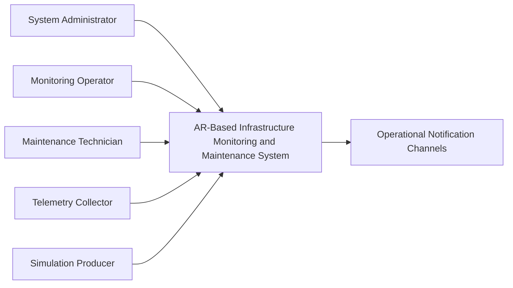

## 4. Business Scope and Capabilities

### 4.1 Scope Overview

The scope of the AR-Based Infrastructure Monitoring and Maintenance System focuses on supporting the core operational workflow of a simulated data center environment. The initial release is designed to help users monitor asset status, respond to alerts, coordinate incident handling, and complete maintenance inspection with clear operational context.

The system boundary includes the following core activities:

- infrastructure status monitoring
- alert review and incident handling
- task handoff between operations and maintenance roles
- asset-specific maintenance inspection
- operational traceability through logs and inspection history
- basic administrative control over users, roles, and asset context

The initial release is intentionally limited to the core workflow needed for capstone demonstration and evaluation. It does not attempt to cover every possible infrastructure operation or enterprise maintenance function.

### 4.2 Context Diagram



### 4.3 External Actors and Systems

| Actor/System | Type | Interaction with the System |
| --- | --- | --- |
| System Administrator | User | Manages access, asset context, monitoring configuration, and operational oversight. |
| Monitoring Operator | User | Reviews alerts, opens incidents, assigns tickets, and follows workflow progress. |
| Maintenance Technician | User | Reviews asset context, performs inspection, and submits inspection results. |
| Telemetry Collector | External System | Sends operational status information into the system for monitoring and analysis. |
| Simulation Producer | External System | Sends simulated operational events to support testing, demo scenarios, and workflow validation. |
| Operational Notification Channels | External System | Receive operational messages such as handling updates, ticket-related notifications, and inspection follow-up. |

### 4.4 Feature Tree

```text
AR-Based Infrastructure Monitoring and Maintenance System
├─ User and Access Management
│  ├─ Authentication
│  │  ├─ Login
│  │  └─ Logout
│  └─ Role Management
│     ├─ System Administrator
│     ├─ Monitoring Operator
│     └─ Maintenance Technician
├─ Asset Context Management
│  ├─ Asset Registry
│  │  ├─ View asset list
│  │  └─ View asset details
│  └─ Marker Mapping
│     ├─ Link marker to asset
│     └─ Resolve asset from marker
├─ Monitoring and Alert Handling
│  ├─ Operational Monitoring
│  │  ├─ View current asset status
│  │  └─ View recent operational history
│  └─ Alert Handling
│     ├─ View alert list
│     ├─ Review alert details
│     └─ Track alert status
├─ Incident and Maintenance Workflow
│  ├─ Incident Management
│  │  ├─ Open incident
│  │  └─ Review incident history
│  ├─ Ticket Handling
│  │  ├─ Assign ticket
│  │  ├─ Update ticket status
│  │  └─ Record handling notes
│  └─ Inspection Management
│     ├─ Review asset context
│     ├─ Submit inspection result
│     └─ Store inspection history
├─ AR Inspection Support
│  ├─ Asset Identification
│  │  └─ Identify the correct asset for inspection
│  ├─ Contextual Review
│  │  └─ View related operational information
│  └─ Inspection Submission
│     └─ Submit inspection outcome
├─ Simulation Support
│  ├─ Scenario Control
│  │  ├─ Run scenario
│  │  └─ Stop scenario
│  └─ Fault Injection
│     └─ Trigger simulated issues
├─ Operational Reporting
│  ├─ Activity History
│  │  ├─ View action logs
│  │  └─ View inspection records
│  └─ Status Summary
│     ├─ View operational summary
│     └─ View handling progress
└─ Administrative Oversight
   ├─ User Oversight
   │  ├─ View users
   │  └─ Manage access level
   └─ Workflow Oversight
      ├─ View workflow status
      └─ Review operational traceability
```

### 4.5 Release Roadmap

| Capability | Initial Release | Subsequent Release | Out of Scope | Notes |
| --- | ---: | ---: | ---: | --- |
| Authentication and role management | Yes |  |  | Required for secure access and role separation. |
| Asset registry and asset details | Yes |  |  | Core context for monitoring and inspection. |
| Marker-to-asset mapping | Yes |  |  | Needed for correct asset identification during field inspection. |
| Current status and recent history view | Yes |  |  | Core monitoring capability for the first release. |
| Alert review and alert status tracking | Yes |  |  | Supports incident triage and operational response. |
| Incident creation and review | Yes |  |  | Required to move from alert to structured handling. |
| Ticket assignment and ticket status tracking | Yes |  |  | Supports handoff to maintenance technicians. |
| Inspection result submission | Yes |  |  | Core maintenance closure activity. |
| Operational activity logs | Yes |  |  | Supports traceability and review. |
| Basic operational summary | Yes |  |  | Limited to the core workflow and current status. |
| Scenario execution | Yes |  |  | Supports demonstration and workflow validation. |
| Fault injection | Yes |  |  | Used to generate realistic demo situations. |
| Extended reporting dashboard |  | Yes |  | Future enhancement for richer summaries and trends. |
| Advanced filtering and analytics |  | Yes |  | Useful after the core workflow is stable. |
| Multi-site support |  | Yes |  | Not required for the first release. |
| Real-time notification expansion |  | Yes |  | Can be expanded after the initial workflow is complete. |
| Full enterprise workflow integration |  |  | Yes | Excluded because the project is limited to a capstone scope. |
| Advanced predictive advisory |  |  | Yes | Excluded from the first version to keep the scope realistic. |
| External business system integration |  |  | Yes | Excluded from the current project boundary. |

### 4.6 Limitations and Exclusions

#### Limitations

- The initial release is limited to a simulated infrastructure environment.
- The system focuses on the core monitoring, alert handling, and inspection workflow only.
- Reporting is limited to basic operational summaries and traceability views.
- The first version is designed for a controlled capstone scenario rather than a full enterprise operating model.
- The workflow scope is intentionally small enough to support demonstration and validation within the project timeline.

#### Exclusions

- The system does not aim to manage all infrastructure operations in a real production data center.
- The system does not include full enterprise integration with external business platforms.
- The system does not include advanced predictive advisory as a required first-release feature.
- The system does not extend to multi-site operational management in the initial release.
- The system does not attempt to replace existing enterprise-grade maintenance or service management platforms.

