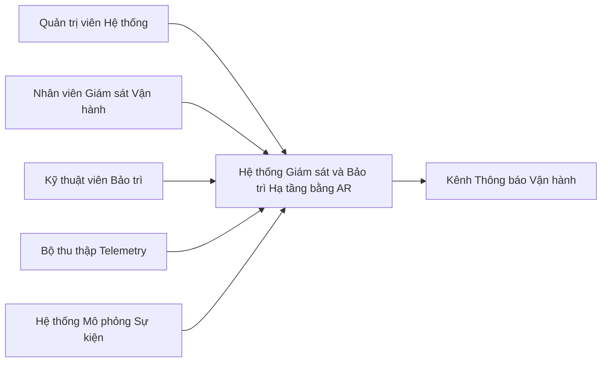

## 4. Phạm vi Nghiệp vụ và Năng lực Hệ thống (Business Scope and Capabilities)

### 4.1 Tổng quan Phạm vi

Phạm vi của **Hệ thống Giám sát và Bảo trì Hạ tầng bằng AR (AR-Based Infrastructure Monitoring and Maintenance System)** tập trung vào việc hỗ trợ quy trình vận hành cốt lõi trong môi trường trung tâm dữ liệu mô phỏng.

Phiên bản phát hành đầu tiên được thiết kế nhằm hỗ trợ người dùng:

- Giám sát trạng thái tài sản.
- Phản hồi các cảnh báo.
- Điều phối xử lý sự cố.
- Thực hiện kiểm tra bảo trì với đầy đủ ngữ cảnh vận hành.

Ranh giới hệ thống bao gồm các hoạt động cốt lõi sau:

- Giám sát trạng thái hạ tầng.
- Xem xét cảnh báo và xử lý sự cố.
- Bàn giao công việc giữa bộ phận vận hành và bảo trì.
- Kiểm tra bảo trì theo từng tài sản cụ thể.
- Đảm bảo khả năng truy vết vận hành thông qua nhật ký và lịch sử kiểm tra.
- Quản trị cơ bản đối với người dùng, vai trò và thông tin tài sản.

Phiên bản đầu tiên được **giới hạn có chủ đích** để tập trung vào quy trình cốt lõi phục vụ cho việc trình diễn và đánh giá đồ án capstone. Hệ thống không hướng tới việc bao phủ toàn bộ các hoạt động vận hành hạ tầng hoặc các chức năng bảo trì cấp doanh nghiệp.

---

### 4.2 Sơ đồ Ngữ cảnh (Context Diagram)



---

### 4.3 Tác nhân và Hệ thống Bên ngoài

| Tác nhân / Hệ thống         | Loại               | Tương tác với Hệ thống                                                                       |
| --------------------------- | ------------------ | -------------------------------------------------------------------------------------------- |
| Quản trị viên Hệ thống      | Người dùng         | Quản lý quyền truy cập, thông tin tài sản, cấu hình giám sát và giám sát hoạt động vận hành. |
| Nhân viên Giám sát Vận hành | Người dùng         | Xem xét cảnh báo, tạo sự cố, phân công công việc và theo dõi tiến độ xử lý.                  |
| Kỹ thuật viên Bảo trì       | Người dùng         | Xem thông tin tài sản, thực hiện kiểm tra và gửi kết quả kiểm tra.                           |
| Bộ thu thập Telemetry       | Hệ thống bên ngoài | Gửi dữ liệu trạng thái vận hành vào hệ thống để giám sát và phân tích.                       |
| Hệ thống Mô phỏng Sự kiện   | Hệ thống bên ngoài | Gửi các sự kiện mô phỏng phục vụ kiểm thử, trình diễn và xác thực quy trình làm việc.        |
| Kênh Thông báo Vận hành     | Hệ thống bên ngoài | Nhận các thông báo như cập nhật xử lý, thông báo liên quan đến ticket và kết quả kiểm tra.   |

---

### 4.4 Cây Chức năng (Feature Tree)

```text
Hệ thống Giám sát và Bảo trì Hạ tầng bằng AR
├─ Quản lý Người dùng và Quyền truy cập
│  ├─ Xác thực
│  │  ├─ Đăng nhập
│  │  └─ Đăng xuất
│  └─ Quản lý Vai trò
│     ├─ Quản trị viên Hệ thống
│     ├─ Nhân viên Giám sát Vận hành
│     └─ Kỹ thuật viên Bảo trì
├─ Quản lý Thông tin Tài sản
│  ├─ Danh mục Tài sản
│  │  ├─ Xem danh sách tài sản
│  │  └─ Xem chi tiết tài sản
│  └─ Ánh xạ Marker
│     ├─ Liên kết marker với tài sản
│     └─ Xác định tài sản từ marker
├─ Giám sát và Xử lý Cảnh báo
│  ├─ Giám sát Vận hành
│  │  ├─ Xem trạng thái hiện tại của tài sản
│  │  └─ Xem lịch sử vận hành gần đây
│  └─ Xử lý Cảnh báo
│     ├─ Xem danh sách cảnh báo
│     ├─ Xem chi tiết cảnh báo
│     └─ Theo dõi trạng thái cảnh báo
├─ Quy trình Sự cố và Bảo trì
│  ├─ Quản lý Sự cố
│  │  ├─ Tạo sự cố
│  │  └─ Xem lịch sử sự cố
│  ├─ Quản lý Ticket
│  │  ├─ Phân công ticket
│  │  ├─ Cập nhật trạng thái ticket
│  │  └─ Ghi chú xử lý
│  └─ Quản lý Kiểm tra
│     ├─ Xem thông tin tài sản
│     ├─ Gửi kết quả kiểm tra
│     └─ Lưu lịch sử kiểm tra
├─ Hỗ trợ Kiểm tra bằng AR
│  ├─ Nhận diện Tài sản
│  │  └─ Xác định chính xác tài sản cần kiểm tra
│  ├─ Xem Ngữ cảnh Liên quan
│  │  └─ Hiển thị thông tin vận hành liên quan
│  └─ Gửi Kết quả Kiểm tra
│     └─ Gửi kết quả kiểm tra
├─ Hỗ trợ Mô phỏng
│  ├─ Điều khiển Kịch bản
│  │  ├─ Chạy kịch bản
│  │  └─ Dừng kịch bản
│  └─ Mô phỏng Sự cố
│     └─ Kích hoạt lỗi mô phỏng
├─ Báo cáo Vận hành
│  ├─ Lịch sử Hoạt động
│  │  ├─ Xem nhật ký hoạt động
│  │  └─ Xem hồ sơ kiểm tra
│  └─ Tổng quan Trạng thái
│     ├─ Xem báo cáo vận hành tổng hợp
│     └─ Xem tiến độ xử lý
└─ Giám sát Quản trị
   ├─ Quản lý Người dùng
   │  ├─ Xem danh sách người dùng
   │  └─ Quản lý mức quyền truy cập
   └─ Giám sát Quy trình
      ├─ Xem trạng thái quy trình
      └─ Kiểm tra khả năng truy vết vận hành
```

---

### 4.5 Lộ trình Phát hành (Release Roadmap)

| Năng lực / Chức năng                       | Phiên bản đầu tiên | Phiên bản tiếp theo | Ngoài phạm vi | Ghi chú                                                                |
| ------------------------------------------ | :----------------: | :-----------------: | :-----------: | ---------------------------------------------------------------------- |
| Xác thực và quản lý vai trò                |         Có         |                     |               | Yêu cầu để bảo mật truy cập và phân tách quyền hạn.                    |
| Danh mục tài sản và thông tin chi tiết     |         Có         |                     |               | Cung cấp ngữ cảnh cốt lõi cho giám sát và kiểm tra.                    |
| Ánh xạ Marker với tài sản                  |         Có         |                     |               | Cần thiết để nhận diện chính xác tài sản khi kiểm tra hiện trường.     |
| Xem trạng thái hiện tại và lịch sử gần đây |         Có         |                     |               | Năng lực giám sát cốt lõi của phiên bản đầu tiên.                      |
| Xem và theo dõi trạng thái cảnh báo        |         Có         |                     |               | Hỗ trợ đánh giá và xử lý sự cố.                                        |
| Tạo và xem sự cố                           |         Có         |                     |               | Cần thiết để chuyển từ cảnh báo sang quy trình xử lý có cấu trúc.      |
| Phân công và theo dõi trạng thái ticket    |         Có         |                     |               | Hỗ trợ bàn giao công việc cho kỹ thuật viên bảo trì.                   |
| Gửi kết quả kiểm tra                       |         Có         |                     |               | Hoạt động cốt lõi để hoàn tất quy trình bảo trì.                       |
| Nhật ký hoạt động vận hành                 |         Có         |                     |               | Hỗ trợ truy vết và đánh giá.                                           |
| Báo cáo vận hành cơ bản                    |         Có         |                     |               | Giới hạn trong quy trình cốt lõi và trạng thái hiện tại.               |
| Thực thi kịch bản mô phỏng                 |         Có         |                     |               | Hỗ trợ trình diễn và xác thực quy trình.                               |
| Mô phỏng lỗi (Fault Injection)             |         Có         |                     |               | Dùng để tạo các tình huống demo thực tế.                               |
| Dashboard báo cáo nâng cao                 |                    |         Có          |               | Cải tiến trong tương lai để cung cấp báo cáo và xu hướng chi tiết hơn. |
| Bộ lọc và phân tích nâng cao               |                    |         Có          |               | Phù hợp sau khi quy trình cốt lõi đã ổn định.                          |
| Hỗ trợ nhiều địa điểm (Multi-site)         |                    |         Có          |               | Không cần thiết trong phiên bản đầu tiên.                              |
| Mở rộng thông báo thời gian thực           |                    |         Có          |               | Có thể phát triển sau khi hoàn thiện quy trình cơ bản.                 |
| Tích hợp quy trình doanh nghiệp toàn diện  |                    |                     |      Có       | Loại khỏi phạm vi vì dự án chỉ ở mức đồ án capstone.                   |
| Tư vấn dự đoán nâng cao                    |                    |                     |      Có       | Loại khỏi phiên bản đầu tiên để đảm bảo phạm vi thực tế.               |
| Tích hợp với hệ thống nghiệp vụ bên ngoài  |                    |                     |      Có       | Không nằm trong phạm vi dự án hiện tại.                                |

---

### 4.6 Giới hạn và Nội dung Loại trừ

#### Giới hạn (Limitations)

- Phiên bản đầu tiên chỉ hỗ trợ môi trường hạ tầng mô phỏng.
- Hệ thống chỉ tập trung vào quy trình giám sát, xử lý cảnh báo và kiểm tra bảo trì cốt lõi.
- Báo cáo chỉ giới hạn ở các tổng hợp vận hành cơ bản và chức năng truy vết.
- Phiên bản đầu tiên được thiết kế cho kịch bản đồ án có kiểm soát thay vì mô hình vận hành doanh nghiệp hoàn chỉnh.
- Phạm vi quy trình được giữ ở mức vừa đủ để có thể trình diễn và xác thực trong thời gian thực hiện dự án.

#### Nội dung Loại trừ (Exclusions)

- Hệ thống không nhằm quản lý toàn bộ hoạt động hạ tầng trong trung tâm dữ liệu thực tế.
- Hệ thống không bao gồm tích hợp đầy đủ với các nền tảng nghiệp vụ doanh nghiệp bên ngoài.
- Hệ thống không bao gồm chức năng tư vấn dự đoán nâng cao như một tính năng bắt buộc của phiên bản đầu tiên.
- Hệ thống không hỗ trợ quản lý vận hành đa địa điểm trong phiên bản đầu tiên.
- Hệ thống không có mục tiêu thay thế các nền tảng quản lý dịch vụ hoặc bảo trì cấp doanh nghiệp hiện có.
