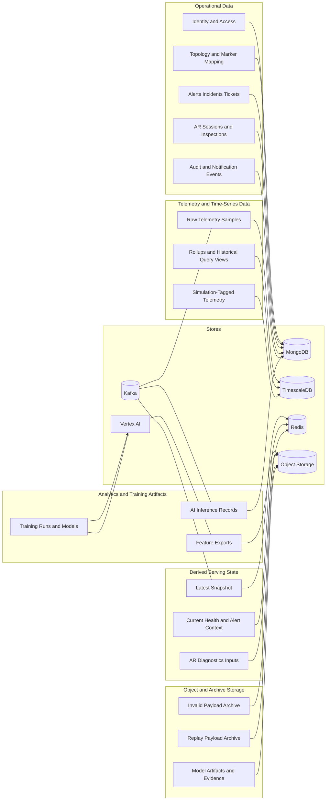

# Data Architecture

## 1. Overview

Tai lieu nay mo ta `data architecture` cho nen tang AR + AI infrastructure monitoring, bo sung cho `data_pipeline_architecture.md`.

Muc tieu:

- Tach ro `source of truth`, `derived serving state`, `event backbone`, `training artifacts`.
- Gan ownership cho `MongoDB`, `TimescaleDB`, `Redis`, `Kafka`, `Object Storage`, `Vertex AI`.
- Dua `database-per-service principle` vao target microservices architecture.
- Lam ro luong du lieu cho dashboard, alerting, incident-ticket, AR diagnostics va AI lifecycle.

## 2. Data Domains

He thong co 5 nhom du lieu chinh:

1. `Operational data`
2. `Telemetry and time-series data`
3. `Derived serving state`
4. `Analytics and training artifacts`
5. `Object and archive storage`

## 3. Database-per-Service Principle

Target architecture tuan theo nguyen tac microservices:

- moi microservice so huu `database schema` hoac `database boundary` rieng.
- khong co service nao duoc query truc tiep bang/collection authoritative cua service khac.
- chia se du lieu giua services thong qua:
  - `REST` hoac `gRPC` cho synchronous reads/commands
  - `Kafka` cho async propagation
  - read-model duplication neu can cho serving
- `MongoDB` co the van la mot cum vat ly chung, nhung phai tach `logical databases` hoac it nhat `strict ownership schemas` theo service.
- `TimescaleDB` la data store authoritative cho telemetry, nhung ownership table/schema van thuoc `Telemetry Ingestion` va `Stream Processing`.

## 4. Data Architecture View

## 5. Store Ownership Model

| Store | Role in architecture | Authoritative or derived | Data classes |
| --- | --- | --- | --- |
| `MongoDB` | Operational system of record, segmented by service boundary | `Authoritative` | identity data, asset context data, monitoring data, incident workflow data, simulation data, notification data, audit data, AI inference records |
| `TimescaleDB` | Telemetry and historical metric store | `Authoritative` for time-series | raw telemetry, rollups, simulation-tagged telemetry, historical query support |
| `Redis` | Serving-state store and hot cache, segmented by service namespace | `Derived` | latest snapshot, current health state, recent dashboard cards, AR diagnostics input cache, short-lived coordination state |
| `Kafka` | Event log and integration backbone | `Neither` source of truth nor query store | canonical telemetry events, snapshot update events, alert candidate events, AI completion events, inspection and simulation events |
| `Object Storage` | Archive and artifact storage | `Authoritative` for archives/artifacts only | invalid payload archives, replay payload archives, attachments, evidence, exported features, model artifacts |
| `Vertex AI` | Managed training and model lifecycle platform | `Managed system of record` for model lifecycle | experiments, training jobs, model registry entries, optional batch prediction outputs |

## 6. Service-to-Database Ownership

| Service | Authoritative database boundary | Notes |
| --- | --- | --- |
| `Identity Service` | `identity_db` trong MongoDB | users, roles, sessions |
| `Asset Context Service` | `asset_context_db` trong MongoDB | topology, markers, asset graph |
| `Monitoring Service` | `monitoring_db` trong MongoDB | alert rules, alerts, monitoring read models |
| `Incident Workflow Service` | `incident_workflow_db` trong MongoDB | incidents, tickets, comments, inspections, AR sessions |
| `Simulation Service` | `simulation_db` trong MongoDB | scenarios, runs, simulation events metadata |
| `Notification Service` | `notification_db` trong MongoDB | notification events, delivery attempts |
| `Audit Service` | `audit_db` trong MongoDB | audit logs |
| `Telemetry Ingestion Service` | `telemetry_raw` schema/tables trong TimescaleDB | raw telemetry write path |
| `Stream Processing Service` | `telemetry_serving` schema/tables trong TimescaleDB + `redis namespaces` | aggregates, materialized telemetry views, snapshots |
| `AI Analytics Service` | `ai_analytics_db` trong MongoDB + `Vertex AI` registry | inference records in MongoDB, training lifecycle in Vertex AI |

Quy tac:

- khong query truc tiep collection cua service khac.
- neu can read nhanh cho UI, tao read model rieng hoac goi service owner.
- BFF khong so huu database authoritative.

## 7. Source of Truth vs Derived State

### 7.1 Authoritative Data

Nhung du lieu sau phai duoc xem la `authoritative`:

- `Topology`, `markers`, `tickets`, `alerts`, `inspections` trong `MongoDB`.
- `raw telemetry` va `historical telemetry windows` trong `TimescaleDB`.
- `model registry` va `training lifecycle` trong `Vertex AI`.

### 7.2 Derived Serving State

Nhung du lieu sau la `derived state`, khong duoc xem la source of truth:

- `latest snapshot`
- `current node/service/container health`
- `dashboard cards`
- `AR diagnostics input cache`
- `temporary feature windows`

Neu derived state mat hoac stale:

- co the rebuild tu raw telemetry, operational data, hoac event replay.
- khong duoc gay sai lech lifecycle nghiep vu.

### 7.3 Event Backbone

`Kafka` chi luu `integration events` va `processing events`:

- no khong phai noi luu ticket hay alert authoritative.
- no khong phai noi query dashboard.
- no ho tro fan-out, replay, decoupling va stream processing.

## 8. Domain-to-Store Mapping

| Domain | Primary store | Supporting stores | Notes |
| --- | --- | --- | --- |
| `Identity and Access` | `identity_db` | `Redis` | session/cache co the nam o Redis, nhung user/role la authoritative trong identity boundary |
| `Topology and Asset` | `asset_context_db` | `Redis`, `Kafka` | topology va marker thuoc cung service boundary |
| `Telemetry Ingestion` | `TimescaleDB` | `Kafka`, `Object Storage` | raw samples vao TSDB, payload archive vao object storage |
| `Monitoring and Alerting` | `monitoring_db` | `Kafka`, `Redis`, `TimescaleDB` | monitoring service own alerts va monitoring read models |
| `Incident and Maintenance Workflow` | `incident_workflow_db` | `Kafka`, `Object Storage` | workflow lifecycle va inspection truth |
| `AR Diagnostics` | `Redis` | `monitoring_db`, `asset_context_db`, `incident_workflow_db`, `TimescaleDB` | diagnostics la composed read model qua BFF, khong co DB authoritative rieng |
| `AI Analytics` | `ai_analytics_db` | `TimescaleDB`, `Kafka`, `Vertex AI`, `Object Storage` | inference records trong MongoDB boundary rieng, training lifecycle trong Vertex AI |
| `Simulation` | `simulation_db` | `TimescaleDB`, `Kafka` | run metadata trong MongoDB, telemetry simulation vao TSDB |

## 9. Data Lifecycle

### 9.1 Telemetry Lifecycle

`Telemetry Collector` gui batch telemetry:

1. `Ingestion Service` xac thuc va validate payload.
2. Raw telemetry duoc luu vao `TimescaleDB`.
3. Canonical events duoc publish len `Kafka`.
4. Snapshot va serving views duoc materialize vao `Redis`.
5. Aggregate/history views duoc tao trong `TimescaleDB`.
6. AI va alerting consume event hoac query recent windows.

### 9.2 Alert and Workflow Lifecycle

1. `Rule` hoac `AI` sinh `alert candidate`.
2. `Monitoring Service` tao `alert` authoritative trong `monitoring_db`.
3. `Incident Workflow Service` tao/cap nhat `incident` va `ticket` trong `incident_workflow_db`.
4. `Notification Service` va `Audit Service` ghi du lieu vao DB boundary rieng cua chung, dong thoi consume event qua `Kafka`.

### 9.3 AR Diagnostics Lifecycle

1. `WebAR Client` quet QR marker.
2. `Control Plane API and BFF` resolve marker va truy van:
   - asset context tu `Asset Context Service`
   - snapshot tu `Redis`
   - active alerts tu `Monitoring Service`
   - ticket context tu `Incident Workflow Service`
   - historical snippets tu `TimescaleDB` neu can
   - AI inference tu `AI Analytics Service`
3. `AR diagnostics bundle` duoc assemble va tra ve client.

### 9.4 AI Lifecycle

1. Stream processing tao feature windows va inference online trong platform.
2. `AI inference records` duoc ghi vao `ai_analytics_db`.
3. Feature export va training datasets duoc dua ra `Object Storage`.
4. `Vertex AI` doc feature export, chay training, ghi experiment va model registry.
5. Model metadata moi duoc sync tro lai platform de online scoring worker su dung.

## 10. Storage Decisions

### 10.1 MongoDB

Dung cho:

- du lieu nghiep vu co lifecycle ro rang.
- query theo document/workflow context.
- tach thanh `logical database per service`.

Khong nen dung cho:

- raw telemetry khoi luong lon trong target architecture.
- mot service query truc tiep collection authoritative cua service khac.

### 10.2 TimescaleDB

Dung cho:

- raw telemetry.
- historical analysis.
- aggregates/rollups.
- simulation-tagged telemetry.

Khong nen dung cho:

- workflow business entities nhu `ticket`, `incident`, `marker`.

### 10.3 Redis

Dung cho:

- latest snapshot.
- hot cache cho dashboard va AR.
- short-lived coordination state.

Khong nen dung cho:

- authoritative business truth dai han.

### 10.4 Kafka

Dung cho:

- event fan-out.
- decoupling processing stages.
- replay stream khi can rebuild serving state.

Khong nen dung cho:

- query dashboard.
- luu ticket/incident authoritative.

### 10.5 Vertex AI

Dung cho:

- training jobs.
- experiment tracking.
- model registry.
- batch predictive analytics neu mo rong.

Khong dung cho:

- online inference hot path trong `v1`.
- request/response AR diagnostics.

## 11. Companion Boundary Table

| Boundary | Primary responsibilities | Primary tech stack | Primary data owned or consumed |
| --- | --- | --- | --- |
| `Operational data` | Quan ly user, topology, marker, alert, incident, ticket, AR session, inspection, audit | MongoDB split by service boundary | Authoritative business entities |
| `Telemetry and time-series data` | Luu raw telemetry, historical windows, rollups, simulation-tagged metrics | TimescaleDB | Raw metric samples, aggregates, history views |
| `Derived serving state` | Cung cap current health, latest snapshot, hot diagnostics inputs | Redis namespaced per service | Latest metrics, current health, AR/dashboard serving cache |
| `Event backbone` | Van chuyen event va ho tro replay | Kafka | Canonical telemetry events, snapshot updates, alert/AI/simulation events |
| `Archive and artifacts` | Luu invalid payload, replay archives, feature exports, attachments, model artifacts | Object Storage | Replay payloads, evidence, datasets, artifacts |
| `Training and model lifecycle` | Quan ly training, experiment, registry | Vertex AI | Experiments, training jobs, registered models |

## 12. Architecture Constraints

- `AR` khong duoc doc raw telemetry truc tiep.
- `AI` khong so huu alert lifecycle, chi enrich hoac de xuat.
- `Redis` khong la source of truth.
- `Kafka` khong thay the database nghiep vu.
- `Vertex AI` khong chen vao hot path online monitoring trong `v1`.
- `Docker` va `k3s` la boundary runtime, khong thay doi ownership du lieu logic.
- `BFF` khong co database authoritative rieng.
- moi microservice phai truy cap data cua service khac thong qua API hoac event, khong query truc tiep database cua nhau.

## 13. Review Checklist

Tai lieu nay dat muc tieu neu:

- tra loi duoc raw telemetry nam o dau.
- tra loi duoc latest/current state nam o dau.
- tra loi duoc workflow operational data nam o dau.
- tra loi duoc AI training/model lifecycle nam o dau.
- tach ro authoritative data, derived state va event backbone.
- the hien ro `database-per-service principle`.
- cho phep suy ra detailed schema va retention strategy o vong tiep theo ma khong phai re-decide ownership.
