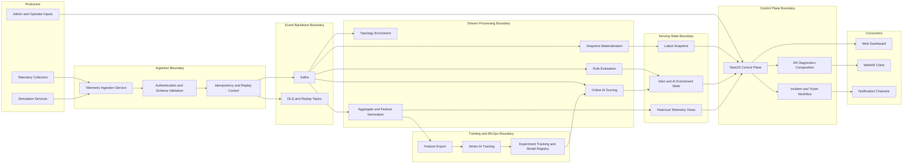

# Data Pipeline Architecture

## 1. Overview

Tai lieu nay mo ta `data pipeline architecture` cho nen tang AR + AI infrastructure monitoring theo muc `abstract-enterprise`.

Muc tieu:

- Xac dinh ro boundary cua pipeline du lieu.
- Chot vai tro cua `Kafka`, `TimescaleDB`, `MongoDB`, `Redis`, `Vertex AI`, `Docker`, `k3s`.
- Lam cau noi giua service decomposition, interaction matrix va data architecture.
- Dam bao pipeline ho tro du monitoring, alerting, AR diagnostics va AI enrichment.

Trong pham vi tai lieu nay:

- `NestJS` la `control plane`.
- Python services la `data plane`.
- `Vertex AI` chi duoc dung cho `training`, `experiment`, `model registry` va `batch analytics` neu can.
- `Kafka` la `event backbone` bat buoc trong target architecture.

Ngoai pham vi:

- Chi tiet worker-level implementation.
- Chi tiet schema cua tung Kafka message.
- Chi tiet deployment manifest cho `k3s`.

## 2. Architecture Drivers

Pipeline du lieu phai dap ung cac rang buoc nghiep vu sau:

- Nhan duoc telemetry va metadata tu `Telemetry Collector` theo mo hinh `near-realtime with batching`.
- Ho tro luong `alert -> incident -> ticket -> AR inspection`.
- Cung cap `latest diagnostics bundle` nhanh cho `WebAR Client` ma khong query raw telemetry truc tiep.
- Ho tro AI anomaly detection va risk scoring nhu mot lop enrich, khong lam blocking monitoring co ban.
- Tach ro `source of truth` va `derived serving state`.

## 3. Target Runtime Assumptions

- Platform core chay bang container images tren `Docker`.
- Cac thanh phan self-managed duoc orkestrate tren `k3s`.
- `Vertex AI` nam ngoai `k3s`, duoc coi la managed external AI platform.
- `Kafka` la event backbone chinh cho telemetry, snapshot, alert, AI va simulation events.
- `Socket` chi dung cho realtime push ra client, khong dung lam backbone giua services.

## 4. Boundary View

## 5. Responsibilities by Boundary

| Boundary                      | Primary responsibilities                                                                                       | Primary tech stack                                             | Primary data owned or consumed                                                                                                                                                              |
| ----------------------------- | -------------------------------------------------------------------------------------------------------------- | -------------------------------------------------------------- | ------------------------------------------------------------------------------------------------------------------------------------------------------------------------------------------- |
| `Producers`                   | Sinh telemetry, metadata, simulation events, user commands                                                     | Go/Python collectors, simulation runtime, web/admin clients    | Raw metrics, container metadata, simulation events, commands                                                                                                                                |
| `Ingestion Boundary`          | Nhan batch payload, auth, schema validation, idempotency, persist raw input, publish canonical events          | Python FastAPI, Pydantic, REST, object archive adapter         | Batched telemetry payloads, invalid payload archives, replay metadata                                                                                                                       |
| `Event Backbone Boundary`     | Van chuyen su kien bat dong bo, DLQ, replay                                                                    | Kafka                                                          | `telemetry.raw`, `telemetry.validated`, `telemetry.enriched`, `snapshot.updated`, `alert.candidate`, `alert.created`, `ai.inference.completed`, `inspection.submitted`, `simulation.events` |
| `Stream Processing Boundary`  | Enrich topology, materialize snapshot, evaluate rule, tao aggregate/feature, online scoring                    | Python workers, Kafka consumers, gRPC lookup, TimescaleDB jobs | Enriched telemetry, snapshot state, alert candidates, aggregate windows, feature windows, anomaly/risk outputs                                                                              |
| `Serving State Boundary`      | Cung cap current state, alert/AI enrichment state, history views                                               | Redis, TimescaleDB, MongoDB read models                        | Latest snapshot, active alert context, AI enrichment context, historical telemetry views                                                                                                    |
| `Control Plane Boundary`      | Query orchestration, incident-ticket workflow, diagnostics bundle assembly, notification and audit integration | NestJS, REST, gRPC, Socket                                     | Dashboard payloads, AR diagnostics inputs, incident/ticket lifecycle, notification events                                                                                                   |
| `Training and MLOps Boundary` | Batch feature export, model training, experiment tracking, model registry                                      | Vertex AI                                                      | Feature datasets, training jobs, model artifacts, experiment metadata                                                                                                                       |
| `Consumers`                   | Dashboard, AR, notification delivery                                                                           | Web app, AR client, notification adapters                      | Dashboard views, AR diagnostics bundles, outbound operational notifications                                                                                                                 |

## 6. Pipeline Responsibilities

### 6.1 Telemetry Ingestion Service

`Telemetry Ingestion Service` co cac trach nhiem:

- Nhan batch telemetry va metadata qua `REST`.
- Xac thuc `collector` hoac `simulation producer`.
- Validate schema va version payload.
- Enforce `idempotency` va `at-least-once` delivery semantics.
- Persist raw telemetry vao `TimescaleDB` va luu invalid/archive payload vao object storage neu can.
- Publish canonical telemetry events len `Kafka`.

### 6.2 Stream Processing

Luong stream processing trong target architecture gom:

- `Topology enrichment`: gan `rack`, `switch`, `node`, `service`, `container` context vao telemetry.
- `Snapshot materialization`: cap nhat `latest snapshot` cho dashboard va AR.
- `Rule evaluation`: danh gia threshold/state-based rules va sinh `alert candidate`.
- `Aggregate and feature generation`: tao time windows, recent trends, feature sets cho reporting va AI.
- `Online AI scoring`: sinh `anomaly score`, `risk score`, `predictive hints` trong platform runtime.

### 6.3 Serving

Serving layer phai cung cap:

- `latest snapshot` cho dashboard va AR.
- `active alerts` va `ai inference results` cho diagnostics.
- `historical telemetry views` cho history, reporting va root-cause analysis.
- `AR diagnostics bundle inputs` de control plane compose bundle.

### 6.4 Training and MLOps

`Vertex AI` chi tham gia cac luong sau:

- batch feature export tu platform.
- model training jobs.
- experiment tracking.
- model registry.
- batch predictive analytics neu phase sau can them.

`Vertex AI` khong nam trong hot path cua:

- realtime telemetry ingest.
- dashboard snapshot updates.
- online AR diagnostics retrieval.

## 7. Kafka Event Model

Target architecture chot `Kafka` la backbone voi model su kien sau:

| Topic                    | Producer boundary            | Consumer boundary                                      | Purpose                                               |
| ------------------------ | ---------------------------- | ------------------------------------------------------ | ----------------------------------------------------- |
| `telemetry.raw`          | `Ingestion Boundary`         | `Stream Processing Boundary`                           | Phan bo raw telemetry da qua auth va basic validation |
| `telemetry.validated`    | `Ingestion Boundary`         | `Stream Processing Boundary`                           | Canonical event sau schema validation va idempotency  |
| `telemetry.enriched`     | `Stream Processing Boundary` | `Stream Processing Boundary`, `Control Plane Boundary` | Du lieu da duoc map topology va co ngu canh asset     |
| `snapshot.updated`       | `Stream Processing Boundary` | `Control Plane Boundary`                               | Cap nhat latest state cho dashboard va AR             |
| `alert.candidate`        | `Stream Processing Boundary` | `Control Plane Boundary`, `Stream Processing Boundary` | Ket qua danh gia rule hoac AI can triage              |
| `alert.created`          | `Control Plane Boundary`     | `Consumers`, `Control Plane Boundary`                  | Alert chinh thuc trong workflow van hanh              |
| `ai.inference.completed` | `Stream Processing Boundary` | `Control Plane Boundary`                               | Ket qua anomaly/risk scoring                          |
| `inspection.submitted`   | `Control Plane Boundary`     | `Control Plane Boundary`, `Consumers`                  | Dong bo inspection vao ticket/notification flow       |
| `simulation.events`      | `Producers`                  | `Ingestion Boundary`, `Control Plane Boundary`         | Trace va inject context tu simulation runtime         |

Quy tac delivery:

- `at-least-once` la mac dinh.
- DLQ/replay la concern bat buoc o target architecture.
- `Kafka` la event log va integration backbone, khong la `source of truth` cua business entities.

## 8. Protocol Mapping

Quy uoc protocol giua cac boundary:

- `REST`: `client -> control plane`, `collector -> ingestion`.
- `gRPC`: internal synchronous lookup/composition nhu `ingestion -> topology`, `AR diagnostics -> snapshot/alert/ticket`.
- `Kafka`: async event propagation cho telemetry, alert, AI, simulation, inspection.
- `Socket`: realtime push tu control plane den dashboard va AR client neu can.

## 9. AR as a First-Class Consumer

AR phai duoc xem la mot `first-class consumer` cua data plane:

- `WebAR Client` khong query raw telemetry truc tiep.
- `AR Diagnostics` luon di qua `NestJS control plane`.
- `Control plane` compose diagnostics bundle tu:
  - `latest snapshot`
  - `active alerts`
  - `AI inference results`
  - `ticket context`
  - `maintenance guide`

Dieu nay giup:

- latency on dinh hon cho thao tac scan marker.
- policy/rbac duoc ap dung tap trung.
- tranh leaky coupling giua AR client va telemetry storage.

## 10. Deployment Boundary Note

Trong tai lieu nay can giu tach ro `logical architecture` va `runtime architecture`:

- `Docker` va `k3s` thuoc `runtime and deployment boundary`.
- `Kafka`, `TimescaleDB`, `MongoDB`, `Redis` la platform components ho tro logic boundary.
- `Vertex AI` la external managed platform, khong trien khai trong `k3s`.

Vi vay, cac diagram trong tai lieu chinh khong nen tron:

- business/service responsibilities
- event flow responsibilities
- cluster/node topology chi tiet

## 11. Review Checklist

Tai lieu nay duoc xem la dat muc tieu neu:

- cho thay ro `Kafka`, `TimescaleDB`, `MongoDB`, `Redis`, `Vertex AI`, `Docker`, `k3s` nam o dau.
- moi luong nghiep vu lon deu co boundary phu trach ro rang.
- AR duoc bieu dien la consumer cua serving state, khong truy cap raw telemetry.
- `Vertex AI` duoc gioi han dung cho training/MLOps, khong chen vao hot path runtime.
- tai lieu du abstract de dua vao doc chinh, nhung van du cu the de suy ra detailed design o vong sau.
