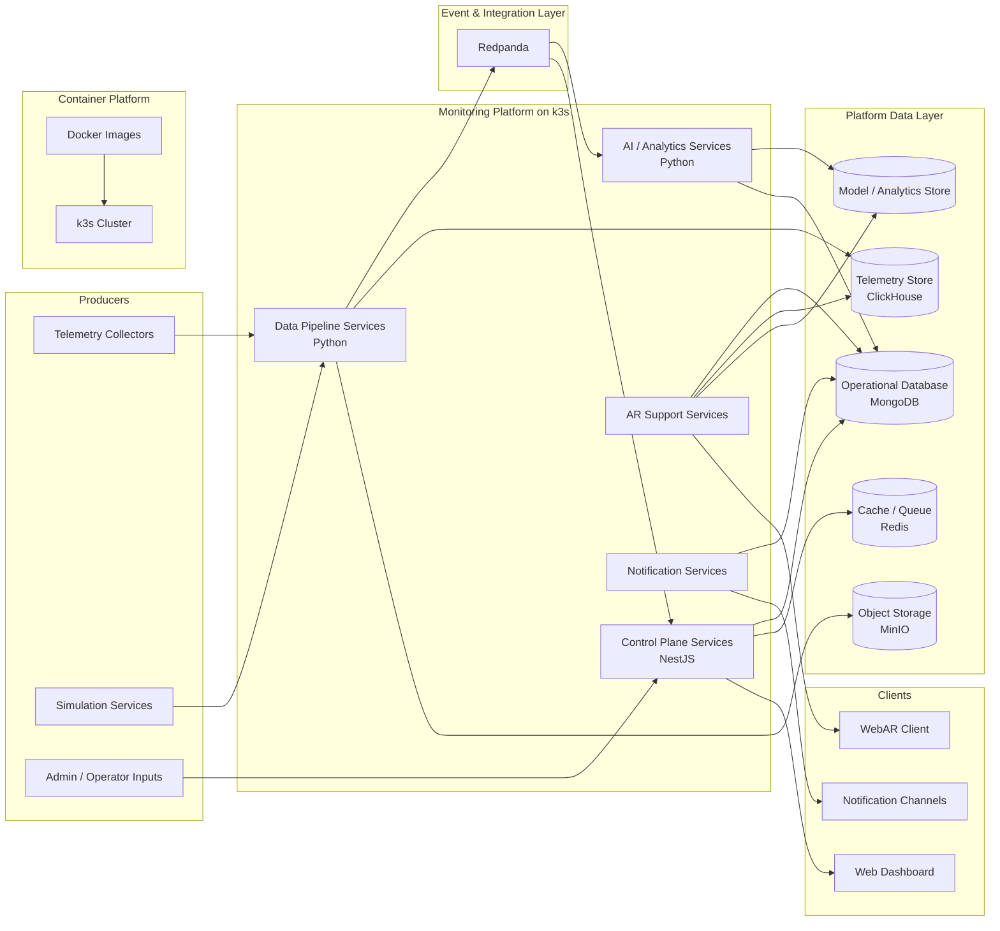

```mermaid
flowchart LR
    subgraph Producers["Producers"]
        P1[Telemetry Collectors]
        P2[Simulation Services]
        P3[Admin / Operator Inputs]
    end

    subgraph Platform["Monitoring Platform on k3s"]
        S1[Control Plane Services\nNestJS]
        S2[Data Pipeline Services\nPython]
        S3[AI / Analytics Services\nPython]
        S4[AR Support Services]
        S5[Notification Services]
    end

    subgraph Messaging["Event & Integration Layer"]
        M1[Redpanda]
    end

    subgraph Data["Platform Data Layer"]
        D1[(Operational Database\nMongoDB)]
        D2[(Telemetry Store\nClickHouse)]
        D3[(Cache / Queue\nRedis)]
        D4[(Object Storage\nMinIO)]
        D5[(Model / Analytics Store)]
    end

    subgraph Clients["Clients"]
        C1[Web Dashboard]
        C2[WebAR Client]
        C3[Notification Channels]
    end

    subgraph Runtime["Container Platform"]
        R1[Docker Images]
        R2[k3s Cluster]
    end

    P1 --> S2
    P2 --> S2
    P3 --> S1

    S2 --> M1
    M1 --> S3
    M1 --> S1

    S1 --> D1
    S1 --> D3
    S2 --> D2
    S2 --> D4
    S3 --> D5
    S3 --> D1
    S4 --> D1
    S4 --> D2
    S4 --> D5
    S5 --> D1

    S1 --> C1
    S4 --> C2
    S5 --> C3

    R1 --> R2
```

Note: Control Plane gom cac service khac o ben trong check [[service_interaction_matrix]] de biet toan bo service

