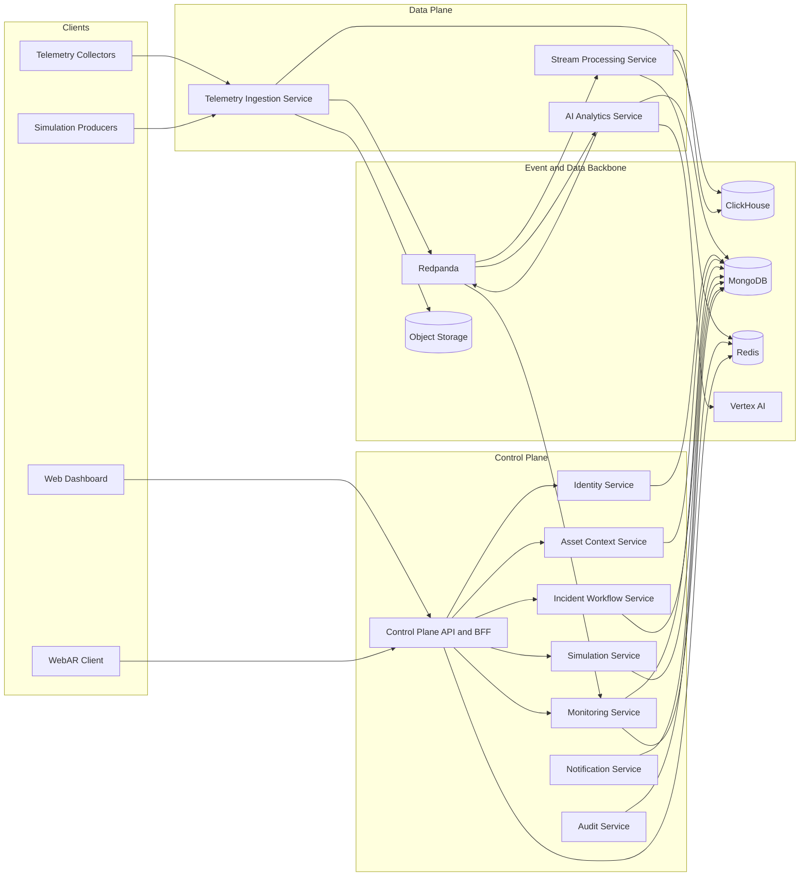

# System Architecture

## 1. Architecture Overview

The target architecture is divided into four primary layers:

- Client Layer
- Control Plane
- Data Plane
- Platform Data Layer

External actors interact with the system through:

- Web Dashboard
- WebAR Client
- Telemetry Collectors
- Simulation Producers

## 2. High-Level View

## 3. Client Layer

### 3.1 Web Dashboard

The Web Dashboard serves as the primary interface for:

- Monitoring
- Alert triage
- Incident tracking
- Administrative operations
- Historical analysis and reporting

### 3.2 WebAR Client

The WebAR Client is a browser-based field interface that uses QR marker-based spatial anchoring.

It does not:

- Read raw telemetry directly
- Own business truth
- Bypass the Control Plane when requesting diagnostic bundles

## 4. Control Plane

### 4.1 Control Plane API and BFF

This component acts as the public entry point for both the Dashboard and the WebAR Client.

Responsibilities:

- Authentication and authorization
- Request orchestration
- Response shaping
- AR diagnostics composition
- Real-time push communication when required

It does not own authoritative business data.

### 4.2 Identity Service

Responsible for managing:

- Users
- Roles
- Permissions
- Sessions and authentication metadata

### 4.3 Asset Context Service

Responsible for managing:

- Racks
- Switches
- Nodes
- Services
- Containers
- Marker mappings

### 4.4 Monitoring Service

Responsible for managing:

- Alert rules
- Alerts
- Monitoring read models

### 4.5 Incident Workflow Service

Responsible for managing:

- Incidents
- Tickets
- Comments
- Inspection workflows
- AR sessions and inspections

### 4.6 Simulation Service

Responsible for managing:

- Scenarios
- Runs
- Fault injection lifecycle

### 4.7 Notification Service

Responsible for managing:

- Notification events
- Delivery status

### 4.8 Audit Service

Responsible for managing:

- Audit logs
- Business operation traceability

## 5. Data Plane

### 5.1 Telemetry Ingestion Service

Responsibilities:

- Receive telemetry batches
- Authenticate producers
- Validate schemas
- Enforce idempotency
- Persist raw telemetry
- Publish canonical events

### 5.2 Stream Processing Service

Responsibilities:

- Enrich telemetry using topology context
- Materialize snapshots
- Evaluate rules
- Build aggregates
- Generate alert candidates

### 5.3 AI Analytics Service

Responsibilities:

- Anomaly detection
- Risk scoring
- Predictive hint generation
- Store inference records

## 6. Storage and Event Backbone

### 6.1 MongoDB

Used for operational data:

- Identity
- Asset context
- Monitoring
- Incident workflow
- Simulation
- Notification
- Audit
- AI inference records

### 6.2 ClickHouse

Used for telemetry and historical time-series data:

- Raw telemetry
- Rollups
- Historical windows
- Simulation-tagged metrics

### 6.3 Redis

Used for derived serving state:

- Latest snapshots
- Hot cache
- Current health context

### 6.4 Redpanda

Used as the event backbone for:

- Telemetry events
- Snapshot events
- Alert candidate events
- AI output events
- Simulation events

Redpanda is not the source of truth for business entities.

### 6.5 Object Storage

Used for:

- Invalid payload archives
- Replay archives
- Feature exports
- Model artifacts

### 6.6 Vertex AI

Used for:

- Training jobs
- Experiment tracking
- Model registry

Vertex AI is not part of the runtime hot path.

## 7. Database-per-Service Principle

Each service must own its own data boundary.

Rules:

- Do not directly query another service's authoritative database
- Cross-service communication must occur through REST, gRPC, or Redpanda
- Sharing the same physical database cluster does not imply shared ownership
- The BFF must not own an authoritative database

## 8. Architecture Constraints

- The WebAR Client must not read raw telemetry directly
- AI must not own the alert lifecycle
- Redpanda must not replace business databases
- Redis is not a source of truth
- The Control Plane should not become a query-only aggregation layer
- Business domains must maintain proper bounded contexts according to service decomposition

