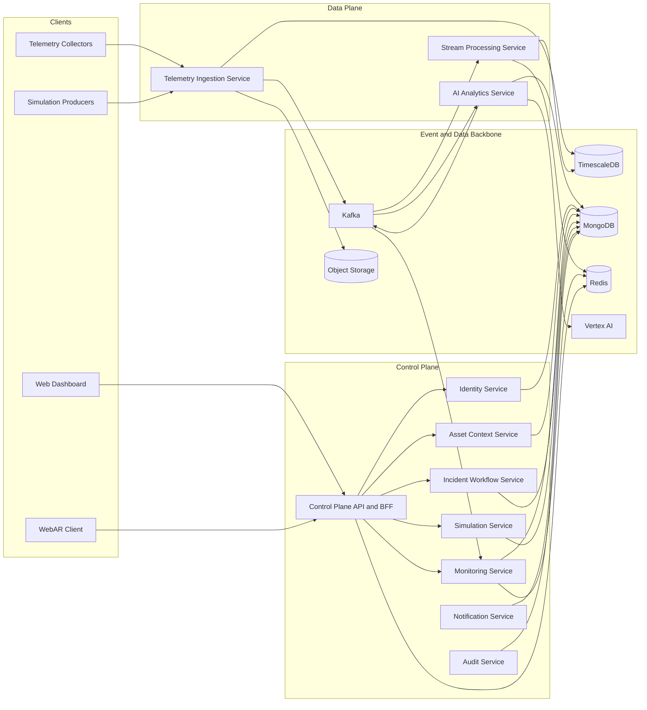

# Kiến Trúc Hệ Thống

## 1. Tổng Quan Kiến Trúc

Kiến trúc target được chia thành 4 lớp chính:

* Client Layer
* Control Plane
* Data Plane
* Platform Data Layer

Tác nhân bên ngoài giao tiếp với hệ thống thông qua:

* Web Dashboard
* WebAR Client
* Telemetry Collectors
* Simulation Producers

## 2. Góc Nhìn Cấp Cao (High-Level View)

## 3. Client Layer

### 3.1 Web Dashboard

Web Dashboard là giao diện chính cho:

* Monitoring
* Alert Triage
* Incident Tracking
* Admin Operations
* History and Reporting

### 3.2 WebAR Client

WebAR Client là giao diện hiện trường chạy trên trình duyệt (browser-based), sử dụng QR marker-based spatial anchoring.

Nó không:

* Đọc raw telemetry trực tiếp
* Sở hữu business truth
* Bypass control plane khi cần diagnostics bundle

## 4. Control Plane

### 4.1 Control Plane API and BFF

Đây là public entrypoint cho Dashboard và WebAR Client.

Trách nhiệm:

* Authentication/Authorization (AuthN/AuthZ)
* Request Orchestration
* Response Shaping
* AR Diagnostics Composition
* Realtime Push nếu cần

Nó không sở hữu authoritative business data.

### 4.2 Identity Service

Quản lý:

* User
* Role
* Permission
* Session và Authentication Metadata

### 4.3 Asset Context Service

Quản lý:

* Rack
* Switch
* Node
* Service
* Container
* Marker Mapping

### 4.4 Monitoring Service

Quản lý:

* Alert Rules
* Alerts
* Monitoring Read Models

### 4.5 Incident Workflow Service

Quản lý:

* Incident
* Ticket
* Comment
* Inspection Workflow
* AR Sessions và Inspections

### 4.6 Simulation Service

Quản lý:

* Scenario
* Run
* Fault Injection Lifecycle

### 4.7 Notification Service

Quản lý:

* Notification Events
* Delivery Status

### 4.8 Audit Service

Quản lý:

* Audit Log
* Traceability cho các thao tác nghiệp vụ

## 5. Data Plane

### 5.1 Telemetry Ingestion Service

Trách nhiệm:

* Nhận telemetry batch
* Xác thực producer
* Validate schema
* Enforce idempotency
* Persist raw telemetry
* Publish canonical events

### 5.2 Stream Processing Service

Trách nhiệm:

* Enrich telemetry theo topology
* Materialize snapshot
* Evaluate rules
* Build aggregates
* Produce alert candidates

### 5.3 AI Analytics Service

Trách nhiệm:

* Anomaly Detection
* Risk Scoring
* Predictive Hint Generation
* Lưu trữ inference records

## 6. Storage và Event Backbone

### 6.1 MongoDB

Dùng cho operational data:

* Identity
* Asset Context
* Monitoring
* Incident Workflow
* Simulation
* Notification
* Audit
* AI Inference Records

### 6.2 TimescaleDB

Dùng cho telemetry và historical time-series:

* Raw Telemetry
* Rollups
* Historical Windows
* Simulation-Tagged Metrics

### 6.3 Redis

Dùng cho derived serving state:

* Latest Snapshot
* Hot Cache
* Current Health Context

### 6.4 Kafka

Dùng làm event backbone:

* Telemetry Events
* Snapshot Events
* Alert Candidate Events
* AI Output Events
* Simulation Events

Kafka không phải source of truth của business entity.

### 6.5 Object Storage

Dùng cho:

* Invalid Payload Archive
* Replay Archive
* Feature Export
* Model Artifacts

### 6.6 Vertex AI

Dùng cho:

* Training Jobs
* Experiment Tracking
* Model Registry

Vertex AI không nằm trong hot path runtime.

## 7. Nguyên Tắc Database-per-Service

Mỗi service phải có vùng ownership riêng.

Quy tắc:

* Không query trực tiếp database authoritative của service khác
* Cross-service access thông qua REST, gRPC hoặc Kafka
* Shared physical cluster không đồng nghĩa với shared ownership
* BFF không sở hữu authoritative database

## 8. Các Ràng Buộc Kiến Trúc

* WebAR Client không đọc raw telemetry trực tiếp
* AI không sở hữu alert lifecycle
* Kafka không thay thế database nghiệp vụ
* Redis không phải source of truth
* Control Plane không nên biến thành query-only aggregation service
* Đoạn nghiệp vụ phải giữ đúng bounded context theo service decomposition
