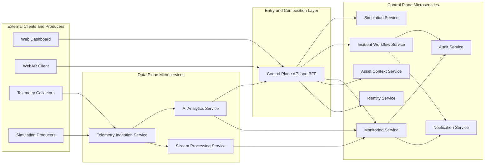

# Service Decomposition

## 1. Overview

Tai lieu nay mo ta `service decomposition` cho nen tang AR + AI infrastructure monitoring.

Muc tieu:

- Chot ranh gioi `logical services` truoc khi di sau vao API, data architecture, event contract va deployment.
- Tach ro `control plane`, `data plane`, `AR support`, `simulation`, `notification`, `audit`.
- Gan ownership cho tung service theo `business capability`, khong theo controller hay table.

Trong pham vi:

- `logical service decomposition`
- trach nhiem chinh cua moi service
- ownership du lieu chinh
- giao tiep tong quat giua cac service

Ngoai pham vi:

- symbol-level implementation
- file/module layout cu the trong codebase
- schema chi tiet cua API va event

## 2. Decomposition Principles

Service decomposition trong he thong nay tuan theo cac nguyen tac sau:

- Tach theo `bounded context`, khong tach service chi vi co man hinh hay endpoint rieng.
- Moi microservice phai co `source of truth` hoac `clear ownership boundary`.
- `Write path` phai co owner ro rang.
- `Read aggregation` duoc phep tong hop tu nhieu service, nhung logic tong hop nen nam o `API composition layer`, khong tao them microservice chi de query-hop.
- `AI` la lop enrich, khong so huu `alert lifecycle`.
- `AR diagnostics` la mot `query use case`, khong phai microservice domain doc lap.
- Neu mot capability chi lam `fan-in query` ma khong co du lieu rieng, no nen la `BFF / gateway composition capability`.

## 3. Microservice Landscape

## 4. Service Catalog

### 4.1 Control Plane API and BFF

Vai tro:

- public entrypoint cho `Web Dashboard` va `WebAR Client`
- API composition cho dashboard va AR diagnostics
- apply authn/authz, response shaping, realtime push gateway

Primary ownership:

- khong so huu business data authoritative
- so huu request orchestration va read composition

Ly do tach:

- day la lop composition can thiet trong microservices architecture de tranh tao nhieu microservice chi de query-hop.

### 4.2 Identity Service

Vai tro:

- quan ly user, role, permission
- login, logout, token/session
- access policy cho dashboard, AR, admin

Primary ownership:

- users
- roles
- sessions hoac auth metadata

Ly do tach:

- day la capability nen, khong nen tron voi topology hay workflow van hanh.

### 4.3 Asset Context Service

Vai tro:

- quan ly `rack` va `node`
- quan ly marker mapping
- cung cap asset graph va marker resolution context cho monitoring, ingestion va AR

Primary ownership:

- racks
- nodes
- markers

Ly do tach:

- `topology` va `marker mapping` co cung asset boundary. Tach thanh hai microservice se tao query-coupling khong can thiet, nhat la cho AR flow.
- workload runtime nhu `container` va `service state` khong nen la truth trong asset boundary; no nen duoc compose tu monitoring/data plane khi can.

### 4.4 Telemetry Ingestion Service

Vai tro:

- nhan batch telemetry va metadata tu collector/simulation
- validate schema
- xac thuc producer
- enforce idempotency
- persist raw telemetry
- publish canonical telemetry events

Primary ownership:

- ingest contract
- replay/archive metadata cua payload

Primary stores consumed or written:

- ClickHouse
- Redpanda
- Object Storage

Ly do tach:

- day la data plane entrypoint, khong nen de NestJS control plane ganh.

### 4.5 Stream Processing Service

Vai tro:

- topology enrichment
- snapshot materialization
- rule evaluation
- aggregate generation
- feature preparation cho AI va reporting

Primary ownership:

- latest snapshot derived state
- aggregate windows
- alert candidate emission

Primary stores:

- Redis
- ClickHouse

Ly do tach:

- trong target microservices, `snapshot` va `rule evaluation` deu la derived-stream capability. Tach qua nho se tang event chatter va tang query-sharing ma khong tao them business value.

### 4.6 Monitoring Service

Vai tro:

- quan ly `alert_rules`
- quan ly lifecycle `alerts`
- phuc vu monitoring queries, alert queue, recent health views cho dashboard va AR
- consume snapshot, aggregate va AI enrichments de tao read models phuc vu UI

Primary ownership:

- alert rules
- alerts
- monitoring read models phuc vu control plane

Ly do tach:

- `alert rules`, `alerts`, va `monitoring read APIs` thuoc cung mot bounded context. `AR diagnostics` khong nen la microservice rieng ma nen doc du lieu monitoring thong qua lop nay.

### 4.7 AI Analytics Service

Vai tro:

- anomaly detection
- risk scoring
- predictive hint generation
- enrich dashboard, AR, alert triage

Primary ownership:

- ai_models metadata trong platform
- ai_inferences

Supporting platforms:

- ClickHouse
- Redpanda
- Vertex AI
- Object Storage

Ly do tach:

- AI la mot lop enrich doc lap, co vong doi rieng so voi alert va ticket.

### 4.8 Incident Workflow Service

Vai tro:

- quan ly `incident`
- quan ly `maintenance ticket`
- quan ly inspection va maintenance execution workflow
- assignment, comment, status transition
- lien ket alert, inspection va notification

Ticket operations trong boundary nay bao gom:

- tao ticket tu incident hoac alert da duoc triage
- assign va reassign ticket cho `Maintenance Technician`
- acknowledge ticket
- cap nhat status `IN_PROGRESS`, `ESCALATED`, `RESOLVED`, `CANCELLED`
- ghi comment, evidence va execution note
- lien ket inspection result vao ticket
- dong bo ticket outcome nguoc lai incident/notification flow

Primary ownership:

- incidents
- maintenance_tickets
- ticket_comments
- ar_sessions
- ar_inspections

Authoritative write path:

- `createTicket`
- `assignTicket`
- `reassignTicket`
- `acknowledgeTicket`
- `startTicketWork`
- `escalateTicket`
- `resolveTicket`
- `cancelTicket`
- `addTicketComment`
- `attachInspectionEvidence`
- `closeIncidentFromWorkflowOutcome`

Ly do tach:

- incident, ticket, comment, inspection la mot chuoi workflow lien tuc. Tach `Inspection Service` rieng se lam query-sharing va transaction boundary kho hon ma khong co them bounded context moi.
- ticket operation khong nen nam trong `Asset Context Service` vi ticket khong phai topology truth.
- ticket operation cung khong nen nam trong `Monitoring Service` vi monitoring owns alert lifecycle, con ticket la maintenance execution truth.

### 4.9 Simulation Service

Vai tro:

- quan ly scenario
- start/stop run
- inject fault
- publish simulation lifecycle va telemetry context

Primary ownership:

- simulation_scenarios
- simulation_runs
- simulation_events

Ly do tach:

- simulation la domain phuc vu nghien cuu/demo, co producer behavior rieng.

### 4.10 Notification Service

Vai tro:

- gui notification den dashboard, webhook, email/chat sau nay
- retry va ghi nhan delivery status

Primary ownership:

- notification_events
- delivery logs

Ly do tach:

- side effects can duoc tach de retry va quan sat de hon.

### 4.11 Audit Service

Vai tro:

- ghi audit trail cho thao tac nghiep vu va quan tri
- cho phep truy vet actor, object, thoi diem, action

Primary ownership:

- audit_logs

Ly do tach:

- audit la cross-cutting concern, nhung van can owner ro rang.

## 5. Deployment Grouping Recommendation

De trien khai thuc te o giai doan hien tai, co the gom logical services thanh 3 cum vat ly:

| Deployment group | Included logical services | Primary stack |
| --- | --- | --- |
| `Control Plane Edge` | Control Plane API and BFF | NestJS gateway/BFF, Socket |
| `Control Plane Core` | Identity, Asset Context, Monitoring, Incident Workflow, Simulation, Notification, Audit | NestJS microservices, MongoDB |
| `Python Data Plane` | Telemetry Ingestion, Stream Processing, AI Analytics | Python FastAPI/workers, ClickHouse, Redpanda, Redis |
| `Shared Platform Components` | Redpanda, ClickHouse, MongoDB, Redis, Object Storage | Docker, k3s |

Dieu nay giu duoc:

- logical separation cho architecture
- deployment practicality cho PoC va giai doan dau

## 6. Ownership Summary

| Service | Owns source of truth? | Primary store | Notes |
| --- | --- | --- | --- |
| `Control Plane API and BFF` | No | None | API composition only |
| `Identity Service` | Yes | MongoDB | auth and access truth |
| `Asset Context Service` | Yes | MongoDB | topology and marker truth |
| `Telemetry Ingestion Service` | Yes for ingest path and raw telemetry write | ClickHouse | owns ingestion contract |
| `Stream Processing Service` | No, derived only | Redis + ClickHouse | owns snapshots, aggregates, candidates as derived data |
| `Monitoring Service` | Yes | MongoDB | owns alert lifecycle and monitoring read models |
| `AI Analytics Service` | Yes for inference records, no for alert lifecycle | MongoDB + Vertex AI | enrich-only for operations |
| `Incident Workflow Service` | Yes | MongoDB | owns incident, ticket, inspection workflow |
| `Simulation Service` | Yes | MongoDB | owns scenario/run truth |
| `Notification Service` | Yes | MongoDB | owns delivery status |
| `Audit Service` | Yes | MongoDB | owns audit truth |

## 7. Review Checklist

Tai lieu nay dat muc tieu neu:

- moi service map ro vao mot `bounded context`.
- khong con microservice chi ton tai de tong hop query nhu `AR Diagnostics Service`.
- `write path` cua alert, ticket, inspection, topology, marker deu co owner ro rang.
- `AI` va `AR` khong vo tinh tro thanh source-of-truth domain.
- `control plane` va `data plane` duoc tach logic ro rang.
- co the dung tai lieu nay lam input truc tiep cho `service interaction matrix`, `data architecture`, `API architecture`, `deployment architecture`.

