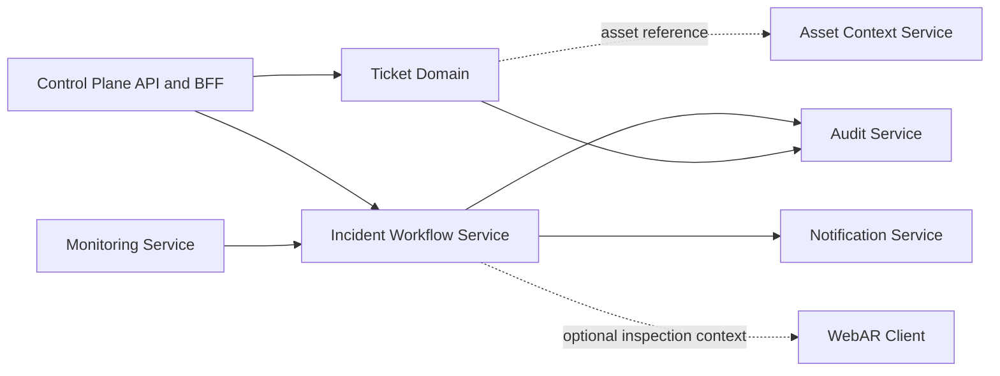
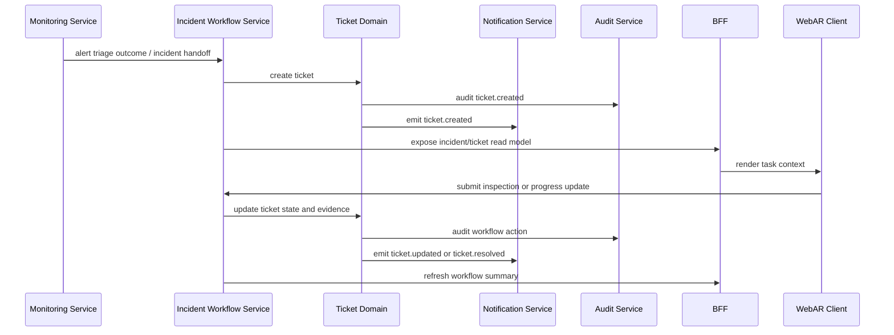

# Incident Workflow Service and Ticket Domain Design

## 1. Purpose

Tai lieu nay mo ta `Incident Workflow Service` va `Ticket Domain` theo huong architecture-first cho he thong AR-based Infrastructure Monitoring and Maintenance.

Muc tieu cua tai lieu:

- lam ro pham vi nghiep vu cua `Incident Workflow Service`
- tach ro `ticket` la domain co the lam truoc, khong phu thuoc hoan toan vao `incident` va `monitoring`
- mo ta day du flow nghiep vu tu khi ticket duoc tao cho toi luc dong ticket
- de xuat cau truc project phu hop voi codebase hien tai
- danh dau ro cac muc `A/B/C/D` la uu tien implementation truoc

Tai lieu nay khong di vao chi tiet class hoac code implementation.

## 2. Architectural Position

`Incident Workflow Service` nam trong control plane va la bounded context cho cac quy trinh van hanh sau alert triage.

No owner:

- incident lifecycle
- ticket lifecycle
- comment and activity timeline
- inspection workflow
- evidence and attachment tracking
- workflow-level notifications and audit events

No khong owner:

- alert lifecycle
- asset topology truth
- telemetry history truth
- AI inference truth

`Ticket` duoc xem la vertical slice co the ship som. Trong giai doan dau, ticket co the chay o che do manual-first, sau do moi gan:

- auto-create tu monitoring
- linkage voi incident
- AR inspection
- escalation va notification chuan hoa

## 3. Scope Decomposition

Tai lieu nay chia domain thanh 2 lop:

### 3.1 Incident Workflow Service

Lop nay quan ly quy trinh tong the:

- nhan handoff tu monitoring
- tao va dieu phoi ticket
- lien ket ticket voi incident
- day state toi notification va audit
- compose read models cho dashboard va WebAR

### 3.2 Ticket Domain

Ticket la phan co the lam som nhat va deu huong ve thuc thi nghiep vu.

Subdomain trong ticket:

1. Ticket Core
2. Assignment and Ownership
3. Comment and Activity Timeline
4. Evidence and Attachments
5. Inspection Execution
6. Notification Hooks
7. Workflow Audit
8. Read Models

## 4. Domain Flow Overview



## 5. Ticket Domain

### 5.1 Ticket Core

Ticket Core la co so de team co the ship som.

Responsibilities:

- create ticket
- get ticket detail
- list tickets
- update ticket status
- close or cancel ticket

Suggested lifecycle:

- `OPEN`
- `ASSIGNED`
- `IN_PROGRESS`
- `WAITING_FOR_INFO`
- `RESOLVED`
- `CLOSED`
- `CANCELLED`

Neu can giu MVP gon hon, chi can:

- `OPEN`
- `ASSIGNED`
- `IN_PROGRESS`
- `RESOLVED`
- `CLOSED`
- `CANCELLED`

### 5.2 Assignment and Ownership

Responsibilities:

- assign ticket
- reassign ticket
- acknowledge ticket
- track current assignee
- track ownership history

Mot ticket co the co:

- current owner
- current assignee
- assignment history

### 5.3 Comment and Activity Timeline

Responsibilities:

- add comment
- record action history
- show chronological activity timeline
- keep ticket context transparent for operators

Timeline nen ghi lai:

- create
- assign
- comment
- status change
- attachment added
- inspection submitted
- resolved
- closed

### 5.4 Evidence and Attachments

Responsibilities:

- attach image
- attach note
- attach document or link
- attach diagnostic snapshot
- attach field evidence

Phan nay giup ticket tro thanh ho so xu ly, khong chi la mot state machine don gian.

### 5.5 Inspection Execution

Responsibilities:

- start inspection
- submit inspection result
- link AR session
- store checklist result
- mark inspection complete

Day la noi ticket sau nay gan voi field operation va WebAR.

### 5.6 Notification Hooks

Ticket domain khong nen gui notification truc tiep. No chi emit event de Notification Service consume.

Events de xuat:

- `ticket.created`
- `ticket.assigned`
- `ticket.reassigned`
- `ticket.status.changed`
- `ticket.escalated`
- `ticket.resolved`
- `ticket.closed`

### 5.7 Workflow Audit

Responsibilities:

- record actor
- record object
- record action
- record timestamp
- record before/after state when needed

## 6. Incident Workflow Service

### 6.1 Service Responsibilities

Incident Workflow Service la owner cua quy trinh sau alert triage.

Responsibilities:

- receive incident handoff
- create incident and/or ticket from triage outcome
- keep linkage between incident and ticket
- coordinate escalation
- manage inspection workflow
- publish workflow state to BFF
- trigger notification and audit side effects

### 6.2 Incident vs Ticket Relationship

`Incident` la context rong hon ticket.

- `Incident` mo ta su co van hanh
- `Ticket` mo ta don vi thuc thi xu ly

Mot incident co the co:

- mot hoac nhieu ticket
- mot hoac nhieu inspection session
- mot history escalation

Trong phase dau, co the cho phep:

- ticket standalone
- incident optional link

Sau nay:

- monitoring tao incident
- incident tao ticket
- ticket closure sync ve incident

### 6.3 Full Incident Workflow



### 6.4 AR and Inspection Flow

Khi field engineer dung WebAR:

1. quet QR marker
2. BFF resolve marker qua Asset Context Service
3. BFF lay ticket/incident context
4. BFF compose diagnostics bundle
5. WebAR hien inspection checklist va evidence capture
6. nguoi dung submit inspection result
7. Incident Workflow Service cap nhat ticket va timeline

### 6.5 Notification and Audit Flow

Incident Workflow Service phai bao dam:

- moi state transition quan trong co audit record
- moi ticket event co the trigger notification
- delivery status duoc ghi nhan boi Notification Service

## 7. Prioritized Delivery Plan

Tai lieu nay danh dau 4 muc sau la uu tien lam truoc:

### A. Ticket Core

- create ticket
- list/detail
- status transition
- close/cancel

### B. Assignment and Ownership

- assign/reassign
- acknowledge
- current owner tracking

### C. Comment and Activity Timeline

- comment
- action history
- ticket timeline

### D. Evidence and Attachments

- image
- note
- diagnostic snapshot
- field evidence

Nhung muc sau se lam sau:

- incident linkage chuan hoa
- inspection execution day du
- escalation rules
- advanced notification orchestration
- SLA handling

## 8. Suggested Project Structure

De phu hop voi project structure hien tai trong repo, Incident Workflow Service nen di theo clean architecture gan voi backend control-plane pattern.

```text
<service-root>/
  src/
    domain/
      ticket/
        <ticket entity and value objects>
      incident/
        <incident entity and linkage objects>
      inspection/
        <inspection entity and evidence objects>
      ports/
        <repository and integration ports>
    use-cases/
      ticket/
        <ticket commands and queries>
      incident/
        <incident orchestration use-cases>
      inspection/
        <inspection execution use-cases>
      queries/
        <read-model queries>
    adapters/
      persistence/
        <database repositories>
      messaging/
        <event publisher adapters>
      external/
        <notification and audit adapters>
      ...
    presentation/
      http/
        controllers/
        dto/
        ...
    infrastructure/
      <module wiring, config, bootstrap>
```

### Structure guidelines

- `domain/` chi chua entity, enum, policy, port
- `use-cases/` chua orchestration va business flow
- `adapters/` chua persistence va integration implementation
- `presentation/` chua controller, DTO, auth guard, response shaping
- `infrastructure/` wire DI, config, bootstrap

## 9. Service Integration Rules

- `Monitoring Service` co the tao handoff sang Incident Workflow Service.
- `Ticket Domain` khong duoc phu thuoc chac vao monitoring lifecycle khi phase dau chua xong.
- `Asset Context Service` chi cung cap topology/marker reference.
- `Notification Service` chi consume event, khong own workflow truth.
- `Audit Service` luu trace cua action, khong tham gia quyet dinh nghiep vu.
- `Control Plane API and BFF` compose read models cho dashboard va WebAR.

## 10. Implementation Phasing

### Phase 1

- Ticket Core
- Assignment and Ownership
- Comment and Activity Timeline
- Evidence and Attachments

### Phase 2

- Incident linkage
- basic escalation
- notification hooks
- audit integration

### Phase 3

- inspection workflow
- WebAR evidence submission
- ticket and incident sync

### Phase 4

- monitoring auto-create ticket
- richer triage workflows
- workflow analytics and reporting

## 11. Success Criteria

Tai lieu nay duoc xem la day du neu:

- ticket co the chay standalone truoc incident va monitoring
- flow tao/phan cong/binh luan/dinh kem dong co the demo duoc
- incident workflow co the don nhan event tu monitoring sau nay
- WebAR co the gan vao inspection workflow ma khong can raw telemetry
- project structure de xuat khop voi backend layering hien tai
