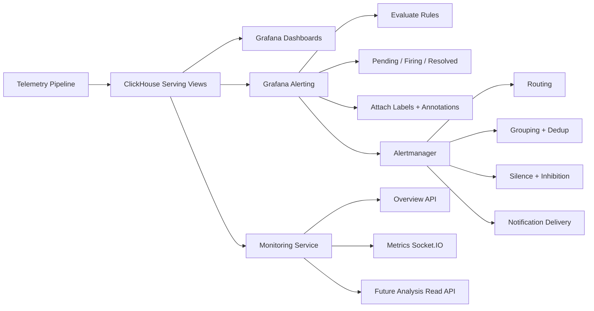
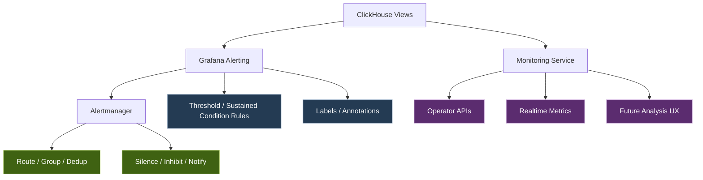

**Spec**
`Monitoring Alerting Delegation v1: ClickHouse + Grafana Alerting + Alertmanager + Monitoring Service`

**1. Status**
Proposed

**2. Context**
Hệ thống hiện đã có:
- `ClickHouse serving views` cho monitoring
- `Monitoring Service` phục vụ read APIs như `overview` và `metrics`
- nhu cầu alerting thực tế cho operator

Vấn đề hiện tại:
- nếu để `Monitoring Service` tự làm detect + dedup + routing + notification thì scope phình rất nhanh
- phần này là bài toán mà observability stack đã giải rất tốt
- team muốn tiết kiệm thời gian và giữ trọng tâm vào domain monitoring/operator experience

Vì vậy, v1 sẽ tách rõ:
- detection giao cho `Grafana Alerting`
- notification control giao cho `Alertmanager`
- `Monitoring Service` giữ vai trò domain read layer và UI-facing context

---

**3. Problem Statement**
Cần một kiến trúc alerting v1:
- dùng được ngay với data source hiện tại là `ClickHouse`
- sinh alert rõ ràng, deterministic, explainable
- tránh spam alert nhờ grouping / dedup / inhibition
- không kéo `Monitoring Service` vào một alert engine lớn ngay từ đầu
- vẫn giữ đường cho phase sau nếu cần thêm analysis/enrichment

---

**4. Goals**
- Dùng `ClickHouse` làm nguồn query cho alert rules
- Dùng `Grafana Alerting` để evaluate điều kiện alert
- Dùng `Alertmanager` để route, group, dedup, silence, inhibit, notify
- Version-control được rule/query/config quan trọng của `Grafana Alerting` và `Alertmanager`
- Giữ `Monitoring Service` tập trung vào operator-facing APIs và realtime metrics
- Thiết kế payload alert đủ ổn định để dùng tốt với Alertmanager

---

**5. Non-Goals**
Không làm trong spec này:
- root cause analysis engine
- ML anomaly detection
- alert explanation tự động bằng AI
- incident workflow automation
- full alert lifecycle ownership trong `Monitoring Service`
- remediation automation

---

**6. Architecture Decision**
Phân vai như sau:

**ClickHouse**
- nguồn dữ liệu query cho monitoring và alerting
- cung cấp current snapshot và trend window thông qua serving views

**Grafana Alerting**
- evaluate rule từ ClickHouse queries
- quyết định trạng thái `pending / firing / resolved`
- gắn `labels` và `annotations` cơ bản cho alert

**Alertmanager**
- nhận alert từ Grafana
- route theo labels
- group alerts
- deduplicate
- silence
- inhibit
- gửi notification ra các channel

**Monitoring Service**
- phục vụ `overview`, `metrics`, và read models cho operator
- không tự làm detection v1
- có thể phase sau đọc trạng thái alert/enrichment để hiển thị UI tốt hơn

---

**7. Data Sources**
Các nguồn ưu tiên cho v1:

- `telemetry_db.node_current_summary`
- `telemetry_db.node_summary_trend_1m`
- `telemetry_db.container_current_summary`
- `telemetry_db.container_summary_trend_1m`

Nguyên tắc:
- `current_summary` cho snapshot alert hiện tại
- `trend_1m` cho sustained condition và chống false positive ngắn hạn

---

**8. Rule Placement Policy**
Rule nên nằm ở `Grafana Alerting` nếu:
- condition rõ ràng
- query được từ ClickHouse
- deterministic
- dễ giải thích với operator
- không cần correlation đa tầng

**Candidate rules v1**
- `NodeStale`
- `NodeCpuUsageHigh`
- `NodeMemoryPressureHigh`
- `NodeDiskUsageHigh`
- `NodeCpuTempCritical`
- `NodeCriticalMetricPresent`
- `ContainerUnhealthyPresent`
- `ContainerRestarting`
- `RackCritical`
- `NodeWorkloadHotspot`

---

**9. Rules Deferred To Later Phase**
Những thứ chưa đưa vào v1:
- primary cause / secondary cause scoring
- confidence scoring
- evidence ranking
- action hints
- thermal vs workload vs memory correlation
- narrative builder
- anomaly detection bằng statistical/ML methods

---

**10. Alert Contract Design**
Alert payload cần chia thành 2 lớp:

**10.1 Labels**
Dùng cho machine processing:
- routing
- grouping
- deduplication
- silencing
- inhibition

**Required labels v1**
```json
{
  "alertname": "NodeCpuTempCritical",
  "severity": "critical",
  "scope_type": "node",
  "node_id": "node-msi-5e8ff2c0",
  "rack_id": "rack-a1",
  "environment": "lab",
  "team": "infra",
  "category": "thermal",
  "source": "grafana"
}
```

**10.2 Annotations**
Dùng cho human-readable context:
```json
{
  "summary": "Node CPU temperature critical",
  "description": "CPU temperature stayed above 90C for 5 minutes",
  "metric_key": "node.cpu_temperature_c",
  "current_value": "95.4",
  "threshold": "90",
  "observed_window": "5m",
  "dashboard_url": "https://grafana/...",
  "runbook_url": "https://docs/..."
}
```

---

**11. Label Design Rules**
Chỉ đưa vào `labels` các field ổn định, cardinality chấp nhận được.

**Allowed in labels**
- `alertname`
- `severity`
- `scope_type`
- `node_id`
- `workload_id`
- `rack_id`
- `environment`
- `team`
- `category`
- `source`

**Not allowed in labels**
- metric values biến động liên tục
- `freshnessSec`
- `lastSeenAt`
- `current_value`
- `restart_count`
- workload top list
- evidence text
- timestamps runtime

Lý do:
- tránh đổi fingerprint liên tục
- tránh phá dedup/grouping
- tránh spam notification

---

**12. Grouping Policy**
`Alertmanager` grouping nên dựa trên loại alert.

**Rack-oriented grouping**
```yaml
group_by: [alertname, rack_id]
```

Phù hợp khi muốn gom một đợt sự cố theo rack.

**Node-oriented grouping**
```yaml
group_by: [alertname, node_id]
```

Phù hợp khi muốn thấy từng node rõ ràng.

**Decision v1**
- rack-level alerts: group theo `alertname + rack_id`
- node-level alerts: group theo `alertname + node_id`
- workload-level alerts: group theo `alertname + workload_id`

---

**13. Inhibition Policy**
V1 cần suppression theo tầng để giảm alert fatigue.

**Recommended inhibition**
- `RackCritical` inhibit:
  - `NodeStale`
  - `NodeDown`
  - `ContainerUnhealthyPresent`

Điều kiện:
- cùng `rack_id`

**Severity-based inhibition**
- `critical` inhibit `warning`
- khi cùng `node_id`, `workload_id`, hoặc cùng `alert family`

---

**14. Notification Routing Policy**
Ví dụ routing v1:

- `severity=critical` -> kênh khẩn cấp
- `severity=warning` -> kênh theo dõi
- `environment=prod` -> on-call mạnh hơn
- `environment=lab` -> Slack/Telegram nhóm dev
- `team=infra` -> đội infra
- `category=thermal` -> có thể về nhóm hạ tầng/phần cứng

---

**15. Monitoring Service Boundary**
`Monitoring Service` tiếp tục sở hữu:
- node overview API
- node metrics realtime
- rack monitoring read APIs
- alert read models đã sync từ external alert stack
- future analysis read APIs
- operator UI composition

`Monitoring Service` chưa sở hữu trong v1:
- alert rule evaluation
- silencing engine
- dedup engine
- route tree
- notification delivery engine

`Monitoring Service` có thể làm trong v1:
- ingest hoặc sync current alert state từ integration path
- map alert state thành dashboard-facing read payload
- giữ linkage read-side tới incident nếu operator đã triage

---

**16. Future Extension Path**
Sau khi v1 ổn định, có thể thêm một lớp enrichment đọc từ alert stream/current alert state để tạo:
- operator summary
- probable cause
- evidence list
- action hints
- UI analysis panel

Lúc đó `Monitoring Service` hoặc service phân tích riêng có thể tiêu thụ alert state mà không phải thay thế Grafana/Alertmanager.

---

**17. Risks**
- Rule threshold đặt quá cứng sẽ gây false positive
- Nếu labels thiết kế sai sẽ làm Alertmanager group/dedup kém
- Nếu cho field động vào labels thì alert fingerprint sẽ vỡ
- Nếu inhibition quá mạnh có thể che mất symptom hữu ích

---

**18. Acceptance Criteria**
Spec được coi là chốt khi team đồng ý:
- detection nằm ở `Grafana Alerting`
- routing/grouping/silence/inhibition nằm ở `Alertmanager`
- bộ rule v1 được cấu hình trong `Grafana Alerting` dựa trên serving views của `ClickHouse`
- `Alertmanager` config hỗ trợ `group_by`, routing, dedup và inhibition theo contract mới không dùng `scope_id`
- `Monitoring Service` không làm alert engine v1
- alert payload dùng `labels + annotations` như trên
- rule v1 chỉ bám vào serving views hiện có của ClickHouse
- có đường để sync current alert state về `Monitoring Service` phục vụ dashboard

---

**19. Alert Catalog v1**
Catalog này định nghĩa bộ alert đầu tiên nên triển khai để có giá trị vận hành sớm, dễ tune, và bám sát các serving views hiện có.

**19.1 Common conventions**
- `source` luôn là `grafana`
- `team` mặc định là `infra` nếu chưa có routing ownership chi tiết hơn
- `environment` lấy theo môi trường triển khai thực tế như `lab`, `staging`, `prod`
- `scope_type` dùng một trong `rack`, `node`, `workload`
- alert phải dùng định danh cụ thể theo scope như `node_id`, `rack_id`, `workload_id`
- `category` phản ánh nhóm vấn đề như `availability`, `resource`, `thermal`, `runtime`

**19.2 NodeStale**
- Purpose:
  Phát hiện node không còn cập nhật telemetry/current summary đủ mới, thường phản ánh mất kết nối agent, node down, hoặc pipeline stale.
- Source views:
  - `telemetry_db.node_current_summary`
- Suggested condition:
  - `summary_ts` cũ hơn ngưỡng v1, ví dụ `120s`
- Severity:
  - `warning` khi stale nhẹ
  - `critical` khi stale vượt ngưỡng cao hơn, ví dụ `300s`
- Labels:
```json
{
  "alertname": "NodeStale",
  "severity": "warning",
  "scope_type": "node",
  "node_id": "<node_id>",
  "rack_id": "<rack_id>",
  "environment": "<env>",
  "team": "infra",
  "category": "availability",
  "source": "grafana"
}
```
- Annotations:
```json
{
  "summary": "Node telemetry is stale",
  "description": "Node has not updated current summary within the expected freshness window",
  "metric_key": "summary_ts",
  "observed_window": "current snapshot",
  "dashboard_url": "<grafana_url>",
  "runbook_url": "<runbook_url>"
}
```
- Grouping:
  - `group_by: [alertname, node_id]`
- Inhibition:
  - bị inhibit bởi `RackCritical` cùng `rack_id`
- Operator meaning:
  - node có thể unreachable, agent chết, hoặc telemetry pipeline của node đang lỗi

**19.3 NodeCpuUsageHigh**
- Purpose:
  Phát hiện node bị CPU saturation kéo dài.
- Source views:
  - `telemetry_db.node_summary_trend_1m`
- Suggested condition:
  - `cpu_usage_pct_current > 90` trong `5m`
- Severity:
  - `warning` ở ngưỡng thấp hơn như `80`
  - `critical` ở `90+` sustained
- Labels:
```json
{
  "alertname": "NodeCpuUsageHigh",
  "severity": "critical",
  "scope_type": "node",
  "node_id": "<node_id>",
  "rack_id": "<rack_id>",
  "environment": "<env>",
  "team": "infra",
  "category": "resource",
  "source": "grafana"
}
```
- Annotations:
```json
{
  "summary": "Node CPU usage is high",
  "description": "CPU usage stayed above threshold during the evaluation window",
  "metric_key": "node.cpu_usage_pct",
  "current_value": "<value>",
  "threshold": "90",
  "observed_window": "5m",
  "dashboard_url": "<grafana_url>",
  "runbook_url": "<runbook_url>"
}
```
- Grouping:
  - `group_by: [alertname, node_id]`
- Inhibition:
  - `critical` instance inhibits corresponding `warning`
- Operator meaning:
  - node đang quá tải compute, cần mở metrics tab để kiểm tra workload contributor

**19.4 NodeMemoryPressureHigh**
- Purpose:
  Phát hiện memory pressure kéo dài ở node.
- Source views:
  - `telemetry_db.node_summary_trend_1m`
- Suggested condition:
  - `memory_used_pct_current > 90` trong `5m`
- Severity:
  - `warning` ở `80+`
  - `critical` ở `90+`
- Labels:
```json
{
  "alertname": "NodeMemoryPressureHigh",
  "severity": "critical",
  "scope_type": "node",
  "node_id": "<node_id>",
  "rack_id": "<rack_id>",
  "environment": "<env>",
  "team": "infra",
  "category": "resource",
  "source": "grafana"
}
```
- Annotations:
```json
{
  "summary": "Node memory pressure is high",
  "description": "Memory usage remained high during the evaluation window",
  "metric_key": "node.memory_used_pct",
  "current_value": "<value>",
  "threshold": "90",
  "observed_window": "5m",
  "dashboard_url": "<grafana_url>",
  "runbook_url": "<runbook_url>"
}
```
- Grouping:
  - `group_by: [alertname, node_id]`
- Inhibition:
  - `critical` instance inhibits corresponding `warning`
- Operator meaning:
  - node gần cạn RAM, dễ dẫn đến eviction, OOM, hoặc workload degraded

**19.5 NodeDiskUsageHigh**
- Purpose:
  Phát hiện disk usage cao kéo dài, một nguyên nhân rất thường gặp gây chết node.
- Source views:
  - `telemetry_db.node_summary_trend_1m`
  - hoặc fallback `telemetry_db.node_current_summary` nếu trend chưa đủ ổn
- Suggested condition:
  - `disk_used_pct_max_current > 85` trong `10m`
- Severity:
  - `warning` ở `85+`
  - `critical` ở `92+`
- Labels:
```json
{
  "alertname": "NodeDiskUsageHigh",
  "severity": "warning",
  "scope_type": "node",
  "node_id": "<node_id>",
  "rack_id": "<rack_id>",
  "environment": "<env>",
  "team": "infra",
  "category": "resource",
  "source": "grafana"
}
```
- Annotations:
```json
{
  "summary": "Node disk usage is high",
  "description": "Disk usage remained above threshold during the evaluation window",
  "metric_key": "node.disk_used_pct_max",
  "current_value": "<value>",
  "threshold": "85",
  "observed_window": "10m",
  "dashboard_url": "<grafana_url>",
  "runbook_url": "<runbook_url>"
}
```
- Grouping:
  - `group_by: [alertname, node_id]`
- Inhibition:
  - `critical` instance inhibits corresponding `warning`
- Operator meaning:
  - node sắp hết dung lượng, cần dọn dữ liệu, log, hoặc di dời workload

**19.6 NodeCpuTempCritical**
- Purpose:
  Phát hiện thermal risk vật lý ở node, mức ưu tiên cao vì có thể dẫn tới hỏng phần cứng hoặc throttle mạnh.
- Source views:
  - `telemetry_db.node_summary_trend_1m`
- Suggested condition:
  - `cpu_temperature_c_current > 90` trong `3m` đến `5m`
- Severity:
  - `critical`
- Labels:
```json
{
  "alertname": "NodeCpuTempCritical",
  "severity": "critical",
  "scope_type": "node",
  "node_id": "<node_id>",
  "rack_id": "<rack_id>",
  "environment": "<env>",
  "team": "infra",
  "category": "thermal",
  "source": "grafana"
}
```
- Annotations:
```json
{
  "summary": "Node CPU temperature critical",
  "description": "CPU temperature stayed above critical threshold during the evaluation window",
  "metric_key": "node.cpu_temperature_c",
  "current_value": "<value>",
  "threshold": "90",
  "observed_window": "5m",
  "dashboard_url": "<grafana_url>",
  "runbook_url": "<runbook_url>"
}
```
- Grouping:
  - `group_by: [alertname, node_id]`
- Inhibition:
  - none by default, because this is a top-priority physical symptom
- Operator meaning:
  - có khả năng vấn đề tản nhiệt, airflow, quạt, hoặc workload sinh nhiệt bất thường

**19.7 ContainerUnhealthyPresent**
- Purpose:
  Báo node đang có workload/container unhealthy để operator biết node có vấn đề runtime phía ứng dụng.
- Source views:
  - `telemetry_db.container_current_summary`
- Suggested condition:
  - tồn tại container trên node có `health_status != healthy`
- Severity:
  - `warning`
  - nâng lên `critical` nếu tỷ lệ unhealthy vượt ngưỡng do team định nghĩa sau
- Labels:
```json
{
  "alertname": "ContainerUnhealthyPresent",
  "severity": "warning",
  "scope_type": "node",
  "node_id": "<node_id>",
  "rack_id": "<rack_id>",
  "environment": "<env>",
  "team": "infra",
  "category": "runtime",
  "source": "grafana"
}
```
- Annotations:
```json
{
  "summary": "Unhealthy containers detected on node",
  "description": "At least one container on this node is not healthy",
  "metric_key": "container.health_status",
  "observed_window": "current snapshot",
  "dashboard_url": "<grafana_url>",
  "runbook_url": "<runbook_url>"
}
```
- Grouping:
  - `group_by: [alertname, node_id]`
- Inhibition:
  - bị inhibit bởi `RackCritical` cùng `rack_id`
- Operator meaning:
  - node đang host workload lỗi; bước tiếp theo là mở overview/metrics để xem workload nào nổi bật

**19.8 ContainerRestarting**
- Purpose:
  Phát hiện container restart bất thường, useful cho lỗi ứng dụng hoặc runtime instability.
- Source views:
  - `telemetry_db.container_current_summary`
  - `telemetry_db.container_summary_trend_1m`
- Suggested condition:
  - tồn tại workload có `restart_count_current > 0`
  - phase sau có thể đổi sang tăng restart qua window để bớt noisy
- Severity:
  - `warning`
- Labels:
```json
{
  "alertname": "ContainerRestarting",
  "severity": "warning",
  "scope_type": "workload",
  "workload_id": "<workload_id>",
  "node_id": "<node_id>",
  "rack_id": "<rack_id>",
  "environment": "<env>",
  "team": "infra",
  "category": "runtime",
  "source": "grafana"
}
```
- Annotations:
```json
{
  "summary": "Container restart detected",
  "description": "A container restart was detected on the node",
  "metric_key": "container.restart_count",
  "observed_window": "current snapshot",
  "dashboard_url": "<grafana_url>",
  "runbook_url": "<runbook_url>"
}
```
- Grouping:
  - `group_by: [alertname, workload_id]`
- Inhibition:
  - có thể bị inhibit bởi `RackCritical` nếu team muốn giảm noise ở outage lớn
- Operator meaning:
  - đây thường là symptom workload-level, cần drill-down vào workload và logs nếu có

**19.9 RackCritical**
- Purpose:
  Alert rack-level để phản ánh sự cố diện rộng và làm nguồn suppression cho node/workload alerts bên dưới.
- Source views:
  - derived rack serving view nếu đã có
  - hoặc rule tổng hợp từ node views trong Grafana query layer
- Suggested condition:
  - số node `critical` hoặc `stale` trong rack vượt ngưỡng
  - hoặc rack power/network metric critical nếu sau này đã có
- Severity:
  - `critical`
- Labels:
```json
{
  "alertname": "RackCritical",
  "severity": "critical",
  "scope_type": "rack",
  "rack_id": "<rack_id>",
  "environment": "<env>",
  "team": "infra",
  "category": "availability",
  "source": "grafana"
}
```
- Annotations:
```json
{
  "summary": "Rack critical condition detected",
  "description": "Multiple node-level critical or stale conditions were observed in the same rack",
  "observed_window": "current snapshot or 5m",
  "dashboard_url": "<grafana_url>",
  "runbook_url": "<runbook_url>"
}
```
- Grouping:
  - `group_by: [alertname, rack_id]`
- Inhibition:
  - acts as inhibitor for child node/workload alerts in same rack
- Operator meaning:
  - ưu tiên kiểm tra nguồn điện, network uplink, switch, hoặc sự cố vật lý mức rack trước

**19.10 Implementation priority**
Thứ tự ưu tiên theo alert catalog để có giá trị sớm:
1. `NodeStale`
2. `NodeCpuTempCritical`
3. `NodeMemoryPressureHigh`
4. `NodeDiskUsageHigh`
5. `ContainerUnhealthyPresent`
6. `ContainerRestarting`
7. `RackCritical`
8. `NodeCpuUsageHigh`

**19.11 Implementation sequence**
Thứ tự triển khai v1 nên đi theo workstream thay vì nhảy ngay vào backend:

1. chốt `alert contract` cho labels và annotations
2. chốt `ClickHouse query contract` cho từng rule v1
3. cấu hình `Grafana Alerting` rules và evaluation windows
4. cấu hình `Alertmanager` cho grouping, dedup, routing, silence, inhibition
5. verify notification delivery trên môi trường `lab`
6. thêm đường sync current alert state về `Monitoring Service`
7. enrich dashboard read APIs như `rack overview`, `rack monitoring state`, `node overview`, `alert list`
8. thêm handoff `create incident from alert` sang `Incident Workflow Service`

**19.12 Operator interpretation guideline**
- `NodeStale`:
  ưu tiên kiểm tra reachability/agent/pipeline
- `NodeCpuTempCritical`:
  ưu tiên kiểm tra vấn đề vật lý/tản nhiệt
- `NodeMemoryPressureHigh` và `NodeCpuUsageHigh`:
  ưu tiên kiểm tra workload pressure
- `ContainerUnhealthyPresent` và `ContainerRestarting`:
  ưu tiên điều tra runtime/service issue
- `RackCritical`:
  ưu tiên nhìn sự cố diện rộng trước, sau đó mới drill-down node con

---

**Mermaid**


**Mermaid trách nhiệm**

