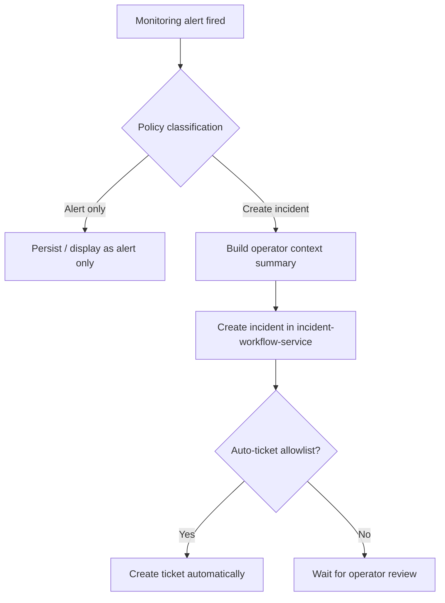

# Spec: Monitoring Incident Policy V1

## Objective
Define a minimal, shippable incident policy for the monitoring workflow:

```text
alert -> incident -> ticket
```

This v1 policy treats `incident` as:

1. A `wake-up filter`:
   only alerts that are meaningful for an operator or on-call technician should become incidents.
2. An `operator context` layer:
   once an incident exists, it must explain what happened, where it happened, why it matters, and what to check first.

The primary user is the on-call operator or technician who needs to decide quickly whether a situation requires immediate action.

Success means:
- noisy alerts remain as alerts only
- meaningful alerts become incidents with clearer context than the raw alert payload
- only a very small, operationally obvious subset auto-creates tickets
- the workflow is simple enough to ship without a generalized correlation or diagnosis engine

## Assumptions
1. This policy applies to alerts produced by the delegated Grafana alerting rules already defined in `infra/grafana/provisioning/alerting/rules-delegated-alerting-v1.yaml`.
2. The scope of v1 is `monitoring-service` plus the existing `incident-workflow-service` API contract.
3. V1 will not attempt multi-alert correlation, incident aggregation, or root-cause inference.
4. V1 will use deterministic policy decisions in backend code or simple configuration, not an LLM or external rules engine.
5. `NodeStale` requires a stricter wake-up threshold than the current alert threshold of `120s`; the incident policy can define a separate escalation threshold.

## Tech Stack
- `NestJS 11`
- `TypeScript 5`
- `monitoring-service` for alert evaluation and incident handoff
- `incident-workflow-service` for incident and ticket persistence
- `MongoDB` for operational workflow state
- Existing alert context is carried through incident `metadata`

## Commands
Monitoring Service:

```bash
cd backend/apps/control-plane/monitoring-service
npm run build
npm test
npm run lint
```

Incident Workflow Service:

```bash
cd backend/apps/control-plane/incident-workflow-service
npm run build
npm test
npm run lint
```

Notes:
- `npm test` is the intended verification command for both services.
- In recent local work, `monitoring-service` builds cleanly; test stability should be re-checked before implementation begins.

## Project Structure
```text
backend/apps/control-plane/monitoring-service/
  src/application/use-cases/           -> incident handoff and policy decision logic
  src/application/mappers/             -> alert-to-incident summary/context mapping
  src/application/ports/               -> incident workflow client and policy-related interfaces
  src/presentation/http/controllers/   -> incident handoff HTTP surface
  src/presentation/http/dto/           -> request/response DTOs
  src/infrastructure/http/             -> REST client to incident-workflow-service

backend/apps/control-plane/incident-workflow-service/
  src/domain/entities/                 -> incident canonical fields
  src/use-cases/commands/              -> create incident / create ticket behavior
  src/presentation/http/controllers/   -> incidents and tickets API
  src/adapters/persistence/mongoose/   -> incident and ticket persistence

infra/grafana/provisioning/alerting/
  rules-delegated-alerting-v1.yaml     -> source-of-truth alert inventory for policy input

docs/superpowers/specs/
  2026-07-22-monitoring-incident-policy-v1-spec.md -> this spec
```

## Code Style
The policy logic should stay explicit, small, and reviewable. Prefer short rule tables or straightforward condition branches over generalized abstractions.

```ts
function classifyAlertForWorkflow(alert: MonitoringAlert): WorkflowDecision {
  if (alert.alertName === 'RackSignalLossPresent') {
    return { createIncident: true, createTicket: true, priority: 'critical' };
  }

  if (alert.alertName === 'ContainerRestarting') {
    return { createIncident: false, createTicket: false, priority: 'none' };
  }

  return { createIncident: true, createTicket: false, priority: 'review' };
}
```

Conventions:
- prefer explicit per-alert policy over “smart” inference
- keep incident summary generation deterministic
- keep naming aligned with current domain terms: `alert`, `incident`, `ticket`, `operator`, `technician`
- preserve existing service boundaries rather than pushing workflow ownership into monitoring read models

## Testing Strategy
- Framework: existing `jest` test suites in both services
- Unit tests should cover:
  - alert classification into `alert only`, `incident`, or `incident + ticket`
  - incident summary generation from alert metadata
  - special handling for `NodeStale` wake-up threshold
  - idempotent behavior when the same alert is processed repeatedly
- Controller and integration-level tests should cover:
  - handoff payload shape from monitoring to incident workflow
  - auto-ticket creation only for the approved allowlist
- Minimum verification for each implementation slice:
  - `npm run build` in touched service
  - targeted `npm test` in touched service

## Boundaries
- Always:
  - keep `incident` as a workflow decision layer, not just a copy of the alert
  - keep auto-ticket creation limited to a small allowlist
  - include operator-facing context in incident payloads: what happened, where, severity, evidence, first actions
  - preserve backward-compatible API changes where possible

- Ask first:
  - changing alert thresholds in Grafana rules
  - adding new persistence collections just for policy state
  - introducing a generalized rule engine or AI summarization layer
  - changing incident/ticket APIs in ways that affect frontend consumers

- Never:
  - auto-create tickets for every warning or every critical by default
  - introduce LLM-based core decision making in the hot path
  - block alert ingestion because incident or ticket creation fails
  - merge unrelated correlation/aggregation work into this v1

## Policy Inventory
Current delegated alert groups and recommended v1 workflow treatment:

### Alert Only
- `ContainerRestarting`
- `ContainerUnhealthyPerContainer`
- `ContainerUnhealthyPresent`
- `NodeDiskUsageHigh`
- `NodePacketLossHigh`

Reason:
- these are useful signals but too noisy or too context-dependent for automatic incident creation in v1

### Auto Incident, No Auto Ticket
- `RackDegraded`
- `NodeMemoryPressureHigh`
- `NodeCpuUsageHigh`
- `ServicePartialOutage`
- `NodeStale` only when it passes a stricter wake-up threshold

Reason:
- these deserve operator visibility and structured context
- they do not always justify immediate tracked work without human review

### Auto Incident + Auto Ticket
- `RackSignalLossPresent`
- `RackCritical`
- `NodeCpuTempCritical`

Reason:
- these are the clearest “wake someone up and start work now” cases in the current rule set
- they are narrow enough to keep v1 behavior simple and understandable

## Proposed Incident Meaning
For v1, an incident must answer these operator questions:

1. What is happening?
2. Where is it happening?
3. How urgent is it?
4. What is the evidence?
5. What should be checked first?

Incident summary content should be deterministic and derived from alert fields already available:
- `alertName`
- `scopeType`
- `nodeId`, `rackId`, `workloadId`, `serviceId`
- `severity`
- `summary`
- `description`
- `currentValue`
- `threshold`
- `startsAt`
- `lastReceivedAt`
- `dashboardUrl`
- `runbookUrl`

## Incident Summary Shape
V1 should enrich the incident record with an operator-facing summary model similar to:

```json
{
  "summary": {
    "whatHappened": "Node node-msi-341b683e stopped publishing fresh monitoring snapshots.",
    "where": {
      "scopeType": "node",
      "nodeId": "node-msi-341b683e",
      "rackId": "6a5792c1ea8de69105cf48dd"
    },
    "urgency": "review_now",
    "evidence": [
      "stale_age_sec=14543 seconds",
      "threshold=120 seconds",
      "startedAt=2026-07-22T07:21:30Z"
    ],
    "firstActions": [
      "Check whether the node is currently reachable.",
      "Check monitoring agent or collector status on the node."
    ]
  }
}
```

V1 does not require this exact schema to be top-level yet; it may initially live inside `metadata` if that keeps implementation smaller. The important requirement is that the operator-facing fields exist somewhere structured and consistent.

## Ticket Policy
Auto-ticket creation is intentionally conservative.

Rules:
- If policy result is `alert only`, do not create incident or ticket.
- If policy result is `incident only`, create incident and wait for operator action.
- If policy result is `incident + ticket`, create both in the same workflow attempt.

Auto-ticket allowlist for v1:
- `RackSignalLossPresent`
- `RackCritical`
- `NodeCpuTempCritical`

All other alerts must not auto-create tickets.

## NodeStale Special Rule
`NodeStale` is the main ambiguous case in the current rules.

Alert threshold today:
- alert fires when stale age is greater than `120s`

Incident wake-up policy for v1:
- not every `NodeStale` alert becomes an incident
- incident creation should use a separate escalation threshold tuned for operator attention

Initial recommendation:
- create an incident only when stale age exceeds `1800s` (`30m`)

Rationale:
- this keeps short-lived telemetry hiccups out of the wake-up path
- it still surfaces prolonged monitoring blindness as an operator concern

The exact threshold remains configurable and should be called out as a policy constant.

## Flow


## Success Criteria
- A documented allowlist exists for:
  - `alert only`
  - `incident only`
  - `incident + ticket`
- `incident` meaning is explicit in code and docs as `wake-up filter + operator context`
- `NodeStale` uses a separate incident escalation threshold from the alert threshold
- Auto-ticket creation is restricted to:
  - `RackSignalLossPresent`
  - `RackCritical`
  - `NodeCpuTempCritical`
- Incident payloads contain structured operator context, not just raw alert metadata
- The implementation can be delivered without:
  - correlation engine
  - cross-alert aggregation
  - LLM-based diagnosis

## Open Questions
- Should `NodeMemoryPressureHigh` remain `incident only`, or should repeated sustained memory pressure become auto-ticket in a later phase?
- Should `ServicePartialOutage` always create an incident, or only when affected capacity drops below a stricter threshold than the current rule?
- Should the operator-facing summary live in top-level incident fields in v1, or remain inside `metadata.summary` for a smaller schema change?
