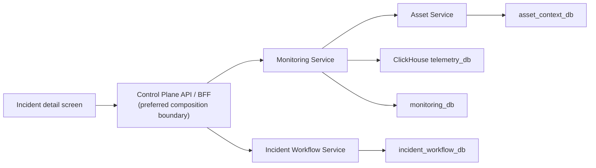
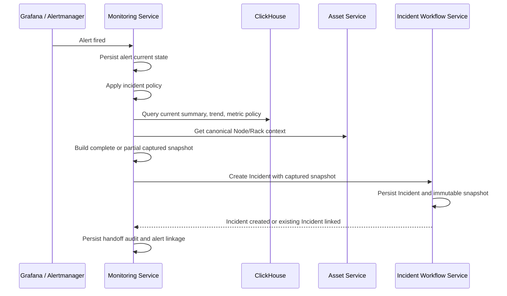
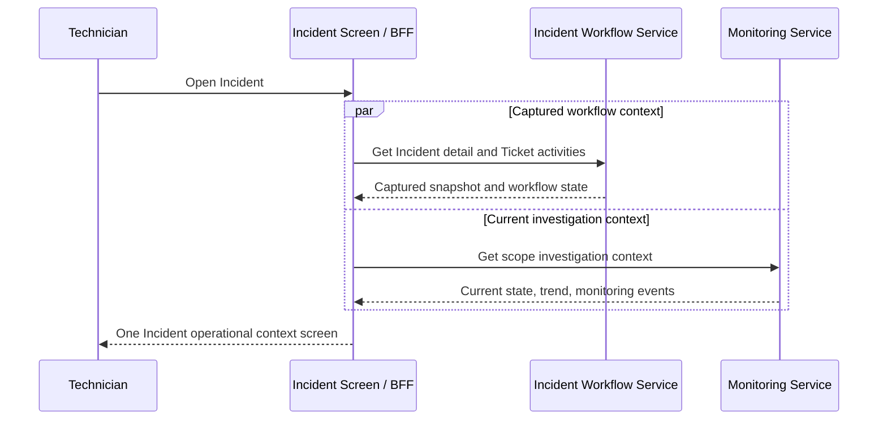

# Spec: Incident Operational Context V1

## Status

- Phase: `SPECIFY`
- Date: `2026-07-23`
- Requires human review before moving to `PLAN`
- Related specifications:
  - `2026-07-22-monitoring-incident-policy-v1-spec.md`
  - `2026-07-22-alert-incident-audit-boundary-spec.md`
  - `2026-06-18-incident-workflow-ticket-design.md`

## Assumptions

1. The primary user is an on-call technician or monitoring operator.
2. The first supported scopes are `node` and `rack`.
3. The first operator screen must answer:
   - What is broken?
   - Which asset and location are affected?
   - What happened immediately before the incident?
4. Reducing screen switching is more important than adding automated diagnosis.
5. A captured incident snapshot is immutable evidence. It must not be overwritten
   by a later current-state refresh.
6. A user-selected `from` and `to` range is an investigation query, not a new
   persisted snapshot by default.
7. Monitoring Service owns alert and monitoring context composition.
8. Asset Service remains authoritative for node and rack identity and topology.
9. Incident Workflow Service remains authoritative for incident, ticket, and
   workflow state.
10. No service may query another service's MongoDB directly.
11. V1 uses deterministic data and policy. It does not use an LLM for diagnosis,
    event generation, or recommended actions.

## Objective

Build an operator-facing incident context model that lets an on-call technician
understand an incident from one screen without manually opening the monitoring
overview, asset inventory, alert detail, and ticket detail screens.

The Incident should become an operational investigation record, not merely a
copy of the originating alert.

### Job To Be Done

> When I am paged for an infrastructure incident, I want to see what failed,
> where it is, what is currently affected, and what changed shortly before the
> incident, so I can choose the first verification action without reconstructing
> the situation across multiple screens.

### Success Definition

Within the first 30 seconds of opening an Incident, the technician can identify:

1. The affected Node or Rack.
2. Its canonical asset identity and physical placement.
3. The alert and evidence that caused escalation.
4. The health state captured when the Incident was created.
5. The current health state, clearly distinguished from captured state.
6. The important monitoring and workflow transitions around the Incident.
7. Previous Incidents for the same scope when such records exist.

## Non-Goals

V1 does not include:

- LLM-generated diagnosis or recommended actions.
- General root-cause analysis.
- Multi-rack or cross-service correlation.
- Automatic causal claims such as "the rack uplink caused the node outage".
- A new query-only microservice.
- Direct database reads across service ownership boundaries.
- Container and Service incident context.
- Persisting every user-selected investigation range as evidence.
- Replacing Grafana alert rules or ClickHouse health policy.

## Core Concepts

### Captured Snapshot

A `capturedSnapshot` is an immutable record created during Incident handoff.
It records what Monitoring and Asset services knew at that moment.

It is used for:

- audit and post-incident review;
- preserving evidence beyond telemetry retention;
- explaining why the Incident was created;
- comparing initial state with current state.

The snapshot window is:

```text
from = alert.startsAt - configuredLookback
to   = snapshot.capturedAt
```

The lookback duration is configuration, not a TypeScript literal:

```text
MONITORING_INCIDENT_CONTEXT_LOOKBACK_MINUTES=30
```

### Current Context

`currentContext` is calculated when the Incident screen is opened or refreshed.
It answers whether the Node or Rack is still affected now.

Current context must never mutate `capturedSnapshot`.

### Investigation Window

An `investigationWindow` is a read-only query using operator-supplied:

```text
from
to
interval
```

It recalculates trends and events for the selected range. It is not persisted in
V1. A later evidence-capture feature may explicitly persist a selected window.

### Event Timeline

The timeline is an ordered projection of factual transitions:

- alert fired or resolved;
- Node liveness changed;
- Rack health changed;
- Incident created or changed;
- Ticket created, assigned, acknowledged, or changed.

It does not contain inferred causes.

## Architectural Ownership



If the BFF composition route is not available in the first implementation, the
frontend may call Incident Workflow and Monitoring APIs concurrently while still
rendering one Incident screen. This is a delivery fallback, not a change in data
ownership.

### Service Responsibilities

#### Monitoring Service

- Own alert current state and monitoring transition history.
- Query ClickHouse monitoring views.
- Resolve metric policy and observed telemetry context.
- Request canonical Node/Rack context from Asset Service.
- Build the captured snapshot during incident handoff.
- Expose dynamic monitoring investigation queries.
- Never own Incident or Ticket lifecycle.

#### Asset Service

- Own canonical Node and Rack identity and placement.
- Serve Node context and Rack topology through API/gRPC.
- Never derive alert, telemetry, Incident, or Ticket truth.

#### Incident Workflow Service

- Own Incident and Ticket lifecycle.
- Persist the captured snapshot supplied during handoff.
- Return captured snapshot in Incident detail.
- Return prior Incidents for the same grouping/scope key.
- Return Ticket activities.
- Never query ClickHouse or Asset Service databases directly.

#### Control Plane API / BFF

- Compose Incident workflow data with dynamic monitoring context.
- Shape one frontend response when this composition endpoint exists.
- Never become the authoritative owner of snapshots, events, or workflow state.

## Data Provenance

### Authoritative and Derived Sources

| Context field | Source | Owner | Semantics |
| --- | --- | --- | --- |
| Incident code, status, severity | `incident_workflow_db.incidents` | Incident Workflow | Workflow truth |
| Incident creator | `incidents.createdBy` | Incident Workflow | Authenticated creator |
| Ticket status and activity | `incident_workflow_db.tickets` | Incident Workflow | Workflow truth |
| Originating alert | `monitoring_db.alert_current_states` | Monitoring | Latest alert state |
| Operator handoff audit | `monitoring_db.alert_incident_handoff_audits` | Monitoring | Append-only handoff audit |
| Node identity | `asset_context_db.nodes` via Asset API | Asset | Canonical identity |
| Rack identity | `asset_context_db.racks` via Asset API/gRPC | Asset | Canonical identity |
| Rack membership | Asset API; ClickHouse replica for telemetry joins | Asset | Canonical in Asset |
| Observed hardware | `telemetry_db.node_fingerprint_latest` | Monitoring data plane | Latest observed fingerprint |
| Current Node health | `telemetry_db.node_current_summary` | Monitoring data plane | Derived current summary |
| Per-metric Node liveness | `telemetry_db.node_current_live` | Monitoring data plane | Derived live metric state |
| Node one-minute trend | `telemetry_db.node_summary_trend_1m` | Monitoring data plane | Derived historical trend |
| Generic metric trend | `telemetry_db.v_agg_1m_by_scope_metric` | Monitoring data plane | Generic one-minute aggregate |
| Raw telemetry | `telemetry_db.telemetry_metrics` | Monitoring data plane | Raw normalized metric, TTL 7 days |
| Current Rack impact | `telemetry_db.rack_current_summary` | Monitoring data plane | Derived current Rack summary |
| Rack history | `telemetry_db.v_rack_summary_history` | Monitoring data plane | Persisted 1m/5m summary |
| Metric freshness and severity | `telemetry_db.metric_profile` | Monitoring policy | Versioned health policy |
| Monitoring transitions | Proposed `monitoring_db.monitoring_events` | Monitoring | Append-only factual events |

### Canonical Versus Observed Asset Data

Asset and telemetry data must not be silently merged into one object.

Example:

```json
{
  "asset": {
    "nodeId": "asset-object-id",
    "nodeCode": "node-msi-341b683e",
    "displayName": "Maintenance Node 01",
    "serialNumber": "ASSET-SERIAL-001",
    "rackId": "6a5792c1ea8de69105cf48dd"
  },
  "observedHardware": {
    "observedAt": "2026-07-23T04:16:45.000Z",
    "hardwareSerial": "BSS-0123456789",
    "osProduct": "Windows 11",
    "primaryIpv4": "26.254.143.103"
  }
}
```

If `serialNumber` and `hardwareSerial` differ, both values remain visible. V1
must not choose one silently or overwrite Asset Service data.

### Alert Threshold Versus Health Policy

These are separate concepts:

- Alert threshold comes from `alert_current_states.threshold` and the originating
  Grafana alert metadata.
- Current health severity comes from `metric_profile`.

They may differ legitimately. For example, an alert rule can fire at `90`, while
the generic metric profile marks critical at `95`.

The Incident response must preserve both with explicit source labels.

## ClickHouse Query Mapping

### Current Node Condition

Primary source:

```sql
SELECT *
FROM telemetry_db.node_current_summary
WHERE node_id = {nodeId:String}
LIMIT 1;
```

Used fields:

- `summary_ts`
- `overall_health_code`
- `operational_severity_code`
- `signal_severity_code`
- `is_any_stale`
- `is_any_unknown`
- `stale_metric_count`
- `warning_metric_count`
- `critical_metric_count`
- `worst_metric_key`
- `worst_metric_numeric_value`
- `worst_metric_text_value`

Liveness evidence:

```sql
SELECT
    metric_key,
    latest_ts,
    stale_age_sec,
    freshness_code,
    live_state,
    severity_code
FROM telemetry_db.node_current_live
WHERE node_id = {nodeId:String}
  AND metric_key = 'agent.heartbeat'
LIMIT 1;
```

The metric key is selected from configured liveness policy. The response does
not invent a heartbeat timestamp when no row exists.

### Observed Node Hardware

```sql
SELECT *
FROM telemetry_db.node_fingerprint_latest
WHERE node_id = {nodeId:String}
LIMIT 1;
```

Empty observed strings should be returned as `null` or omitted according to the
API serialization contract. They must not be replaced with guessed values.

### Node Investigation Window

Fast operator summary:

```sql
SELECT *
FROM telemetry_db.node_summary_trend_1m
WHERE node_id = {nodeId:String}
  AND bucket_start >= {from:DateTime}
  AND bucket_start <= {to:DateTime}
ORDER BY bucket_start ASC;
```

Generic alert metric evidence:

```sql
SELECT
    bucket_start,
    metric_key,
    tags_json,
    sample_count,
    value_min,
    value_max,
    value_avg,
    value_p95,
    value_last,
    text_last,
    max_severity_code
FROM telemetry_db.v_agg_1m_by_scope_metric
WHERE scope_type = 'node'
  AND scope_id = {nodeId:String}
  AND metric_key = {alertMetricKey:String}
  AND bucket_start >= {from:DateTime}
  AND bucket_start <= {to:DateTime}
ORDER BY bucket_start ASC;
```

The primary evidence metric comes from `alert.metricKey`, not from a hardcoded
metric list.

### Current Rack Impact

```sql
SELECT *
FROM telemetry_db.rack_current_summary
WHERE rack_id = {rackId:String}
LIMIT 1;
```

Used fields:

- `rack_severity_code`
- `total_nodes`
- `bad_nodes`
- `critical_nodes`
- `warning_nodes`
- `stale_nodes`
- `silent_dead_nodes`
- `bad_node_ratio`
- `is_rack_level_failure`
- `has_signal_loss`
- `worst_node_id`
- `worst_metric_key`

Canonical Rack name, location, and Node membership still come from Asset Service.

### Rack Investigation Window

```sql
SELECT *
FROM telemetry_db.v_rack_summary_history
WHERE rack_id = {rackId:String}
  AND bucket_granularity = {interval:String}
  AND bucket_start >= {from:DateTime}
  AND bucket_start <= {to:DateTime}
ORDER BY bucket_start ASC;
```

`bucket_granularity` is mandatory. Omitting it can mix `1m` and `5m` records and
produce duplicate timestamps.

### Retention Constraints

Runtime DDL currently defines:

- `telemetry_metrics`: TTL of 7 days.
- `agg_1m_by_scope_metric`: no TTL currently declared.
- `agg_5m_by_scope_metric`: no TTL currently declared.
- `rack_summary_history`: no TTL currently declared.

Therefore:

- raw forensic samples are not durable Incident evidence;
- summary trends can support long-range investigation while retained;
- the captured snapshot must persist the selected evidence needed for audit.

## Captured Snapshot Contract

Recommended typed field on the Incident:

```ts
type IncidentContextSnapshot = {
  schemaVersion: 'incident.context.v1';
  capturedAt: string;
  window: {
    from: string;
    to: string;
    interval: '1m';
  };
  completeness: 'complete' | 'partial' | 'minimal';
  unavailableSources: Array<{
    source: string;
    reasonCode: string;
  }>;
  alert: IncidentAlertEvidence;
  scope: IncidentScopeReference;
  asset?: IncidentAssetSnapshot;
  observedHardware?: ObservedNodeHardware;
  condition?: IncidentConditionSnapshot;
  impact?: IncidentImpactSnapshot;
  metricEvidence: IncidentMetricEvidence[];
  sourceRefs: IncidentContextSourceRef[];
};
```

Recommended response example:

```json
{
  "schemaVersion": "incident.context.v1",
  "capturedAt": "2026-07-23T04:18:45.000Z",
  "window": {
    "from": "2026-07-23T03:48:45.000Z",
    "to": "2026-07-23T04:18:45.000Z",
    "interval": "1m"
  },
  "completeness": "complete",
  "unavailableSources": [],
  "alert": {
    "fingerprint": "516463c5d098a6b0",
    "alertName": "NodeStale",
    "category": "availability",
    "severity": "warning",
    "metricKey": "stale_age_sec",
    "currentValue": "14543",
    "threshold": "120",
    "startsAt": "2026-07-22T07:21:30.000Z",
    "summary": "Node node-msi-341b683e stale for 14543s"
  },
  "scope": {
    "scopeType": "node",
    "scopeId": "node-msi-341b683e",
    "rackId": "6a5792c1ea8de69105cf48dd"
  },
  "asset": {
    "nodeCode": "node-msi-341b683e",
    "displayName": "Maintenance Node 01",
    "hostname": "msi-maintenance-01",
    "rack": {
      "rackId": "6a5792c1ea8de69105cf48dd",
      "rackCode": "LOCAL-LAB-01",
      "displayName": "Local Lab Rack 01",
      "siteCode": "HCM",
      "roomCode": "LAB"
    }
  },
  "observedHardware": {
    "observedAt": "2026-07-23T04:16:45.000Z",
    "osProduct": "Windows 11",
    "primaryIpv4": "26.254.143.103",
    "macAddress": "02:50:1A:91:62:70",
    "logicalCpuCount": 16
  },
  "condition": {
    "observedAt": "2026-07-23T04:16:44.000Z",
    "healthCode": 4,
    "operationalSeverityCode": 0,
    "signalSeverityCode": 2,
    "isStale": true,
    "lastHeartbeatAt": "2026-07-23T04:16:44.000Z",
    "staleAgeSec": 121,
    "staleAfterSec": 120,
    "policyVersion": 1,
    "worstMetric": {
      "metricKey": "node.heartbeat.loss",
      "valueNumeric": 0,
      "valueText": "PING_TIMEOUT"
    }
  },
  "impact": {
    "affectedNodeCount": 1,
    "totalNodeCount": 1,
    "affectedRatio": 1
  },
  "metricEvidence": [
    {
      "metricKey": "agent.heartbeat",
      "label": "Agent Heartbeat",
      "unit": "state",
      "windowMin": null,
      "windowMax": null,
      "windowAvg": null,
      "lastValueNumeric": 1,
      "lastValueText": "1"
    }
  ],
  "sourceRefs": [
    {
      "system": "asset-service",
      "dataset": "nodes",
      "observedAt": "2026-07-23T04:18:45.000Z"
    },
    {
      "system": "clickhouse",
      "dataset": "node_current_summary",
      "observedAt": "2026-07-23T04:16:44.000Z"
    },
    {
      "system": "clickhouse",
      "dataset": "metric_profile",
      "policyVersion": 1
    }
  ]
}
```

Values above demonstrate shape only. Production values must come from the
referenced sources.

### Partial Snapshot Semantics

Incident creation must not fail solely because an enrichment source is
temporarily unavailable.

Minimum required snapshot:

- `schemaVersion`
- `capturedAt`
- `window`
- `alert`
- `scope`
- `completeness`
- `unavailableSources`

Examples:

```json
{
  "completeness": "partial",
  "unavailableSources": [
    {
      "source": "asset-service",
      "reasonCode": "TIMEOUT"
    }
  ]
}
```

Rules:

- Never fabricate fallback asset names.
- Use IDs already present on the alert when enrichment is unavailable.
- Record source failure using stable reason codes.
- Apply a bounded enrichment timeout.
- Persist the partial snapshot and allow later current-context reads to succeed.

## Monitoring Event Model

Existing `alert_current_states` and `monitoring_states` are current-state
collections. They do not preserve every repeated transition.

V1 introduces an append-only Monitoring-owned collection:

```text
monitoring_db.monitoring_events
```

Recommended schema:

```ts
type MonitoringEvent = {
  eventKey: string;
  eventType:
    | 'alert.fired'
    | 'alert.resolved'
    | 'node.liveness.changed'
    | 'rack.health.changed';
  scopeType: 'node' | 'rack';
  scopeId: string;
  rackId?: string;
  occurredAt: string;
  observedAt: string;
  fromState?: string;
  toState?: string;
  alertFingerprint?: string;
  incidentCode?: string;
  evidence: Record<string, unknown>;
  source: {
    service: 'monitoring-service';
    component: string;
    policyVersion?: number;
  };
};
```

Indexes:

```text
unique(eventKey)
(scopeType, scopeId, occurredAt desc)
(rackId, occurredAt desc)
(alertFingerprint, occurredAt desc)
(incidentCode, occurredAt desc)
```

### Liveness Transition Rule

The heartbeat source is:

```text
telemetry_metrics.metric_key = agent.heartbeat
```

The stale boundary comes from:

```text
metric_profile.stale_after_sec
```

The transition detector emits only when state changes:

```text
online -> stale
stale -> online
online -> offline
offline -> online
```

No event is emitted on unchanged polling cycles.

The event records evidence, not a causal explanation:

```json
{
  "eventType": "node.liveness.changed",
  "scopeType": "node",
  "scopeId": "node-msi-341b683e",
  "fromState": "online",
  "toState": "stale",
  "occurredAt": "2026-07-23T04:18:44.000Z",
  "evidence": {
    "metricKey": "agent.heartbeat",
    "lastHeartbeatAt": "2026-07-23T04:16:44.000Z",
    "staleAfterSec": 120
  },
  "source": {
    "service": "monitoring-service",
    "component": "node-liveness-transition-detector",
    "policyVersion": 1
  }
}
```

### Timeline Composition

The Incident screen timeline combines:

1. Monitoring events from `monitoring_events`.
2. Incident `createdAt` and future Incident workflow activities.
3. Ticket `activities`.

All items normalize to:

```ts
type IncidentTimelineItem = {
  id: string;
  occurredAt: string;
  category: 'monitoring' | 'alert' | 'incident' | 'ticket';
  type: string;
  actor?: {
    type: 'system' | 'user';
    userId?: string;
    displayName?: string;
  };
  scope?: {
    type: 'node' | 'rack';
    id: string;
  };
  data: Record<string, unknown>;
  source: string;
};
```

The backend returns structured `type` and `data`. Human-readable timeline labels
belong to an API presenter or frontend translation catalog. Source measurements,
IDs, timestamps, and state transitions must never be hardcoded display data.

## API Direction

### Incident Detail

Existing Incident detail should expose the persisted snapshot:

```http
GET /api/v1/incidents/:incidentId
```

Relevant response:

```json
{
  "data": {
    "id": "6a61840f39ef5be41a0b9c27",
    "incidentCode": "MON-ALERT-...",
    "title": "Rack signal loss",
    "severity": "CRITICAL",
    "status": "OPEN",
    "createdBy": {},
    "capturedSnapshot": {},
    "ticketIds": [],
    "createdAt": "2026-07-23T03:01:32.000Z",
    "updatedAt": "2026-07-23T03:01:32.000Z"
  }
}
```

The response must be mapped through an HTTP DTO/presenter and must not expose
Domain Entity internals such as `props`.

### Dynamic Investigation Context

Recommended Monitoring API:

```http
GET /api/v1/monitoring/scopes/:scopeType/:scopeId/investigation
    ?from=<ISO-8601>
    &to=<ISO-8601>
    &interval=1m|5m
```

V1 scope validation:

```text
scopeType = node | rack
```

Response sections:

```json
{
  "data": {
    "scope": {},
    "currentContext": {},
    "window": {
      "from": "2026-07-23T03:30:00.000Z",
      "to": "2026-07-23T04:30:00.000Z",
      "interval": "1m"
    },
    "metricSeries": [],
    "monitoringTimeline": [],
    "sourceRefs": []
  }
}
```

Rules:

- `from` and `to` are required for explicit investigation.
- Input timestamps must be valid ISO-8601 values.
- API response timestamps must be UTC ISO-8601.
- ClickHouse `Asia/Ho_Chi_Minh` timestamps must be converted explicitly.
- Maximum points must be enforced by configuration.
- `rack` queries must explicitly select `bucket_granularity`.
- Empty windows return empty arrays, not fabricated zeroes.
- Null metric values remain null when no sample exists.

### One-Screen Composition

Preferred BFF endpoint:

```http
GET /api/v1/incidents/:incidentId/operational-context
    ?from=<ISO-8601>
    &to=<ISO-8601>
    &interval=1m|5m
```

The BFF composes:

- Incident detail and captured snapshot from Incident Workflow;
- current monitoring context and monitoring timeline from Monitoring;
- Ticket activities from Incident Workflow.

This endpoint is optional for the first backend slice. The frontend can initially
perform the two reads concurrently without changing the one-screen UX.

## End-to-End Flow

### Incident Creation



### Incident Screen Read



## Failure and Consistency Semantics

### Source Unavailable During Snapshot

- Incident creation continues with `partial` or `minimal` snapshot.
- Missing source is recorded.
- Monitoring handoff audit records enrichment outcome.
- No source failure is represented as a healthy value.

### Incident Workflow Unavailable

This spec does not redesign the distributed transaction boundary.
Current handoff failure behavior remains governed by the existing incident policy
and audit specifications.

A later outbox/reconciliation spec may make handoff delivery durable.

### Repeated Processing

- Incident creation remains idempotent according to Incident grouping/dedup rules.
- Snapshot is written only when the Incident is first created.
- Linking another Alert to an existing Incident must not overwrite the original
  snapshot.
- Additional Alert evidence may be appended to a separate related-alert list in
  a later correlation slice.

### Time Semantics

- API timestamps are UTC ISO-8601.
- ClickHouse query parameters must be converted into the database timezone
  explicitly.
- `capturedAt` is generated by Monitoring Service.
- Source observation timestamps remain separate from `capturedAt`.
- Ordering uses `occurredAt`; ingestion/audit uses `observedAt`.

## Tech Stack

- NestJS 11
- TypeScript 5
- MongoDB and Mongoose
- ClickHouse and `@clickhouse/client`
- Existing REST and gRPC service integrations
- Jest for unit and contract tests

No new framework or external rules engine is required.

## Commands

Monitoring Service:

```powershell
Set-Location backend/apps/control-plane/monitoring-service
npm run build
npm test
npm run lint
```

Incident Workflow Service:

```powershell
Set-Location backend/apps/control-plane/incident-workflow-service
npm run build
npm test
npm run lint
```

Asset Service, only if its API/gRPC contract changes:

```powershell
Set-Location backend/apps/control-plane/asset-service
npm run build
npm test
npm run lint
```

## Project Structure

```text
backend/apps/control-plane/monitoring-service/
  src/application/services/          snapshot composition and transition logic
  src/application/use-cases/         handoff and investigation orchestration
  src/application/ports/             Asset, ClickHouse, event, workflow ports
  src/infrastructure/clickhouse/      source-specific read queries
  src/infrastructure/database/        monitoring event persistence
  src/presentation/http/              investigation API and DTOs

backend/apps/control-plane/incident-workflow-service/
  src/domain/                         typed captured snapshot contract
  src/use-cases/                      Incident detail and prior-Incident queries
  src/adapters/persistence/mongoose/  snapshot persistence
  src/presentation/http/              flat response DTO/presenter

backend/apps/control-plane/asset-service/
  src/presentation/http/              existing Node context API
  src/presentation/grpc/              Rack and optional Node context contract

backend/apps/clickhouse-init/
  existing views and policy tables    telemetry source of truth

docs/superpowers/specs/
  2026-07-23-incident-operational-context-spec.md
```

## Code Style

Source mapping must be explicit and typed:

```ts
const snapshot = await contextComposer.capture({
  alert,
  scope,
  capturedAt: clock.now(),
  window: configuredWindow,
});

return {
  ...snapshot,
  completeness: unavailableSources.length === 0 ? 'complete' : 'partial',
  unavailableSources,
};
```

Conventions:

- Use `capturedSnapshot`, `currentContext`, and `investigationWindow`
  consistently.
- Use source-specific value objects instead of an unbounded metadata blob.
- Preserve null when a source has no value.
- Include observation and policy versions where available.
- Do not generate causal language from metric coincidence.
- Keep query parameters bound through ClickHouse parameters.
- Keep HTTP responses separate from Domain Entity internals.

## Testing Strategy

### Unit Tests

Monitoring Service:

- Builds Node snapshot from alert, Asset context, summary, fingerprint, and trend.
- Builds Rack snapshot from alert, Asset topology, Rack summary, and history.
- Keeps canonical and observed hardware fields separate.
- Uses alert threshold and metric policy as different sources.
- Produces partial snapshot on Asset timeout.
- Produces partial snapshot on ClickHouse timeout.
- Does not fabricate missing values.
- Emits liveness event only on a state transition.
- Deduplicates repeated transition processing.
- Filters Rack history by bucket granularity.
- Converts ClickHouse timestamps to UTC ISO-8601.

Incident Workflow Service:

- Persists typed captured snapshot on Incident creation.
- Does not overwrite snapshot when linking an existing Incident.
- Returns flat HTTP DTO without `props`.
- Returns previous Incidents by scope/grouping key.

### Contract Tests

- Monitoring handoff payload is accepted by Incident Workflow.
- Snapshot schema version is preserved.
- Partial snapshots are accepted.
- Unknown future optional fields do not break V1 readers.

### Integration Tests

- ClickHouse Node current and trend query mapping.
- ClickHouse Rack current and history query mapping.
- Monitoring event unique index and chronological query.
- Incident snapshot Mongo serialization.

### E2E Scenarios

#### NodeStale

1. Heartbeat stops.
2. Freshness policy crosses stale threshold.
3. One `node.liveness.changed` event is written.
4. `NodeStale` alert is persisted.
5. Incident policy decides whether to create an Incident.
6. Incident snapshot includes last heartbeat and policy threshold.
7. Repeated scheduler cycles do not duplicate liveness events.
8. Heartbeat returns and one recovery event is written.

#### RackSignalLossPresent

1. One or more Rack nodes become stale or silent.
2. Rack current summary reports signal loss.
3. Incident is created according to policy.
4. Snapshot contains canonical Rack topology and captured impact.
5. Rack history query contains only the requested granularity.
6. Current context can later show recovery without mutating captured impact.

## Boundaries

### Always

- Preserve database-per-service ownership.
- Capture source references and observation timestamps.
- Keep snapshot and current state separate.
- Use policy/configuration sources for thresholds and freshness.
- Return partial context honestly when enrichment fails.
- Validate `scopeType`, `from`, `to`, and `interval`.
- Keep timeline events factual and append-only.
- Keep Incident HTTP responses flat and DTO-mapped.

### Ask First

- Adding a BFF composition endpoint.
- Changing Asset Service gRPC contracts.
- Adding a new ClickHouse table or retention policy.
- Persisting user-selected investigation windows.
- Moving monitoring events to Kafka or Audit Service.
- Changing Incident dedup/grouping semantics.
- Making snapshot enrichment a hard requirement for Incident creation.

### Never

- Read another service's MongoDB directly.
- Hardcode asset identity, metric measurements, or source timestamps.
- Treat ClickHouse topology replicas as canonical Asset data.
- Replace missing data with zero or a guessed healthy status.
- Overwrite the captured snapshot with refreshed data.
- Infer a root cause from simultaneous events in V1.
- Block alert ingestion because context enrichment failed.
- Expose Mongoose or Domain Entity internals over HTTP.

## Success Criteria

- A Node Incident detail contains canonical Asset context from Asset Service.
- A Rack Incident detail contains canonical Rack context and captured impact.
- Captured snapshots include `schemaVersion`, `capturedAt`, source window,
  completeness, source references, alert evidence, and scope.
- Current context is returned separately from captured context.
- Alert threshold and metric health policy are distinguishable in the response.
- Node trend uses `node_summary_trend_1m` or generic aggregate views.
- Rack history always filters `bucket_granularity`.
- Raw telemetry retention is not treated as durable Incident evidence.
- Node liveness transitions are persisted only when state changes.
- Timeline data contains no unsupported causal claims.
- Asset or ClickHouse timeout produces a partial Incident snapshot rather than a
  fabricated or failed Incident.
- Incident response does not contain a `props` wrapper.
- A technician can see the required context on one frontend screen.

## Open Questions

1. Should the typed snapshot be a top-level Incident field
   `capturedSnapshot`, or initially live at `metadata.capturedSnapshot` for a
   smaller migration?
2. Is the first composition boundary the frontend making two concurrent calls,
   or should the Control Plane API/BFF endpoint be part of V1?
3. Should Monitoring Service call the existing Asset HTTP Node context endpoint,
   or should Asset Service add a `BatchGetNodes` gRPC method?
4. What timeout budget should apply to Asset and ClickHouse enrichment during
   synchronous Incident handoff?
5. Should `offline` be a distinct liveness state in V1, or is
   `online | stale` sufficient until a second threshold is configured?
6. What is the maximum allowed investigation range and configured maximum point
   count?
7. Should Incident Workflow add a dedicated Incident activity collection now,
   or only compose `createdAt` with existing Ticket activities in V1?

## Approval Gate

Do not proceed to implementation planning until the human reviewer confirms:

- snapshot storage location;
- first composition boundary;
- liveness state model;
- investigation range constraints;
- whether the proposed `monitoring_events` collection is accepted.
