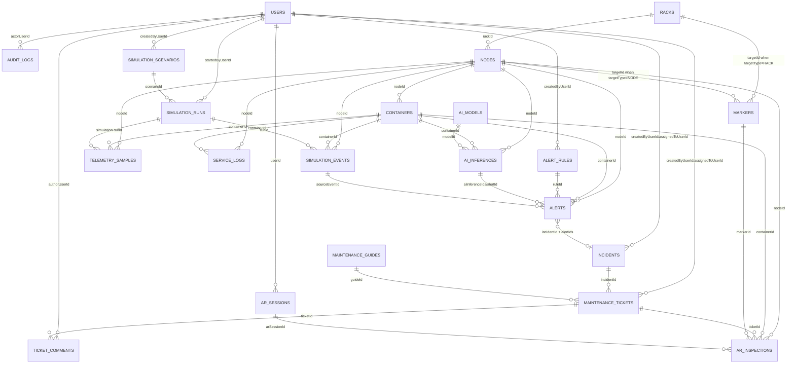

# Phan tich he thong va MongoDB schema cho nen tang giam sat ha tang AR + AI

Nguon phan tich: `01_topic_proposal/topic_proposal_vn.md`.

Ghi chu ve skill: duong dan `skills/mongodb/SKILL.md` duoc neu trong yeu cau nhung hien khong ton tai trong workspace. Tai lieu nay vi vay ap dung huong thiet ke MongoDB theo nguyen tac document-first: embed voi metadata nho, it thay doi va doc cung nhau; reference voi du lieu co vong doi rieng, tan suat ghi cao, hoac tang truong lon nhu telemetry, alert, incident, ticket, log va ket qua AI.

## 1. Tong quan he thong

### 1.1 Ten he thong

Nen tang giam sat va bao tri ha tang trung tam du lieu mo phong dua tren thuc te tang cuong, telemetry thoi gian thuc va phan tich ho tro boi AI.

### 1.2 Muc tieu he thong

He thong la proof-of-concept cho moi truong trung tam du lieu mo phong. Trong pham vi nay, he thong khong thay the nen tang enterprise DCIM/AIOps hoan chinh ma tap trung chung minh ba gia tri cot loi:

| Nhom gia tri | Mo ta |
| --- | --- |
| Giam sat tap trung | Thu thap va truc quan hoa telemetry tu rack, node va container mo phong. |
| Bao tri gan voi khong gian vat ly | Dung AR marker de anh xa thanh phan ha tang voi thong tin van hanh tuong ung. |
| Ho tro thong minh | Dung anomaly detection va predictive insight de lam giau canh bao, su co va huong dan bao tri. |

### 1.3 Ranh gioi he thong

| Trong pham vi | Ngoai pham vi |
| --- | --- |
| Dashboard web cho quan tri vien va NOC | Tich hop truc tiep voi trung tam du lieu that |
| Ung dung AR/WebAR dua tren QR/ArUco marker | Nhan dang vat the phuc tap bang computer vision nang cao |
| Docker-based simulator tao rack, node, container va event | Quan ly tai san phan cung doanh nghiep day du |
| Telemetry CPU, memory, network, storage, service/container status | Giam sat day du tat ca tin hieu enterprise observability |
| Alert, incident, maintenance ticket o muc PoC | ITSM day du nhu ServiceNow/Jira Service Management |
| AI anomaly score, risk insight, forecast co ban | Model AI production-grade, MLOps day du |

### 1.4 Cac phan he chinh

| Phan he | Trach nhiem |
| --- | --- |
| Web Dashboard | Hien thi telemetry, topology rack/node/container, alert, incident, ticket va insight AI. |
| AR Frontend | Quet marker, hien thi overlay node/container, log gan day, alert, huong dan bao tri va ticket action. |
| Backend API | Quan ly user, topology, marker mapping, telemetry query, alert, incident, ticket, audit trail. |
| Telemetry Collector | Lay metric va metadata tu Docker simulator, gui ve backend theo batch/stream. |
| AI Analytics | Cham diem bat thuong, sinh risk insight, du bao xu huong ngan han, gan evidence vao alert/incident. |
| Simulation Runtime | Tao rack, node, container, workload va su kien loi mo phong. |

## 2. Actor cua he thong

| Actor | Loai | Mo ta |
| --- | --- | --- |
| IT Administrator | Human primary | Quan ly he thong, topology, user, marker mapping, nguong canh bao va tong quan suc khoe ha tang. |
| NOC Engineer | Human primary | Giam sat telemetry thoi gian thuc, xac minh alert, phan loai su co va dieu phoi xu ly. |
| Maintenance Technician | Human primary | Su dung AR de kiem tra tai cho, xem log/trang thai, thuc hien huong dan bao tri va cap nhat ticket. |
| Simulation Operator | Human secondary | Tao/chay/dung kich ban mo phong, phat sinh workload va su kien loi de phuc vu demo/nghien cuu. |
| Telemetry Collector | System actor | Thu thap metric, log, container state va day du lieu vao backend. |
| AI Analytics Service | System actor | Xu ly telemetry de tao anomaly score, risk insight va forecast. |
| Notification Consumer | External/system actor | Nhan su kien thong bao hoac webhook neu PoC mo rong sang email/chat/webhook. |

## 3. Use case theo actor

Tong so use case: 37.

### 3.1 IT Administrator

| ID | Use case | Muc tieu nghiep vu | Du lieu chinh |
| --- | --- | --- | --- |
| UC01 | Dang nhap dashboard | Xac thuc nguoi dung va lay quyen truy cap phu hop | `users`, `audit_logs` |
| UC02 | Quan ly tai khoan va vai tro | Tao, khoa, cap nhat role cho admin, NOC va technician | `users`, `audit_logs` |
| UC03 | Xem tong quan suc khoe ha tang | Nam nhanh trang thai rack, node, container, alert va incident | `racks`, `nodes`, `containers`, `alerts`, `incidents` |
| UC04 | Quan ly rack mo phong | Tao/cap nhat rack, vi tri, mo ta va trang thai hien thi | `racks`, `audit_logs` |
| UC05 | Quan ly node mo phong | Gan node vao rack, cap nhat metadata va trang thai van hanh | `nodes`, `racks`, `audit_logs` |
| UC06 | Quan ly container/service tren node | Theo doi container, service, image, port va health status | `containers`, `nodes` |
| UC07 | Cau hinh marker AR | Gan QR/ArUco marker voi rack hoac node de AR truy xuat dung ngu canh | `markers`, `racks`, `nodes`, `audit_logs` |
| UC08 | Cau hinh nguong canh bao | Dat nguong CPU, memory, network, storage hoac service state | `alert_rules`, `audit_logs` |
| UC09 | Xem bao cao lich su van hanh | Tong hop telemetry, alert, incident va ticket theo khoang thoi gian | `telemetry_samples`, `alerts`, `incidents`, `maintenance_tickets` |
| UC10 | Quan ly phien ban model AI | Theo doi model nao dang duoc dung va cau hinh sensitivity | `ai_models`, `audit_logs` |

### 3.2 NOC Engineer

| ID | Use case | Muc tieu nghiep vu | Du lieu chinh |
| --- | --- | --- | --- |
| UC11 | Theo doi telemetry thoi gian thuc | Quan sat metric node/container gan realtime tren dashboard | `telemetry_samples`, `nodes`, `containers` |
| UC12 | Loc telemetry theo rack/node/container | Giam nhieu thong tin va tap trung vao thanh phan can kiem tra | `racks`, `nodes`, `containers`, `telemetry_samples` |
| UC13 | Xem chi tiet alert | Doc severity, metric vi pham, AI score va evidence lien quan | `alerts`, `ai_inferences`, `telemetry_samples` |
| UC14 | Acknowledge alert | Xac nhan alert da duoc nhan de tranh trung lap xu ly | `alerts`, `audit_logs` |
| UC15 | Phan loai alert la true/false positive | Danh dau ket qua xac minh de phuc vu danh gia rule va AI | `alerts`, `audit_logs` |
| UC16 | Tao incident tu alert | Gom alert bat thuong thanh mot su co co vong doi xu ly | `incidents`, `alerts`, `users` |
| UC17 | Gan incident cho technician | Dieu phoi nguoi kiem tra tai cho hoac trong AR simulation | `incidents`, `maintenance_tickets`, `users` |
| UC18 | Cap nhat muc do uu tien incident | Dieu chinh priority dua tren anh huong node/service | `incidents`, `audit_logs` |
| UC19 | Xem log gan day cua service | Ho tro xac minh loi container/service truoc khi dieu phoi | `service_logs`, `containers`, `nodes` |
| UC20 | Dong incident sau khi xac minh | Hoan tat su co sau khi ticket duoc resolve va metric on dinh | `incidents`, `alerts`, `maintenance_tickets`, `audit_logs` |

### 3.3 Maintenance Technician

| ID | Use case | Muc tieu nghiep vu | Du lieu chinh |
| --- | --- | --- | --- |
| UC21 | Dang nhap ung dung AR | Xac thuc technician va thiet bi/phien AR | `users`, `ar_sessions`, `audit_logs` |
| UC22 | Quet marker rack/node | Xac dinh thanh phan ha tang dang duoc nhin qua camera | `markers`, `racks`, `nodes`, `ar_sessions` |
| UC23 | Xem overlay trang thai node | Hien thi suc khoe, CPU, memory, network, storage va alert tren node | `nodes`, `telemetry_samples`, `alerts` |
| UC24 | Xem danh sach container tren node | Biet workload nao dang chay va container nao bat thuong | `containers`, `telemetry_samples`, `alerts` |
| UC25 | Xem log/service health tai cho | Doc log gan day va health check ngay trong AR overlay | `service_logs`, `containers`, `nodes` |
| UC26 | Lam theo huong dan bao tri | Thuc hien checklist theo ngu canh loi mo phong | `maintenance_guides`, `maintenance_tickets` |
| UC27 | Cap nhat ticket sang in progress | Bao cho NOC biet technician da bat dau xu ly | `maintenance_tickets`, `audit_logs` |
| UC28 | Them ghi chu va bang chung kiem tra | Luu nhan xet, anh/screenshot AR neu co va ket qua buoc kiem tra | `maintenance_tickets`, `ticket_comments`, `ar_inspections` |
| UC29 | Escalate ticket | Chuyen su co len NOC/admin khi khong xu ly duoc trong AR flow | `maintenance_tickets`, `incidents`, `audit_logs` |
| UC30 | Resolve ticket | Danh dau hoan tat bao tri va ket qua kiem tra sau xu ly | `maintenance_tickets`, `incidents`, `audit_logs` |

### 3.4 Simulation Operator

| ID | Use case | Muc tieu nghiep vu | Du lieu chinh |
| --- | --- | --- | --- |
| UC31 | Tao kich ban mo phong | Dinh nghia rack, node, container, workload va pattern loi | `simulation_scenarios`, `racks`, `nodes`, `containers` |
| UC32 | Chay/dung kich ban mo phong | Kich hoat hoac tam dung dong telemetry va event | `simulation_runs`, `simulation_events` |
| UC33 | Tao su kien loi mo phong | Sinh CPU spike, memory leak, network degradation hoac container failure | `simulation_events`, `telemetry_samples`, `alerts` |
| UC34 | Reset moi truong mo phong | Dua node/container ve baseline de lap lai demo/experiment | `simulation_runs`, `nodes`, `containers`, `audit_logs` |

### 3.5 Telemetry Collector

| ID | Use case | Muc tieu nghiep vu | Du lieu chinh |
| --- | --- | --- | --- |
| UC35 | Gui telemetry batch/stream | Luu metric node/container theo thoi gian de dashboard va AI su dung | `telemetry_samples`, `nodes`, `containers` |
| UC36 | Gui log va thay doi trang thai container | Dong bo service log, restart count, health status va lifecycle event | `service_logs`, `containers`, `simulation_events` |

### 3.6 AI Analytics Service

| ID | Use case | Muc tieu nghiep vu | Du lieu chinh |
| --- | --- | --- | --- |
| UC37 | Cham diem bat thuong va tao insight | Tao anomaly score, risk level, explanation, forecast va de xuat bao tri | `ai_inferences`, `ai_models`, `telemetry_samples`, `alerts` |

## 4. Entity/collection suy ra tu use case

| Nhom | Entity/collection | Ly do ton tai |
| --- | --- | --- |
| Identity & access | `users` | Can dang nhap, role, assignment va audit actor cho UC01, UC02, UC17, UC21. |
| Identity & access | `audit_logs` | Can truy vet thay doi cau hinh, alert, incident, ticket cho cac thao tac quan tri va van hanh. |
| Topology | `racks` | Bieu dien rack mo phong va neo vao AR marker. |
| Topology | `nodes` | Thanh phan ha tang chinh duoc giam sat, canh bao va bao tri. |
| Topology | `containers` | Workload/service chay tren node, co telemetry/log/trang thai rieng. |
| AR mapping | `markers` | Lien ket QR/ArUco marker voi rack hoac node. |
| AR workflow | `ar_sessions` | Luu phien AR, thiet bi, marker scan va nguoi dung. |
| AR workflow | `ar_inspections` | Luu ket qua kiem tra tai cho/AR, bang chung va ticket lien quan. |
| Monitoring | `telemetry_samples` | Time-series metric cho node/container. |
| Monitoring | `service_logs` | Log gan day va su kien service/container phuc vu xac minh loi. |
| Alerting | `alert_rules` | Cau hinh nguong/rule cua admin. |
| Alerting | `alerts` | Canh bao phat sinh tu rule hoac AI, co lifecycle acknowledge/resolve. |
| AIOps | `ai_models` | Quan ly model, loai model va phien ban dang dung. |
| AIOps | `ai_inferences` | Ket qua anomaly/risk/forecast gắn voi telemetry, node/container, alert. |
| Incident management | `incidents` | Gom alert thanh su co co priority, owner va status. |
| Maintenance workflow | `maintenance_tickets` | Cong viec bao tri gan cho technician, co status va checklist. |
| Maintenance workflow | `ticket_comments` | Ghi chu, bang chung va trao doi tren ticket. |
| Maintenance workflow | `maintenance_guides` | Huong dan/checklist theo loai loi hoac container/service. |
| Simulation | `simulation_scenarios` | Dinh nghia kich ban demo/experiment. |
| Simulation | `simulation_runs` | Theo doi moi lan chay kich ban. |
| Simulation | `simulation_events` | Su kien CPU spike, memory leak, network degradation, service failure. |
| Integration | `notification_events` | Hang doi/thong tin thong bao ra dashboard, webhook hoac kenh mo rong. |

## 5. Conceptual schema

### 5.1 Nguyen tac modeling

| Nguyen tac | Ap dung |
| --- | --- |
| Topology doc co metadata on dinh | `racks`, `nodes`, `containers`, `markers` la collection rieng de de quan ly va query theo entity. |
| Telemetry la du lieu tang truong lon | `telemetry_samples` tach rieng, toi uu time-series va TTL/retention neu can. |
| Alert/incident/ticket co vong doi rieng | Tach thanh collection rieng de cap nhat status, owner, priority va audit ro rang. |
| AR session va inspection tach rieng | Phien quet marker va ket qua kiem tra co ngu canh nguoi dung/thiet bi rieng. |
| AI inference tach rieng | Cho phep luu modelVersion, score, explanation va evidence ma khong lam phinh telemetry raw. |
| Embed lich su nho | Status history/checklist steps co the embed trong ticket vi doc cung nhau va kich thuoc gioi han. |
| Reference voi quan he nhieu va lon | Telemetry, log, alert, incident, comment va inference reference toi node/container/user. |

### 5.2 Quan he conceptual

| Quan he | Cardinality | Cach luu de xuat |
| --- | --- | --- |
| User tao/cap nhat AuditLog | 1:N | `audit_logs.actorUserId` reference `users._id`. |
| Rack chua Node | 1:N | `nodes.rackId` reference `racks._id`. |
| Node chay Container | 1:N | `containers.nodeId` reference `nodes._id`. |
| Marker gan voi Rack hoac Node | 1:0..1 moi target | `markers.targetType`, `markers.targetId`. |
| Node co nhieu TelemetrySample | 1:N | `telemetry_samples.nodeId`. |
| Container co nhieu TelemetrySample | 1:N | `telemetry_samples.containerId` optional. |
| Container co nhieu ServiceLog | 1:N | `service_logs.containerId`. |
| AlertRule tao Alert | 1:N | `alerts.ruleId` optional. |
| AIModel tao AIInference | 1:N | `ai_inferences.modelId`. |
| AIInference co the tao/gia tri hoa Alert | 1:N hoac N:1 | `alerts.aiInferenceIds`, `ai_inferences.alertId` optional. |
| Alert duoc gom vao Incident | N:1 | `alerts.incidentId`, `incidents.alertIds`. |
| Incident co MaintenanceTicket | 1:N | `maintenance_tickets.incidentId`. |
| Ticket co Comment | 1:N | `ticket_comments.ticketId`. |
| Ticket dung MaintenanceGuide | N:1 optional | `maintenance_tickets.guideId`. |
| ARSession co nhieu ARInspection | 1:N | `ar_inspections.arSessionId`. |
| ARInspection gan Ticket | N:1 optional | `ar_inspections.ticketId`. |
| SimulationScenario co SimulationRun | 1:N | `simulation_runs.scenarioId`. |
| SimulationRun co SimulationEvent | 1:N | `simulation_events.runId`. |
| SimulationEvent co the tao Alert | 1:N optional | `alerts.sourceEventId`. |

## 6. Field can co theo use case

### 6.1 `users`

| Field | Type | Bat buoc | Ghi chu/use case |
| --- | --- | --- | --- |
| `_id` | ObjectId | Yes | Primary id. |
| `fullName` | string | Yes | Hien thi actor trong dashboard/ticket. |
| `email` | string | Yes | Dang nhap, unique. |
| `passwordHash` | string | Yes | Xac thuc UC01, UC21. |
| `roles` | string[] | Yes | `ADMIN`, `NOC_ENGINEER`, `TECHNICIAN`, `SIMULATION_OPERATOR`. |
| `status` | string | Yes | `ACTIVE`, `LOCKED`, `DISABLED`. |
| `lastLoginAt` | date | No | Bao mat va audit. |
| `createdAt` | date | Yes | Timestamp. |
| `updatedAt` | date | Yes | Timestamp. |

### 6.2 `racks`

| Field | Type | Bat buoc | Ghi chu/use case |
| --- | --- | --- | --- |
| `_id` | ObjectId | Yes | Primary id. |
| `rackCode` | string | Yes | Ma rack hien thi tren dashboard/AR, unique. |
| `name` | string | Yes | Ten than thien. |
| `locationLabel` | string | No | Vi tri mo phong. |
| `description` | string | No | Mo ta. |
| `status` | string | Yes | `NORMAL`, `DEGRADED`, `CRITICAL`, `MAINTENANCE`, `OFFLINE`. |
| `layout` | object | No | Toa do logic tren dashboard map. |
| `createdAt` | date | Yes | Timestamp. |
| `updatedAt` | date | Yes | Timestamp. |

### 6.3 `nodes`

| Field | Type | Bat buoc | Ghi chu/use case |
| --- | --- | --- | --- |
| `_id` | ObjectId | Yes | Primary id. |
| `rackId` | ObjectId | Yes | Reference `racks`. |
| `nodeCode` | string | Yes | Ma node unique. |
| `hostname` | string | Yes | Ten host/container host mo phong. |
| `ipAddress` | string | No | Metadata simulation. |
| `nodeType` | string | Yes | `COMPUTE`, `STORAGE`, `NETWORK`, `MOCK_SERVICE_HOST`. |
| `status` | string | Yes | Health tong hop. |
| `capacity.cpuCores` | number | No | Dung cho dashboard va capacity context. |
| `capacity.memoryMb` | number | No | Dung cho dashboard va capacity context. |
| `capacity.storageGb` | number | No | Dung cho dashboard va capacity context. |
| `lastSeenAt` | date | No | Collector heartbeat. |
| `createdAt` | date | Yes | Timestamp. |
| `updatedAt` | date | Yes | Timestamp. |

### 6.4 `containers`

| Field | Type | Bat buoc | Ghi chu/use case |
| --- | --- | --- | --- |
| `_id` | ObjectId | Yes | Primary id. |
| `nodeId` | ObjectId | Yes | Reference `nodes`. |
| `containerRuntimeId` | string | Yes | Docker/container id. |
| `name` | string | Yes | Ten container/service. |
| `image` | string | No | Anh container. |
| `serviceName` | string | No | Ten service nghiep vu mo phong. |
| `ports` | object[] | No | Port mapping. |
| `status` | string | Yes | `RUNNING`, `RESTARTING`, `STOPPED`, `FAILED`, `UNKNOWN`. |
| `healthStatus` | string | No | `HEALTHY`, `UNHEALTHY`, `STARTING`, `NONE`. |
| `restartCount` | number | Yes | Xac minh instability. |
| `lastStateChangeAt` | date | No | Log lifecycle. |
| `createdAt` | date | Yes | Timestamp. |
| `updatedAt` | date | Yes | Timestamp. |

### 6.5 `markers`

| Field | Type | Bat buoc | Ghi chu/use case |
| --- | --- | --- | --- |
| `_id` | ObjectId | Yes | Primary id. |
| `markerCode` | string | Yes | QR/ArUco id unique. |
| `markerType` | string | Yes | `QR`, `ARUCO`. |
| `targetType` | string | Yes | `RACK` hoac `NODE`. |
| `targetId` | ObjectId | Yes | Id cua rack hoac node. |
| `label` | string | No | Ten hien thi trong AR. |
| `relativeOffset.position` | object | No | x, y, z neu can overlay on dinh. |
| `relativeOffset.rotation` | object | No | pitch, yaw, roll. |
| `isActive` | boolean | Yes | Marker co duoc su dung khong. |
| `createdAt` | date | Yes | Timestamp. |
| `updatedAt` | date | Yes | Timestamp. |

### 6.6 `telemetry_samples`

| Field | Type | Bat buoc | Ghi chu/use case |
| --- | --- | --- | --- |
| `_id` | ObjectId | Yes | Primary id hoac MongoDB time-series id. |
| `timestamp` | date | Yes | Thoi diem do. |
| `nodeId` | ObjectId | Yes | Reference `nodes`. |
| `containerId` | ObjectId | No | Reference `containers` neu metric o muc container. |
| `source` | string | Yes | `COLLECTOR`, `SIMULATOR`, `AI_GENERATED`. |
| `metrics.cpuPercent` | number | No | UC11, UC23. |
| `metrics.memoryMb` | number | No | UC11, UC23. |
| `metrics.memoryPercent` | number | No | UC11, UC23. |
| `metrics.networkRxBytes` | number | No | UC11, UC23. |
| `metrics.networkTxBytes` | number | No | UC11, UC23. |
| `metrics.storageReadBytes` | number | No | UC11. |
| `metrics.storageWriteBytes` | number | No | UC11. |
| `metrics.storagePercent` | number | No | UC11, UC23. |
| `statusSnapshot` | object | No | Node/container status tai thoi diem do. |
| `simulationRunId` | ObjectId | No | Trace ve run mo phong. |

### 6.7 `service_logs`

| Field | Type | Bat buoc | Ghi chu/use case |
| --- | --- | --- | --- |
| `_id` | ObjectId | Yes | Primary id. |
| `timestamp` | date | Yes | Thoi diem log. |
| `nodeId` | ObjectId | Yes | Reference `nodes`. |
| `containerId` | ObjectId | No | Reference `containers`. |
| `level` | string | Yes | `DEBUG`, `INFO`, `WARN`, `ERROR`, `FATAL`. |
| `message` | string | Yes | Noi dung log. |
| `source` | string | No | Collector/runtime/service. |
| `traceId` | string | No | Gom log neu co. |
| `metadata` | object | No | Payload linh hoat. |

### 6.8 `alert_rules`

| Field | Type | Bat buoc | Ghi chu/use case |
| --- | --- | --- | --- |
| `_id` | ObjectId | Yes | Primary id. |
| `name` | string | Yes | Ten rule. |
| `targetScope` | string | Yes | `NODE`, `CONTAINER`, `SERVICE`, `RACK`. |
| `metricPath` | string | Yes | Vi du `metrics.cpuPercent`. |
| `operator` | string | Yes | `GT`, `GTE`, `LT`, `LTE`, `EQ`, `NE`. |
| `threshold` | number | Yes | Nguong rule. |
| `durationSeconds` | number | No | Can vuot nguong lien tuc bao lau. |
| `severity` | string | Yes | `LOW`, `MEDIUM`, `HIGH`, `CRITICAL`. |
| `isEnabled` | boolean | Yes | Bat/tat rule. |
| `createdByUserId` | ObjectId | Yes | Admin tao rule. |
| `createdAt` | date | Yes | Timestamp. |
| `updatedAt` | date | Yes | Timestamp. |

### 6.9 `alerts`

| Field | Type | Bat buoc | Ghi chu/use case |
| --- | --- | --- | --- |
| `_id` | ObjectId | Yes | Primary id. |
| `alertCode` | string | Yes | Ma alert hien thi. |
| `ruleId` | ObjectId | No | Reference `alert_rules`. |
| `nodeId` | ObjectId | Yes | Thanh phan bi anh huong. |
| `containerId` | ObjectId | No | Neu alert o muc container/service. |
| `severity` | string | Yes | `LOW`, `MEDIUM`, `HIGH`, `CRITICAL`. |
| `status` | string | Yes | `OPEN`, `ACKNOWLEDGED`, `IN_INCIDENT`, `RESOLVED`, `SUPPRESSED`. |
| `title` | string | Yes | Tom tat. |
| `description` | string | No | Mo ta. |
| `metricPath` | string | No | Metric gay alert. |
| `observedValue` | number | No | Gia tri quan sat. |
| `threshold` | number | No | Nguong. |
| `aiInferenceIds` | ObjectId[] | No | Insight lien quan. |
| `sourceEventId` | ObjectId | No | Su kien mo phong tao alert. |
| `incidentId` | ObjectId | No | Incident gom alert. |
| `acknowledgedByUserId` | ObjectId | No | UC14. |
| `acknowledgedAt` | date | No | UC14. |
| `classification` | string | No | `TRUE_POSITIVE`, `FALSE_POSITIVE`, `NEEDS_REVIEW`. |
| `createdAt` | date | Yes | Timestamp. |
| `resolvedAt` | date | No | Timestamp. |

### 6.10 `ai_models`

| Field | Type | Bat buoc | Ghi chu/use case |
| --- | --- | --- | --- |
| `_id` | ObjectId | Yes | Primary id. |
| `name` | string | Yes | Vi du Isolation Forest, LSTM Autoencoder. |
| `modelType` | string | Yes | `ANOMALY_DETECTION`, `FORECASTING`, `RUL_ESTIMATION`. |
| `version` | string | Yes | Phien ban model. |
| `status` | string | Yes | `ACTIVE`, `INACTIVE`, `EXPERIMENTAL`. |
| `parameters` | object | No | Sensitivity, window size, contamination. |
| `trainedAt` | date | No | Neu co training. |
| `createdAt` | date | Yes | Timestamp. |
| `updatedAt` | date | Yes | Timestamp. |

### 6.11 `ai_inferences`

| Field | Type | Bat buoc | Ghi chu/use case |
| --- | --- | --- | --- |
| `_id` | ObjectId | Yes | Primary id. |
| `modelId` | ObjectId | Yes | Reference `ai_models`. |
| `timestamp` | date | Yes | Thoi diem infer. |
| `nodeId` | ObjectId | Yes | Target node. |
| `containerId` | ObjectId | No | Target container neu co. |
| `telemetrySampleIds` | ObjectId[] | No | Evidence sample, gioi han kich thuoc. |
| `windowStart` | date | No | Khoang phan tich. |
| `windowEnd` | date | No | Khoang phan tich. |
| `anomalyScore` | number | No | Diem bat thuong. |
| `riskLevel` | string | Yes | `NORMAL`, `LOW`, `MEDIUM`, `HIGH`, `CRITICAL`. |
| `forecast` | object | No | Du bao ngan han. |
| `explanation` | string | No | Dien giai cho dashboard/AR. |
| `recommendation` | string | No | Goi y bao tri. |
| `alertId` | ObjectId | No | Alert duoc tao/lam giau. |

### 6.12 `incidents`

| Field | Type | Bat buoc | Ghi chu/use case |
| --- | --- | --- | --- |
| `_id` | ObjectId | Yes | Primary id. |
| `incidentCode` | string | Yes | Ma su co. |
| `title` | string | Yes | Tom tat. |
| `description` | string | No | Mo ta su co. |
| `status` | string | Yes | `OPEN`, `TRIAGED`, `ASSIGNED`, `IN_PROGRESS`, `ESCALATED`, `RESOLVED`, `CLOSED`. |
| `priority` | string | Yes | `P1`, `P2`, `P3`, `P4`. |
| `severity` | string | Yes | Severity tong hop. |
| `nodeIds` | ObjectId[] | Yes | Node anh huong. |
| `containerIds` | ObjectId[] | No | Container anh huong. |
| `alertIds` | ObjectId[] | Yes | Alert lien quan. |
| `createdByUserId` | ObjectId | No | NOC tao incident. |
| `assignedToUserId` | ObjectId | No | Technician hoac NOC owner. |
| `statusHistory` | object[] | Yes | Embed lich su nho: status, byUserId, at, note. |
| `createdAt` | date | Yes | Timestamp. |
| `resolvedAt` | date | No | Timestamp. |
| `closedAt` | date | No | Timestamp. |

### 6.13 `maintenance_tickets`

| Field | Type | Bat buoc | Ghi chu/use case |
| --- | --- | --- | --- |
| `_id` | ObjectId | Yes | Primary id. |
| `ticketCode` | string | Yes | Ma ticket. |
| `incidentId` | ObjectId | Yes | Reference `incidents`. |
| `guideId` | ObjectId | No | Reference `maintenance_guides`. |
| `title` | string | Yes | Tom tat cong viec. |
| `status` | string | Yes | `OPEN`, `ACKNOWLEDGED`, `IN_PROGRESS`, `ESCALATED`, `RESOLVED`, `CANCELLED`. |
| `priority` | string | Yes | Uu tien xu ly. |
| `assignedToUserId` | ObjectId | No | Technician. |
| `createdByUserId` | ObjectId | No | NOC/admin. |
| `target.nodeId` | ObjectId | Yes | Node can bao tri. |
| `target.containerId` | ObjectId | No | Container/service can bao tri. |
| `checklist` | object[] | No | Embed buoc: title, instruction, status, completedByUserId, completedAt. |
| `resolutionSummary` | string | No | Ket qua xu ly. |
| `createdAt` | date | Yes | Timestamp. |
| `updatedAt` | date | Yes | Timestamp. |
| `resolvedAt` | date | No | Timestamp. |

### 6.14 `ticket_comments`

| Field | Type | Bat buoc | Ghi chu/use case |
| --- | --- | --- | --- |
| `_id` | ObjectId | Yes | Primary id. |
| `ticketId` | ObjectId | Yes | Reference `maintenance_tickets`. |
| `authorUserId` | ObjectId | Yes | User viet comment. |
| `body` | string | Yes | Noi dung ghi chu. |
| `attachments` | object[] | No | Link anh/screenshot/log snippet neu co. |
| `visibility` | string | Yes | `INTERNAL`, `TEAM`. |
| `createdAt` | date | Yes | Timestamp. |

### 6.15 `maintenance_guides`

| Field | Type | Bat buoc | Ghi chu/use case |
| --- | --- | --- | --- |
| `_id` | ObjectId | Yes | Primary id. |
| `guideCode` | string | Yes | Ma guide. |
| `title` | string | Yes | Ten huong dan. |
| `appliesTo` | object | No | metricPath, serviceName, severity, nodeType. |
| `steps` | object[] | Yes | Thu tu, tieu de, instruction, expectedResult. |
| `riskNotes` | string | No | Luu y an toan/van hanh. |
| `isActive` | boolean | Yes | Bat/tat guide. |
| `createdAt` | date | Yes | Timestamp. |
| `updatedAt` | date | Yes | Timestamp. |

### 6.16 `ar_sessions`

| Field | Type | Bat buoc | Ghi chu/use case |
| --- | --- | --- | --- |
| `_id` | ObjectId | Yes | Primary id. |
| `userId` | ObjectId | Yes | Technician. |
| `deviceInfo` | object | No | Browser, OS, camera capability. |
| `startedAt` | date | Yes | Bat dau phien. |
| `endedAt` | date | No | Ket thuc phien. |
| `scannedMarkers` | object[] | No | markerId, scannedAt, targetType, targetId. |
| `status` | string | Yes | `ACTIVE`, `ENDED`, `EXPIRED`. |

### 6.17 `ar_inspections`

| Field | Type | Bat buoc | Ghi chu/use case |
| --- | --- | --- | --- |
| `_id` | ObjectId | Yes | Primary id. |
| `arSessionId` | ObjectId | Yes | Reference `ar_sessions`. |
| `ticketId` | ObjectId | No | Reference `maintenance_tickets`. |
| `markerId` | ObjectId | Yes | Marker duoc quet. |
| `nodeId` | ObjectId | Yes | Node dang inspect. |
| `containerId` | ObjectId | No | Container neu co. |
| `inspectionStatus` | string | Yes | `OBSERVED`, `CHECKED`, `FAILED_CHECK`, `RESOLVED`. |
| `notes` | string | No | Nhan xet tai cho. |
| `evidence` | object[] | No | Anh/screenshot/log snippet. |
| `createdAt` | date | Yes | Timestamp. |

### 6.18 `simulation_scenarios`

| Field | Type | Bat buoc | Ghi chu/use case |
| --- | --- | --- | --- |
| `_id` | ObjectId | Yes | Primary id. |
| `name` | string | Yes | Ten kich ban. |
| `description` | string | No | Mo ta. |
| `topologyTemplate` | object | No | Rack/node/container template. |
| `eventTemplates` | object[] | No | CPU spike, memory leak, network degradation. |
| `createdByUserId` | ObjectId | No | Simulation operator. |
| `createdAt` | date | Yes | Timestamp. |
| `updatedAt` | date | Yes | Timestamp. |

### 6.19 `simulation_runs`

| Field | Type | Bat buoc | Ghi chu/use case |
| --- | --- | --- | --- |
| `_id` | ObjectId | Yes | Primary id. |
| `scenarioId` | ObjectId | Yes | Reference `simulation_scenarios`. |
| `status` | string | Yes | `PENDING`, `RUNNING`, `PAUSED`, `STOPPED`, `COMPLETED`, `FAILED`. |
| `startedByUserId` | ObjectId | No | Simulation operator. |
| `startedAt` | date | No | Bat dau run. |
| `endedAt` | date | No | Ket thuc run. |
| `baselineSnapshot` | object | No | Trang thai ban dau de reset. |

### 6.20 `simulation_events`

| Field | Type | Bat buoc | Ghi chu/use case |
| --- | --- | --- | --- |
| `_id` | ObjectId | Yes | Primary id. |
| `runId` | ObjectId | Yes | Reference `simulation_runs`. |
| `eventType` | string | Yes | `CPU_SPIKE`, `MEMORY_LEAK`, `NETWORK_DEGRADATION`, `CONTAINER_FAILURE`, `RECOVERY`. |
| `nodeId` | ObjectId | Yes | Node bi tac dong. |
| `containerId` | ObjectId | No | Container bi tac dong. |
| `severity` | string | Yes | Muc do su kien. |
| `payload` | object | No | Tham so mo phong. |
| `startedAt` | date | Yes | Bat dau. |
| `endedAt` | date | No | Ket thuc. |
| `createdAlertIds` | ObjectId[] | No | Alert phat sinh. |

### 6.21 `notification_events`

| Field | Type | Bat buoc | Ghi chu/use case |
| --- | --- | --- | --- |
| `_id` | ObjectId | Yes | Primary id. |
| `eventType` | string | Yes | `ALERT_CREATED`, `INCIDENT_ASSIGNED`, `TICKET_UPDATED`, `AI_RISK_CHANGED`. |
| `targetUserId` | ObjectId | No | Nguoi nhan neu co. |
| `channel` | string | Yes | `IN_APP`, `WEBHOOK`, `EMAIL_PLACEHOLDER`. |
| `payload` | object | Yes | Noi dung thong bao. |
| `status` | string | Yes | `PENDING`, `SENT`, `FAILED`, `SKIPPED`. |
| `createdAt` | date | Yes | Timestamp. |
| `sentAt` | date | No | Timestamp gui. |

### 6.22 `audit_logs`

| Field | Type | Bat buoc | Ghi chu/use case |
| --- | --- | --- | --- |
| `_id` | ObjectId | Yes | Primary id. |
| `actorUserId` | ObjectId | No | User thuc hien. |
| `action` | string | Yes | Vi du `ALERT_ACKNOWLEDGED`, `TICKET_RESOLVED`. |
| `entityType` | string | Yes | Collection/entity bi tac dong. |
| `entityId` | ObjectId | No | Id entity. |
| `before` | object | No | Snapshot truoc neu can. |
| `after` | object | No | Snapshot sau neu can. |
| `metadata` | object | No | IP, userAgent, requestId. |
| `createdAt` | date | Yes | Timestamp. |

## 7. Physical relationship diagram

## 8. Goi y index va constraint cho MongoDB

| Collection | Index de xuat | Ly do |
| --- | --- | --- |
| `users` | `{ email: 1 } unique` | Dang nhap nhanh va tranh trung email. |
| `racks` | `{ rackCode: 1 } unique` | Tim rack theo ma. |
| `nodes` | `{ nodeCode: 1 } unique`, `{ rackId: 1, status: 1 }` | Topology map va loc health theo rack. |
| `containers` | `{ nodeId: 1, status: 1 }`, `{ containerRuntimeId: 1 } unique` | Xem workload theo node va dong bo Docker id. |
| `markers` | `{ markerCode: 1 } unique`, `{ targetType: 1, targetId: 1 }` | Quet AR marker va quan ly mapping. |
| `telemetry_samples` | `{ timestamp: -1 }`, `{ nodeId: 1, timestamp: -1 }`, `{ containerId: 1, timestamp: -1 }` | Query realtime va history. |
| `service_logs` | `{ nodeId: 1, timestamp: -1 }`, `{ containerId: 1, timestamp: -1 }`, `{ level: 1, timestamp: -1 }` | Xem log gan day va loc loi. |
| `alert_rules` | `{ isEnabled: 1, targetScope: 1, metricPath: 1 }` | Danh gia rule active. |
| `alerts` | `{ status: 1, severity: 1, createdAt: -1 }`, `{ nodeId: 1, createdAt: -1 }`, `{ incidentId: 1 }` | Dashboard alert, node detail va incident grouping. |
| `ai_models` | `{ modelType: 1, status: 1 }`, `{ name: 1, version: 1 } unique` | Chon model active va quan ly version. |
| `ai_inferences` | `{ nodeId: 1, timestamp: -1 }`, `{ riskLevel: 1, timestamp: -1 }`, `{ alertId: 1 }` | Hien thi insight gan nhat va alert enrichment. |
| `incidents` | `{ status: 1, priority: 1, createdAt: -1 }`, `{ assignedToUserId: 1, status: 1 }` | Hang doi NOC va assignment. |
| `maintenance_tickets` | `{ incidentId: 1 }`, `{ assignedToUserId: 1, status: 1 }`, `{ ticketCode: 1 } unique` | Ticket queue cho technician. |
| `ticket_comments` | `{ ticketId: 1, createdAt: 1 }` | Timeline ticket. |
| `maintenance_guides` | `{ isActive: 1, "appliesTo.metricPath": 1 }` | Goi y guide theo alert/metric. |
| `ar_sessions` | `{ userId: 1, startedAt: -1 }`, `{ status: 1 }` | Theo doi phien AR. |
| `ar_inspections` | `{ ticketId: 1, createdAt: -1 }`, `{ nodeId: 1, createdAt: -1 }` | Bang chung bao tri va lich su kiem tra node. |
| `simulation_scenarios` | `{ name: 1 }` | Chon kich ban. |
| `simulation_runs` | `{ scenarioId: 1, startedAt: -1 }`, `{ status: 1 }` | Quan ly run. |
| `simulation_events` | `{ runId: 1, startedAt: -1 }`, `{ nodeId: 1, startedAt: -1 }` | Trace event mo phong. |
| `notification_events` | `{ status: 1, createdAt: 1 }`, `{ targetUserId: 1, createdAt: -1 }` | Xu ly queue thong bao. |
| `audit_logs` | `{ entityType: 1, entityId: 1, createdAt: -1 }`, `{ actorUserId: 1, createdAt: -1 }` | Truy vet thay doi. |

## 9. Retention va sharding goi y

| Du lieu | Retention goi y cho PoC | Ghi chu |
| --- | --- | --- |
| `telemetry_samples` | 7 den 30 ngay raw data | Co the aggregate thanh hourly summary neu demo dai. |
| `service_logs` | 7 den 14 ngay | Giu log loi lau hon neu can bao cao. |
| `ai_inferences` | 30 den 90 ngay | Can cho danh gia AI va lich su incident. |
| `alerts`, `incidents`, `maintenance_tickets` | Giu lau dai trong PoC | Can cho bao cao va demo workflow. |
| `audit_logs` | Giu lau dai trong PoC | Can cho truy vet. |

Neu du lieu telemetry lon, co the dung MongoDB time-series collection cho `telemetry_samples` voi `timeField: "timestamp"` va `metaField` chua `nodeId`, `containerId`, `source`. Shard key goi y khi can scale la `{ nodeId: 1, timestamp: 1 }` hoac hashed `nodeId` ket hop time bucketing, tuy nhien PoC co the chua can sharding.

## 10. Mapping nhanh use case sang collection

| Use case range | Collection trung tam |
| --- | --- |
| UC01-UC02 | `users`, `audit_logs` |
| UC03-UC10 | `racks`, `nodes`, `containers`, `markers`, `alert_rules`, `ai_models`, `telemetry_samples`, `alerts`, `incidents`, `maintenance_tickets` |
| UC11-UC20 | `telemetry_samples`, `alerts`, `ai_inferences`, `incidents`, `maintenance_tickets`, `service_logs` |
| UC21-UC30 | `ar_sessions`, `markers`, `nodes`, `containers`, `telemetry_samples`, `service_logs`, `maintenance_guides`, `maintenance_tickets`, `ticket_comments`, `ar_inspections` |
| UC31-UC34 | `simulation_scenarios`, `simulation_runs`, `simulation_events`, `racks`, `nodes`, `containers` |
| UC35-UC36 | `telemetry_samples`, `service_logs`, `containers`, `simulation_events` |
| UC37 | `ai_models`, `ai_inferences`, `telemetry_samples`, `alerts` |

## 11. Ket luan thiet ke

Schema de xuat phan tach ro ba dong du lieu:

| Dong du lieu | Collection chinh | Ly do |
| --- | --- | --- |
| Topology va AR context | `racks`, `nodes`, `containers`, `markers` | On dinh, can query nhanh khi dashboard/AR render. |
| Observability va AI | `telemetry_samples`, `service_logs`, `alert_rules`, `alerts`, `ai_models`, `ai_inferences` | Ghi nhieu, doc theo thoi gian, can index rieng. |
| Van hanh va bao tri | `incidents`, `maintenance_tickets`, `ticket_comments`, `maintenance_guides`, `ar_sessions`, `ar_inspections` | Co lifecycle va actor ownership ro rang. |

Voi 37 use case tren, schema nay du de ho tro PoC: dashboard realtime, AR overlay theo marker, anomaly/risk insight, incident-ticket workflow va simulation-driven experiment.
